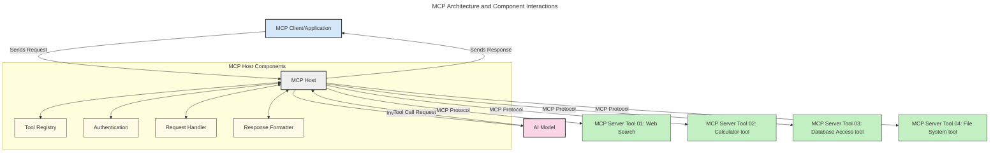
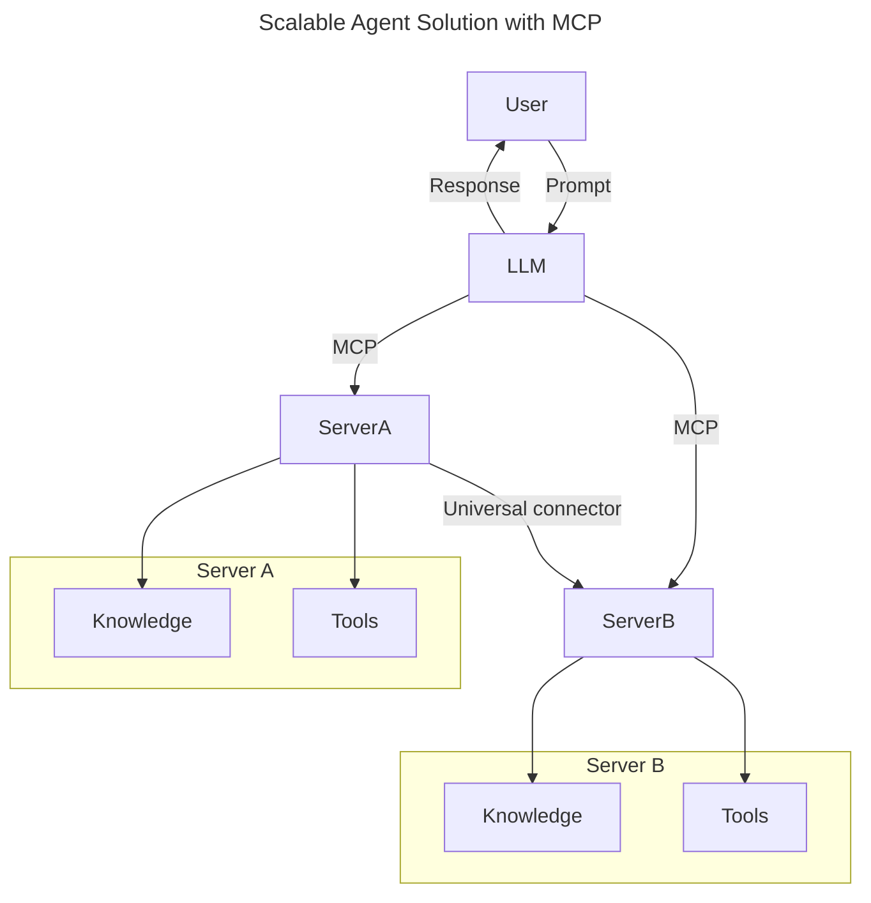

# Introduction to Model Context Protocol (MCP): Why It Matters for Scalable AI Applications

_(Click the image above to view video of this lesson)_

Generative AI applications are a great step forward as they often let the user interact with the app using natural language prompts. However, as more time and resources are invested in such apps, you want to make sure you can easily integrate functionalities and resources in such a way that it's easy to extend, that your app can cater to more than one model being used, and handle various model intricacies. In short, building Gen AI apps is easy to begin with, but as they grow and become more complex, you need to start defining an architecture and will likely need to rely on a standard to ensure your apps are built in a consistent way. This is where MCP comes in to organize things and provide a standard.

---

## **🔍 What Is the Model Context Protocol (MCP)?**

The **Model Context Protocol (MCP)** is an **open, standardized interface** that allows Large Language Models (LLMs) to interact seamlessly with external tools, APIs, and data sources. It provides a consistent architecture to enhance AI model functionality beyond their training data, enabling smarter, scalable, and more responsive AI systems.

---

## **🎯 Why Standardization in AI Matters**

As generative AI applications become more complex, it's essential to adopt standards that ensure **scalability, extensibility, maintainability,** and **avoiding vendor lock-in**. MCP addresses these needs by:

- Unifying model-tool integrations
- Reducing brittle, one-off custom solutions
- Allowing multiple models from different vendors to coexist within one ecosystem

**Note:** While MCP bills itself as an open standard, there are no plans to standardize MCP through any existing standards bodies such as IEEE, IETF, W3C, ISO, or any other standards body.

---

## **📚 Learning Objectives**

By the end of this article, you'll be able to:

- Define **Model Context Protocol (MCP)** and its use cases
- Understand how MCP standardizes model-to-tool communication
- Identify the core components of MCP architecture
- Explore real-world applications of MCP in enterprise and development contexts

---

## **💡 Why the Model Context Protocol (MCP) Is a Game-Changer**

### **🔗 MCP Solves Fragmentation in AI Interactions**

Before MCP, integrating models with tools required:

- Custom code per tool-model pair
- Non-standard APIs for each vendor
- Frequent breaks due to updates
- Poor scalability with more tools

### **✅ Benefits of MCP Standardization**

| **Benefit**              | **Description**                                                                |
|--------------------------|--------------------------------------------------------------------------------|
| Interoperability         | LLMs work seamlessly with tools across different vendors                       |
| Consistency              | Uniform behavior across platforms and tools                                    |
| Reusability              | Tools built once can be used across projects and systems                       |
| Accelerated Development  | Reduce dev time by using standardized, plug-and-play interfaces                |

---

## **🧱 High-Level MCP Architecture Overview**

MCP follows a **client-server model**, where:

- **MCP Hosts** run the AI models
- **MCP Clients** initiate requests
- **MCP Servers** serve context, tools, and capabilities

### **Key Components:**

- **Resources** – Static or dynamic data for models  
- **Prompts** – Predefined workflows for guided generation  
- **Tools** – Executable functions like search, calculations  
- **Sampling** – Agentic behavior via recursive interactions

---

## How MCP Servers Work

MCP servers operate in the following way:

- **Request Flow**:
    1. A request is initiated by an end user or software acting on their behalf.
    2. The **MCP Client** sends the request to an **MCP Host**, which manages the AI Model runtime.
    3. The **AI Model** receives the user prompt and may request access to external tools or data via one or more tool calls.
    4. The **MCP Host**, not the model directly, communicates with the appropriate **MCP Server(s)** using the standardized protocol.
- **MCP Host Functionality**:
    - **Tool Registry**: Maintains a catalog of available tools and their capabilities.
    - **Authentication**: Verifies permissions for tool access.
    - **Request Handler**: Processes incoming tool requests from the model.
    - **Response Formatter**: Structures tool outputs in a format the model can understand.
- **MCP Server Execution**:
    - The **MCP Host** routes tool calls to one or more **MCP Servers**, each exposing specialized functions (e.g., search, calculations, database queries).
    - The **MCP Servers** perform their respective operations and return results to the **MCP Host** in a consistent format.
    - The **MCP Host** formats and relays these results to the **AI Model**.
- **Response Completion**:
    - The **AI Model** incorporates the tool outputs into a final response.
    - The **MCP Host** sends this response back to the **MCP Client**, which delivers it to the end user or calling software.
    

## 👨‍💻 How to Build an MCP Server (With Examples)

MCP servers allow you to extend LLM capabilities by providing data and functionality. 

Ready to try it out? Here are language and/or stack specific SDKs with examples of creating simple MCP servers in different languages/stacks:

- **Python SDK**: https://github.com/modelcontextprotocol/python-sdk

- **TypeScript SDK**: https://github.com/modelcontextprotocol/typescript-sdk

- **Java SDK**: https://github.com/modelcontextprotocol/java-sdk

- **C#/.NET SDK**: https://github.com/modelcontextprotocol/csharp-sdk

## 🌍 Real-World Use Cases for MCP

MCP enables a wide range of applications by extending AI capabilities:

| **Application**              | **Description**                                                                |
|------------------------------|--------------------------------------------------------------------------------|
| Enterprise Data Integration  | Connect LLMs to databases, CRMs, or internal tools                             |
| Agentic AI Systems           | Enable autonomous agents with tool access and decision-making workflows        |
| Multi-modal Applications     | Combine text, image, and audio tools within a single unified AI app            |
| Real-time Data Integration   | Bring live data into AI interactions for more accurate, current outputs        |

### 🧠 MCP = Universal Standard for AI Interactions

The Model Context Protocol (MCP) acts as a universal standard for AI interactions, much like how USB-C standardized physical connections for devices. In the world of AI, MCP provides a consistent interface, allowing models (clients) to integrate seamlessly with external tools and data providers (servers). This eliminates the need for diverse, custom protocols for each API or data source.

Under MCP, an MCP-compatible tool (referred to as an MCP server) follows a unified standard. These servers can list the tools or actions they offer and execute those actions when requested by an AI agent. AI agent platforms that support MCP are capable of discovering available tools from the servers and invoking them through this standard protocol.

### 💡 Facilitates access to knowledge

Beyond offering tools, MCP also facilitates access to knowledge. It enables applications to provide context to large language models (LLMs) by linking them to various data sources. For instance, an MCP server might represent a company’s document repository, allowing agents to retrieve relevant information on demand. Another server could handle specific actions like sending emails or updating records. From the agent’s perspective, these are simply tools it can use—some tools return data (knowledge context), while others perform actions. MCP efficiently manages both.

An agent connecting to an MCP server automatically learns the server's available capabilities and accessible data through a standard format. This standardization enables dynamic tool availability. For example, adding a new MCP server to an agent’s system makes its functions immediately usable without requiring further customization of the agent's instructions.

This streamlined integration aligns with the flow depicted in the following diagram, where servers provide both tools and knowledge, ensuring seamless collaboration across systems. 

### 👉 Example: Scalable Agent Solution

The Universal Connector enables MCP servers to communicate and share capabilities with each other, allowing ServerA to delegate tasks to ServerB or access its tools and knowledge. This federates tools and data across servers, supporting scalable and modular agent architectures. Because MCP standardizes tool exposure, agents can dynamically discover and route requests between servers without hardcoded integrations.

Tool and knowledge federation: Tools and data can be accessed across servers, enabling more scalable and modular agentic architectures.

### 🔄 Advanced MCP Scenarios with Client-Side LLM Integration

Beyond the basic MCP architecture, there are advanced scenarios where both client and server contain LLMs, enabling more sophisticated interactions. In the following diagram, **Client App** could be an IDE with a number of MCP tools available for user by the LLM:

```mermaid
---
title: Advanced MCP Scenarios with Client-Server LLM Integration
description: A sequence diagram showing the detailed interaction flow between user, client application, client LLM, multiple MCP servers, and server LLM, illustrating tool discovery, user interaction, direct tool calling, and feature negotiation phases
---
sequenceDiagram
    autonumber
    actor User as 👤 User
    participant ClientApp as 🖥️ Client App
    participant ClientLLM as 🧠 Client LLM
    participant Server1 as 🔧 MCP Server 1
    participant Server2 as 📚 MCP Server 2
    participant ServerLLM as 🤖 Server LLM
    
    %% Discovery Phase
    rect rgb(220, 240, 255)
        Note over ClientApp, Server2: TOOL DISCOVERY PHASE
        ClientApp->>+Server1: Request available tools/resources
        Server1-->>-ClientApp: Return tool list (JSON)
        ClientApp->>+Server2: Request available tools/resources
        Server2-->>-ClientApp: Return tool list (JSON)
        Note right of ClientApp: Store combined tool<br/>catalog locally
    end
    
    %% User Interaction
    rect rgb(255, 240, 220)
        Note over User, ClientLLM: USER INTERACTION PHASE
        User->>+ClientApp: Enter natural language prompt
        ClientApp->>+ClientLLM: Forward prompt + tool catalog
        ClientLLM->>-ClientLLM: Analyze prompt & select tools
    end
    
    %% Scenario A: Direct Tool Calling
    alt Direct Tool Calling
        rect rgb(220, 255, 220)
            Note over ClientApp, Server1: SCENARIO A: DIRECT TOOL CALLING
            ClientLLM->>+ClientApp: Request tool execution
            ClientApp->>+Server1: Execute specific tool
            Server1-->>-ClientApp: Return results
            ClientApp->>+ClientLLM: Process results
            ClientLLM-->>-ClientApp: Generate response
            ClientApp-->>-User: Display final answer
        end
    
    %% Scenario B: Feature Negotiation (VS Code style)
    else Feature Negotiation (VS Code style)
        rect rgb(255, 220, 220)
            Note over ClientApp, ServerLLM: SCENARIO B: FEATURE NEGOTIATION
            ClientLLM->>+ClientApp: Identify needed capabilities
            ClientApp->>+Server2: Negotiate features/capabilities
            Server2->>+ServerLLM: Request additional context
            ServerLLM-->>-Server2: Provide context
            Server2-->>-ClientApp: Return available features
            ClientApp->>+Server2: Call negotiated tools
            Server2-->>-ClientApp: Return results
            ClientApp->>+ClientLLM: Process results
            ClientLLM-->>-ClientApp: Generate response
            ClientApp-->>-User: Display final answer
        end
    end
```

## 🔐 Practical Benefits of MCP

Here are the practical benefits of using MCP:

- **Freshness**: Models can access up-to-date information beyond their training data
- **Capability Extension**: Models can leverage specialized tools for tasks they weren't trained for
- **Reduced Hallucinations**: External data sources provide factual grounding
- **Privacy**: Sensitive data can stay within secure environments instead of being embedded in prompts

## 📌 Key Takeaways

The following are key takeaways for using MCP:

- **MCP** standardizes how AI models interact with tools and data
- Promotes **extensibility, consistency, and interoperability**
- MCP helps **reduce development time, improve reliability, and extend model capabilities**
- The client-server architecture **enables flexible, extensible AI applications**

## 🧠 Exercise

Think about an AI application you're interested in building.

- Which **external tools or data** could enhance its capabilities?
- How might MCP make integration **simpler and more reliable?**

## Additional Resources

- [MCP GitHub Repository](https://github.com/modelcontextprotocol)

## What's next

Next: [Chapter 1: Core Concepts](../01-CoreConcepts/README.md)
