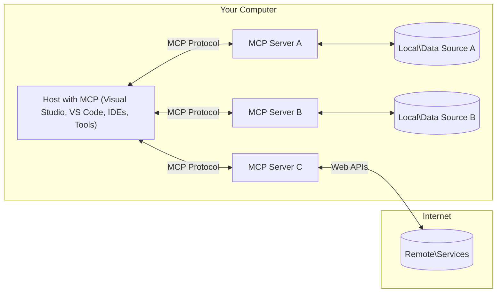

# MCP Core Concepts: Mastering the Model Context Protocol for AI Integration

[](https://youtu.be/earDzWGtE84)

_(Click the image above to view video of this lesson)_

The [Model Context Protocol (MCP)](https://github.com/modelcontextprotocol) is a powerful, standardized framework that optimizes communication between Large Language Models (LLMs) and external tools, applications, and data sources. 
This guide will walk you through the core concepts of MCP. You will learn about its client-server architecture, essential components, communication mechanics, and implementation best practices.

- **Explicit User Consent**: All data access and operations require explicit user approval before execution. Users must clearly understand what data will be accessed and what actions will be performed, with granular control over permissions and authorizations.

- **Data Privacy Protection**: User data is only exposed with explicit consent and must be protected by robust access controls throughout the entire interaction lifecycle. Implementations must prevent unauthorized data transmission and maintain strict privacy boundaries.

- **Tool Execution Safety**: Every tool invocation requires explicit user consent with clear understanding of the tool's functionality, parameters, and potential impact. Robust security boundaries must prevent unintended, unsafe, or malicious tool execution.

- **Transport Layer Security**: All communication channels should use appropriate encryption and authentication mechanisms. Remote connections should implement secure transport protocols and proper credential management.

#### Implementation Guidelines:

- **Permission Management**: Implement fine-grained permission systems that allow users to control which servers, tools, and resources are accessible
- **Authentication & Authorization**: Use secure authentication methods (OAuth, API keys) with proper token management and expiration  
- **Input Validation**: Validate all parameters and data inputs according to defined schemas to prevent injection attacks
- **Audit Logging**: Maintain comprehensive logs of all operations for security monitoring and compliance

## Overview

This lesson explores the fundamental architecture and components that make up the Model Context Protocol (MCP) ecosystem. You'll learn about the client-server architecture, key components, and communication mechanisms that power MCP interactions.

## Key Learning Objectives

By the end of this lesson, you will:

- Understand the MCP client-server architecture.
- Identify roles and responsibilities of Hosts, Clients, and Servers.
- Analyze the core features that make MCP a flexible integration layer.
- Learn how information flows within the MCP ecosystem.
- Gain practical insights through code examples in .NET, Java, Python, and JavaScript.

## MCP Architecture: A Deeper Look

The MCP ecosystem is built on a client-server model. This modular structure allows AI applications to interact with tools, databases, APIs, and contextual resources efficiently. Let's break down this architecture into its core components.

At its core, MCP follows a client-server architecture where a host application can connect to multiple servers:



- **MCP Hosts**: Programs like VSCode, Claude Desktop, IDEs, or AI tools that want to access data through MCP
- **MCP Clients**: Protocol clients that maintain 1:1 connections with servers
- **MCP Servers**: Lightweight programs that each expose specific capabilities through the standardized Model Context Protocol
- **Local Data Sources**: Your computer's files, databases, and services that MCP servers can securely access
- **Remote Services**: External systems available over the internet that MCP servers can connect to through APIs.

The MCP Protocol is an evolving standard using date-based versioning (YYYY-MM-DD format). The current protocol version is **2025-06-18**. You can see the latest updates to the [protocol specification](https://modelcontextprotocol.io/specification/2025-06-18/)

### 1. Hosts

In the Model Context Protocol (MCP), **Hosts** are AI applications that serve as the primary interface through which users interact with the protocol. Hosts coordinate and manage connections to multiple MCP servers by creating dedicated MCP clients for each server connection. Examples of Hosts include:

- **AI Applications**: Claude Desktop, Visual Studio Code, Claude Code
- **Development Environments**: IDEs and code editors with MCP integration  
- **Custom Applications**: Purpose-built AI agents and tools

**Hosts** are applications that coordinate AI model interactions. They:

- **Orchestrate AI Models**: Execute or interact with LLMs to generate responses and coordinate AI workflows
- **Manage Client Connections**: Create and maintain one MCP client per MCP server connection
- **Control User Interface**: Handle conversation flow, user interactions, and response presentation  
- **Enforce Security**: Control permissions, security constraints, and authentication
- **Handle User Consent**: Manage user approval for data sharing and tool execution


### 2. Clients

**Clients** are essential components that maintain dedicated one-to-one connections between Hosts and MCP servers. Each MCP client is instantiated by the Host to connect to a specific MCP server, ensuring organized and secure communication channels. Multiple clients enable Hosts to connect to multiple servers simultaneously.

**Clients** are connector components within the host application. They:

- **Protocol Communication**: Send JSON-RPC 2.0 requests to servers with prompts and instructions
- **Capability Negotiation**: Negotiate supported features and protocol versions with servers during initialization
- **Tool Execution**: Manage tool execution requests from models and process responses
- **Real-time Updates**: Handle notifications and real-time updates from servers
- **Response Processing**: Process and format server responses for display to users

### 3. Servers

**Servers** are programs that provide context, tools, and capabilities to MCP clients. They can execute locally (same machine as the Host) or remotely (on external platforms), and are responsible for handling client requests and providing structured responses. Servers expose specific functionality through the standardized Model Context Protocol.

**Servers** are services that provide context and capabilities. They:

- **Feature Registration**: Register and expose available primitives (resources, prompts, tools) to clients
- **Request Processing**: Receive and execute tool calls, resource requests, and prompt requests from clients
- **Context Provision**: Provide contextual information and data to enhance model responses
- **State Management**: Maintain session state and handle stateful interactions when needed
- **Real-time Notifications**: Send notifications about capability changes and updates to connected clients

Servers can be developed by anyone to extend model capabilities with specialized functionality, and they support both local and remote deployment scenarios.

### 4. Server Primitives

Servers in the Model Context Protocol (MCP) provide three core **primitives** that define the fundamental building blocks for rich interactions between clients, hosts, and language models. These primitives specify the types of contextual information and actions available through the protocol.

MCP servers can expose any combination of the following three core primitives:

#### Resources 

**Resources** are data sources that provide contextual information to AI applications. They represent static or dynamic content that can enhance model understanding and decision-making:

- **Contextual Data**: Structured information and context for AI model consumption
- **Knowledge Bases**: Document repositories, articles, manuals, and research papers
- **Local Data Sources**: Files, databases, and local system information  
- **External Data**: API responses, web services, and remote system data
- **Dynamic Content**: Real-time data that updates based on external conditions

Resources are identified by URIs and support discovery through `resources/list` and retrieval through `resources/read` methods:

```text
file://documents/project-spec.md
database://production/users/schema
api://weather/current
```

#### Prompts

**Prompts** are reusable templates that help structure interactions with language models. They provide standardized interaction patterns and templated workflows:

- **Template-based Interactions**: Pre-structured messages and conversation starters
- **Workflow Templates**: Standardized sequences for common tasks and interactions
- **Few-shot Examples**: Example-based templates for model instruction
- **System Prompts**: Foundational prompts that define model behavior and context
- **Dynamic Templates**: Parameterized prompts that adapt to specific contexts

Prompts support variable substitution and can be discovered via `prompts/list` and retrieved with `prompts/get`:

```markdown
Generate a {{task_type}} for {{product}} targeting {{audience}} with the following requirements: {{requirements}}
```

#### Tools

**Tools** are executable functions that AI models can invoke to perform specific actions. They represent the "verbs" of the MCP ecosystem, enabling models to interact with external systems:

- **Executable Functions**: Discrete operations that models can invoke with specific parameters
- **External System Integration**: API calls, database queries, file operations, calculations
- **Unique Identity**: Each tool has a distinct name, description, and parameter schema
- **Structured I/O**: Tools accept validated parameters and return structured, typed responses
- **Action Capabilities**: Enable models to perform real-world actions and retrieve live data

Tools are defined with JSON Schema for parameter validation and discovered through `tools/list` and executed via `tools/call`:

```typescript
server.tool(
  "search_products", 
  {
    query: z.string().describe("Search query for products"),
    category: z.string().optional().describe("Product category filter"),
    max_results: z.number().default(10).describe("Maximum results to return")
  }, 
  async (params) => {
    // Execute search and return structured results
    return await productService.search(params);
  }
);
```

## Client Primitives

In the Model Context Protocol (MCP), **clients** can expose primitives that enable servers to request additional capabilities from the host application. These client-side primitives allow for richer, more interactive server implementations that can access AI model capabilities and user interactions.

### Sampling

**Sampling** allows servers to request language model completions from the client's AI application. This primitive enables servers to access LLM capabilities without embedding their own model dependencies:

- **Model-Independent Access**: Servers can request completions without including LLM SDKs or managing model access
- **Server-Initiated AI**: Enables servers to autonomously generate content using the client's AI model
- **Recursive LLM Interactions**: Supports complex scenarios where servers need AI assistance for processing
- **Dynamic Content Generation**: Allows servers to create contextual responses using the host's model

Sampling is initiated through the `sampling/complete` method, where servers send completion requests to clients.

### Elicitation  

**Elicitation** enables servers to request additional information or confirmation from users through the client interface:

- **User Input Requests**: Servers can ask for additional information when needed for tool execution
- **Confirmation Dialogs**: Request user approval for sensitive or impactful operations
- **Interactive Workflows**: Enable servers to create step-by-step user interactions
- **Dynamic Parameter Collection**: Gather missing or optional parameters during tool execution

Elicitation requests are made using the `elicitation/request` method to collect user input through the client's interface.

### Logging

**Logging** allows servers to send structured log messages to clients for debugging, monitoring, and operational visibility:

- **Debugging Support**: Enable servers to provide detailed execution logs for troubleshooting
- **Operational Monitoring**: Send status updates and performance metrics to clients
- **Error Reporting**: Provide detailed error context and diagnostic information
- **Audit Trails**: Create comprehensive logs of server operations and decisions

Logging messages are sent to clients to provide transparency into server operations and facilitate debugging.

## Information Flow in MCP

The Model Context Protocol (MCP) defines a structured flow of information between hosts, clients, servers, and models. Understanding this flow helps clarify how user requests are processed and how external tools and data are integrated into model responses.

- **Host Initiates Connection**  
  The host application (such as an IDE or chat interface) establishes a connection to an MCP server, typically via STDIO, WebSocket, or another supported transport.

- **Capability Negotiation**  
  The client (embedded in the host) and the server exchange information about their supported features, tools, resources, and protocol versions. This ensures both sides understand what capabilities are available for the session.

- **User Request**  
  The user interacts with the host (e.g., enters a prompt or command). The host collects this input and passes it to the client for processing.

- **Resource or Tool Use**  
  - The client may request additional context or resources from the server (such as files, database entries, or knowledge base articles) to enrich the model's understanding.
  - If the model determines that a tool is needed (e.g., to fetch data, perform a calculation, or call an API), the client sends a tool invocation request to the server, specifying the tool name and parameters.

- **Server Execution**  
  The server receives the resource or tool request, executes the necessary operations (such as running a function, querying a database, or retrieving a file), and returns the results to the client in a structured format.

- **Response Generation**  
  The client integrates the server's responses (resource data, tool outputs, etc.) into the ongoing model interaction. The model uses this information to generate a comprehensive and contextually relevant response.

- **Result Presentation**  
  The host receives the final output from the client and presents it to the user, often including both the model's generated text and any results from tool executions or resource lookups.

This flow enables MCP to support advanced, interactive, and context-aware AI applications by seamlessly connecting models with external tools and data sources.

## Protocol Architecture & Layers

MCP consists of two distinct architectural layers that work together to provide a complete communication framework:

### Data Layer

The **Data Layer** implements the core MCP protocol using **JSON-RPC 2.0** as its foundation. This layer defines the message structure, semantics, and interaction patterns:

#### Core Components:

- **JSON-RPC 2.0 Protocol**: All communication uses standardized JSON-RPC 2.0 message format for method calls, responses, and notifications
- **Lifecycle Management**: Handles connection initialization, capability negotiation, and session termination between clients and servers
- **Server Primitives**: Enables servers to provide core functionality through tools, resources, and prompts
- **Client Primitives**: Enables servers to request sampling from LLMs, elicit user input, and send log messages
- **Real-time Notifications**: Supports asynchronous notifications for dynamic updates without polling

#### Key Features:

- **Protocol Version Negotiation**: Uses date-based versioning (YYYY-MM-DD) to ensure compatibility
- **Capability Discovery**: Clients and servers exchange supported feature information during initialization
- **Stateful Sessions**: Maintains connection state across multiple interactions for context continuity

### Transport Layer

The **Transport Layer** manages communication channels, message framing, and authentication between MCP participants:

#### Supported Transport Mechanisms:

1. **STDIO Transport**:
   - Uses standard input/output streams for direct process communication
   - Optimal for local processes on the same machine with no network overhead
   - Commonly used for local MCP server implementations

2. **Streamable HTTP Transport**:
   - Uses HTTP POST for client-to-server messages  
   - Optional Server-Sent Events (SSE) for server-to-client streaming
   - Enables remote server communication across networks
   - Supports standard HTTP authentication (bearer tokens, API keys, custom headers)
   - MCP recommends OAuth for secure token-based authentication

#### Transport Abstraction:

The transport layer abstracts communication details from the data layer, enabling the same JSON-RPC 2.0 message format across all transport mechanisms. This abstraction allows applications to switch between local and remote servers seamlessly.

### Security Considerations

MCP implementations must adhere to several critical security principles to ensure safe, trustworthy, and secure interactions across all protocol operations:

- **User Consent and Control**: Users must provide explicit consent before any data is accessed or operations are performed. They should have clear control over what data is shared and which actions are authorized, supported by intuitive user interfaces for reviewing and approving activities.

- **Data Privacy**: User data should only be exposed with explicit consent and must be protected by appropriate access controls. MCP implementations must safeguard against unauthorized data transmission and ensure that privacy is maintained throughout all interactions.

- **Tool Safety**: Before invoking any tool, explicit user consent is required. Users should have a clear understanding of each tool’s functionality, and robust security boundaries must be enforced to prevent unintended or unsafe tool execution.

By following these security principles, MCP ensures user trust, privacy, and safety are maintained across all protocol interactions while enabling powerful AI integrations.

## Code Examples: Key Components

Below are code examples in several popular programming languages that illustrate how to implement key MCP server components and tools.

### .NET Example: Creating a Simple MCP Server with Tools

Here is a practical .NET code example demonstrating how to implement a simple MCP server with custom tools. This example showcases how to define and register tools, handle requests, and connect the server using the Model Context Protocol.

```csharp
using System;
using System.Threading.Tasks;
using ModelContextProtocol.Server;
using ModelContextProtocol.Server.Transport;
using ModelContextProtocol.Server.Tools;

public class WeatherServer
{
    public static async Task Main(string[] args)
    {
        // Create an MCP server
        var server = new McpServer(
            name: "Weather MCP Server",
            version: "1.0.0"
        );
        
        // Register our custom weather tool
        server.AddTool<string, WeatherData>("weatherTool", 
            description: "Gets current weather for a location",
            execute: async (location) => {
                // Call weather API (simplified)
                var weatherData = await GetWeatherDataAsync(location);
                return weatherData;
            });
        
        // Connect the server using stdio transport
        var transport = new StdioServerTransport();
        await server.ConnectAsync(transport);
        
        Console.WriteLine("Weather MCP Server started");
        
        // Keep the server running until process is terminated
        await Task.Delay(-1);
    }
    
    private static async Task<WeatherData> GetWeatherDataAsync(string location)
    {
        // This would normally call a weather API
        // Simplified for demonstration
        await Task.Delay(100); // Simulate API call
        return new WeatherData { 
            Temperature = 72.5,
            Conditions = "Sunny",
            Location = location
        };
    }
}

public class WeatherData
{
    public double Temperature { get; set; }
    public string Conditions { get; set; }
    public string Location { get; set; }
}
```

### Java Example: MCP Server Components

This example demonstrates the same MCP server and tool registration as the .NET example above, but implemented in Java.

```java
import io.modelcontextprotocol.server.McpServer;
import io.modelcontextprotocol.server.McpToolDefinition;
import io.modelcontextprotocol.server.transport.StdioServerTransport;
import io.modelcontextprotocol.server.tool.ToolExecutionContext;
import io.modelcontextprotocol.server.tool.ToolResponse;

public class WeatherMcpServer {
    public static void main(String[] args) throws Exception {
        // Create an MCP server
        McpServer server = McpServer.builder()
            .name("Weather MCP Server")
            .version("1.0.0")
            .build();
            
        // Register a weather tool
        server.registerTool(McpToolDefinition.builder("weatherTool")
            .description("Gets current weather for a location")
            .parameter("location", String.class)
            .execute((ToolExecutionContext ctx) -> {
                String location = ctx.getParameter("location", String.class);
                
                // Get weather data (simplified)
                WeatherData data = getWeatherData(location);
                
                // Return formatted response
                return ToolResponse.content(
                    String.format("Temperature: %.1f°F, Conditions: %s, Location: %s", 
                    data.getTemperature(), 
                    data.getConditions(), 
                    data.getLocation())
                );
            })
            .build());
        
        // Connect the server using stdio transport
        try (StdioServerTransport transport = new StdioServerTransport()) {
            server.connect(transport);
            System.out.println("Weather MCP Server started");
            // Keep server running until process is terminated
            Thread.currentThread().join();
        }
    }
    
    private static WeatherData getWeatherData(String location) {
        // Implementation would call a weather API
        // Simplified for example purposes
        return new WeatherData(72.5, "Sunny", location);
    }
}

class WeatherData {
    private double temperature;
    private String conditions;
    private String location;
    
    public WeatherData(double temperature, String conditions, String location) {
        this.temperature = temperature;
        this.conditions = conditions;
        this.location = location;
    }
    
    public double getTemperature() {
        return temperature;
    }
    
    public String getConditions() {
        return conditions;
    }
    
    public String getLocation() {
        return location;
    }
}
```

### Python Example: Building an MCP Server

This example uses fastmcp, so please ensure you install it first:

```python
pip install fastmcp
```
Code Sample:

```python
#!/usr/bin/env python3
import asyncio
from fastmcp import FastMCP
from fastmcp.transports.stdio import serve_stdio

# Create a FastMCP server
mcp = FastMCP(
    name="Weather MCP Server",
    version="1.0.0"
)

@mcp.tool()
def get_weather(location: str) -> dict:
    """Gets current weather for a location."""
    return {
        "temperature": 72.5,
        "conditions": "Sunny",
        "location": location
    }

# Alternative approach using a class
class WeatherTools:
    @mcp.tool()
    def forecast(self, location: str, days: int = 1) -> dict:
        """Gets weather forecast for a location for the specified number of days."""
        return {
            "location": location,
            "forecast": [
                {"day": i+1, "temperature": 70 + i, "conditions": "Partly Cloudy"}
                for i in range(days)
            ]
        }

# Register class tools
weather_tools = WeatherTools()

# Start the server
if __name__ == "__main__":
    asyncio.run(serve_stdio(mcp))
```

### JavaScript Example: Creating an MCP Server

This example shows MCP server creation in JavaScript and how to register two weather-related tools.

```javascript
// Using the official Model Context Protocol SDK
import { McpServer } from "@modelcontextprotocol/sdk/server/mcp.js";
import { StdioServerTransport } from "@modelcontextprotocol/sdk/server/stdio.js";
import { z } from "zod"; // For parameter validation

// Create an MCP server
const server = new McpServer({
  name: "Weather MCP Server",
  version: "1.0.0"
});

// Define a weather tool
server.tool(
  "weatherTool",
  {
    location: z.string().describe("The location to get weather for")
  },
  async ({ location }) => {
    // This would normally call a weather API
    // Simplified for demonstration
    const weatherData = await getWeatherData(location);
    
    return {
      content: [
        { 
          type: "text", 
          text: `Temperature: ${weatherData.temperature}°F, Conditions: ${weatherData.conditions}, Location: ${weatherData.location}` 
        }
      ]
    };
  }
);

// Define a forecast tool
server.tool(
  "forecastTool",
  {
    location: z.string(),
    days: z.number().default(3).describe("Number of days for forecast")
  },
  async ({ location, days }) => {
    // This would normally call a weather API
    // Simplified for demonstration
    const forecast = await getForecastData(location, days);
    
    return {
      content: [
        { 
          type: "text", 
          text: `${days}-day forecast for ${location}: ${JSON.stringify(forecast)}` 
        }
      ]
    };
  }
);

// Helper functions
async function getWeatherData(location) {
  // Simulate API call
  return {
    temperature: 72.5,
    conditions: "Sunny",
    location: location
  };
}

async function getForecastData(location, days) {
  // Simulate API call
  return Array.from({ length: days }, (_, i) => ({
    day: i + 1,
    temperature: 70 + Math.floor(Math.random() * 10),
    conditions: i % 2 === 0 ? "Sunny" : "Partly Cloudy"
  }));
}

// Connect the server using stdio transport
const transport = new StdioServerTransport();
server.connect(transport).catch(console.error);

console.log("Weather MCP Server started");
```

This JavaScript example demonstrates how to create an MCP client that connects to a server, sends a prompt, and processes the response including any tool calls that were made.

## Security and Authorization

MCP includes several built-in concepts and mechanisms for managing security and authorization throughout the protocol:

1. **Tool Permission Control**:  
  Clients can specify which tools a model is allowed to use during a session. This ensures that only explicitly authorized tools are accessible, reducing the risk of unintended or unsafe operations. Permissions can be configured dynamically based on user preferences, organizational policies, or the context of the interaction.

2. **Authentication**:  
  Servers can require authentication before granting access to tools, resources, or sensitive operations. This may involve API keys, OAuth tokens, or other authentication schemes. Proper authentication ensures that only trusted clients and users can invoke server-side capabilities.

3. **Validation**:  
  Parameter validation is enforced for all tool invocations. Each tool defines the expected types, formats, and constraints for its parameters, and the server validates incoming requests accordingly. This prevents malformed or malicious input from reaching tool implementations and helps maintain the integrity of operations.

4. **Rate Limiting**:  
  To prevent abuse and ensure fair usage of server resources, MCP servers can implement rate limiting for tool calls and resource access. Rate limits can be applied per user, per session, or globally, and help protect against denial-of-service attacks or excessive resource consumption.

By combining these mechanisms, MCP provides a secure foundation for integrating language models with external tools and data sources, while giving users and developers fine-grained control over access and usage.

## Protocol Messages & Communication Flow

MCP communication uses structured **JSON-RPC 2.0** messages to facilitate clear and reliable interactions between hosts, clients, and servers. The protocol defines specific message patterns for different types of operations:

### Core Message Types:

#### **Initialization Messages**
- **`initialize` Request**: Establishes connection and negotiates protocol version and capabilities
- **`initialize` Response**: Confirms supported features and server information  
- **`notifications/initialized`**: Signals that initialization is complete and the session is ready

#### **Discovery Messages**
- **`tools/list` Request**: Discovers available tools from the server
- **`resources/list` Request**: Lists available resources (data sources)
- **`prompts/list` Request**: Retrieves available prompt templates

#### **Execution Messages**  
- **`tools/call` Request**: Executes a specific tool with provided parameters
- **`resources/read` Request**: Retrieves content from a specific resource
- **`prompts/get` Request**: Fetches a prompt template with optional parameters

#### **Client-side Messages**
- **`sampling/complete` Request**: Server requests LLM completion from the client
- **`elicitation/request`**: Server requests user input through the client interface
- **Logging Messages**: Server sends structured log messages to the client

#### **Notification Messages**
- **`notifications/tools/list_changed`**: Server notifies client of tool changes
- **`notifications/resources/list_changed`**: Server notifies client of resource changes  
- **`notifications/prompts/list_changed`**: Server notifies client of prompt changes

### Message Structure:

All MCP messages follow JSON-RPC 2.0 format with:
- **Request Messages**: Include `id`, `method`, and optional `params`
- **Response Messages**: Include `id` and either `result` or `error`  
- **Notification Messages**: Include `method` and optional `params` (no `id` or response expected)

This structured communication ensures reliable, traceable, and extensible interactions supporting advanced scenarios like real-time updates, tool chaining, and robust error handling.

## Key Takeaways

- **Architecture**: MCP uses a client-server architecture where hosts manage multiple client connections to servers
- **Participants**: The ecosystem includes hosts (AI applications), clients (protocol connectors), and servers (capability providers)
- **Transport Mechanisms**: Communication supports STDIO (local) and Streamable HTTP with optional SSE (remote)
- **Core Primitives**: Servers expose tools (executable functions), resources (data sources), and prompts (templates)
- **Client Primitives**: Servers can request sampling (LLM completions), elicitation (user input), and logging from clients
- **Protocol Foundation**: Built on JSON-RPC 2.0 with date-based versioning (current: 2025-06-18)
- **Real-time Capabilities**: Supports notifications for dynamic updates and real-time synchronization
- **Security First**: Explicit user consent, data privacy protection, and secure transport are core requirements

## Exercise

Design a simple MCP tool that would be useful in your domain. Define:
1. What the tool would be named
2. What parameters it would accept
3. What output it would return
4. How a model might use this tool to solve user problems


---

## What's next

Next: [Chapter 2: Security](../02-Security/README.md)
