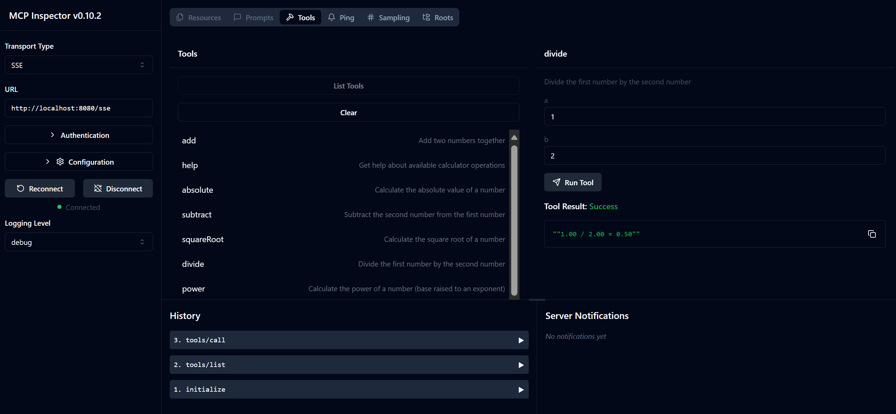

# Basic Calculator MCP Service

This service provides basic calculator operations through the Model Context Protocol (MCP) using Spring Boot with WebFlux transport. It's designed as a simple example for beginners learning about MCP implementations.

For more information, see the [MCP Server Boot Starter](https://docs.spring.io/spring-ai/reference/api/mcp/mcp-server-boot-starter-docs.html) reference documentation.


## Using the Service

The service exposes the following API endpoints through the MCP protocol:

- `add(a, b)`: Add two numbers together
- `subtract(a, b)`: Subtract the second number from the first
- `multiply(a, b)`: Multiply two numbers
- `divide(a, b)`: Divide the first number by the second (with zero check)
- `power(base, exponent)`: Calculate the power of a number
- `squareRoot(number)`: Calculate the square root (with negative number check)
- `modulus(a, b)`: Calculate the remainder when dividing
- `absolute(number)`: Calculate the absolute value

## Dependencies

The project requires the following key dependencies:

```xml
<dependency>
    <groupId>org.springframework.ai</groupId>
    <artifactId>spring-ai-starter-mcp-server-webflux</artifactId>
</dependency>
```

## Building the Project

Build the project using Maven:
```bash
./mvnw clean install -DskipTests
```

## Running the Server

### Using Java

```bash
java -jar target/calculator-server-0.0.1-SNAPSHOT.jar
```

### Using MCP Inspector

The MCP Inspector is a helpful tool for interacting with MCP services. To use it with this calculator service:

1. **Install and run MCP Inspector** in a new terminal window:
   ```bash
   npx @modelcontextprotocol/inspector
   ```

2. **Access the web UI** by clicking the URL displayed by the app (typically http://localhost:6274)

3. **Configure the connection**:
   - Set the transport type to "SSE"
   - Set the URL to your running server's SSE endpoint: `http://localhost:8080/sse`
   - Click "Connect"

4. **Use the tools**:
   - Click "List Tools" to see available calculator operations
   - Select a tool and click "Run Tool" to execute an operation

