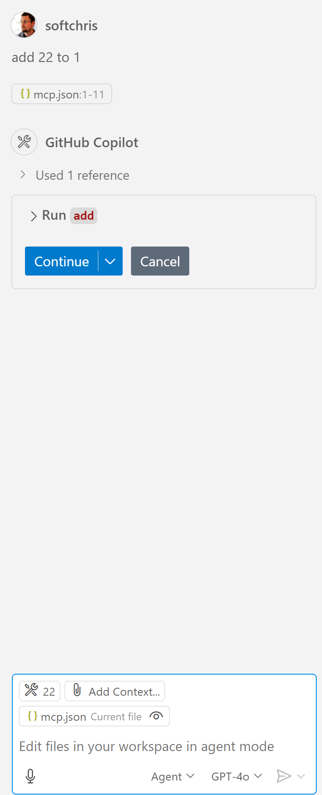

# Running the sample

Here we assume you already have a working server code. Please locate a server from one of the earlier chapters.

## Set up mcp.json

Here's a file you use for reference, [mcp.json](./mcp.json).

Change the server entry as needed to point out the absolute path to your server including the needed full command to run.

In the example file referred above the server entry looks like so:

<details>
<summary>node.js</summary>
```json
"hello-mcp": {
    "command": "node",
    "args": [
        "build/index.js"
    ]
}
```
</details>

<details>
<summary>.NET</summary>

You might have to enter the GitHub repository root, which can be fetched from the command, `git rev-parse --show-toplevel`.

```jsonc
{
  "inputs": [
    {
      "type": "promptString",
      "id": "repository-root",
      "description": "The absolute path to the repository root"
    }
  ],
  "servers": {
    "calculator-mcp-dotnet": {
      "type": "stdio",
      "command": "dotnet",
      "args": [
        "run",
        "--project",
        "${input:repository-root}/03-GettingStarted/02-client/solution/server/server.csproj"
      ]
    }
  }
}
```

</details>

This corresponds to running a command like so: `node build/index.js`.

- Change this server entry to fit where your server file is located or to what's needed to startup your server depending on your chosen runtime and server location.

## Consume the features in the server

- Click the `play` icon, once you've added *mcp.json* to *./vscode* folder,

    Observe the tooling icon change to increase the number of available tools. Tooling icon is located right above the chat field in GitHub Copilot.

## Run a tool

- Type a prompt in your chat window that matches the description of your tool. For example to trigger the tool `add` type something like "add 3 to 20".

    You should see a tool being presented above the chat text box indicating for you to select to run the tool like in this visual:

    

    Selecting the tool should produce a numeric result saying "23" if your prompt was like we mentioned previously.
