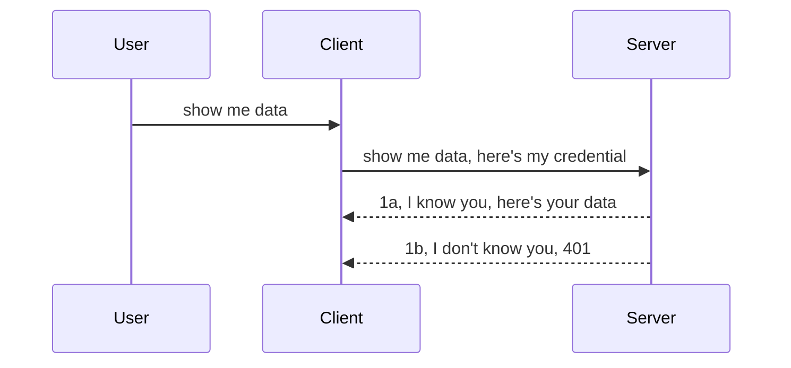

# Simple auth

MCP SDKs support the use of OAuth 2.1 which to be fair is a pretty involved process involving concepts like auth server, resource server, posting credentials, getting a code, exhanging the code for a bearer token until you can finally get your resource data. If you're unused to OAuth which is a great thing to implement, it's a good idea to start with some basic level of auth and build up to better and better security. That's why this chapter exist, to build you up to more advanced auth.

## Auth, what do we mean?

Auth is short for authentication and authorization. The idea is that we need to do two things:

- **Authentication**, which is the process of figuring out whether we let a person enter our house, that they have the right to be "here" that is have access to our resource server where our MCP Server features live.
- **Authorization**, is the process of finding out if a user should have access to these specific resources they're asking for, for example these orders or these products or whether they're allowed to read the content but not delete as another example.

## Credentials: how we tell the system who we are

Well, most web developers out there start thinking in terms of providing a credential to the server, usually a secret that says if they're allowed to be here "Authentication". This credential is usually a base64 encoded version of username and password or an API key that uniquely identifies a specific user. 

This involves sending it via a header called "Authorization" like so:

```json
{ "Authorization": "secret123" }
```

This is usually referred to as basic authentication. How the overall flow then works is in the following way:



Now that we understand how it works from a flow standpoint, how do we implement it? Well, most web servers have a concept called middleware, a piece of code that runs as part of the request that can verify credentials, and if credentials are valid can let the request pass through. If the request doesn't have valid credentials then you get an auth error. Let's see how this can be implemented:

**Python**

```python
class AuthMiddleware(BaseHTTPMiddleware):
    async def dispatch(self, request, call_next):

        has_header = request.headers.get("Authorization")
        if not has_header:
            print("-> Missing Authorization header!")
            return Response(status_code=401, content="Unauthorized")

        if not valid_token(has_header):
            print("-> Invalid token!")
            return Response(status_code=403, content="Forbidden")

        print("Valid token, proceeding...")
       
        response = await call_next(request)
        # add any customer headers or change in the response in some way
        return response


starlette_app.add_middleware(CustomHeaderMiddleware)
```

Here we have: 

- Created a middleware called `AuthMiddleware` where its `dispatch` method is being invoked by the web server. 
- Added the middleware to the web server:

    ```python
    starlette_app.add_middleware(AuthMiddleware)
    ```

- Written validation logic that checks if Authorization header is present and if the secret being sent is valid:

    ```python
    has_header = request.headers.get("Authorization")
    if not has_header:
        print("-> Missing Authorization header!")
        return Response(status_code=401, content="Unauthorized")

    if not valid_token(has_header):
        print("-> Invalid token!")
        return Response(status_code=403, content="Forbidden")
    ```

    if the secret is present and valid then we let the request pass through by calling `call_next` and return the response.

    ```python
    response = await call_next(request)
    # add any customer headers or change in the response in some way
    return response
    ```

How it works is that if a web request are made towards the server the middleware will be invoked and given its implementation it will either let the request pass through or end up returning an error that indicates the client isn't allowed to proceed.

**TypeScript**

Here we create a middleware with the popular framework Express and intercept the request before it reaches the MCP Server. Here's the code for that:

```typescript
function isValid(secret) {
    return secret === "secret123";
}

app.use((req, res, next) => {
    // 1. Authorization header present?  
    if(!req.headers["Authorization"]) {
        res.status(401).send('Unauthorized');
    }
    
    let token = req.headers["Authorization"];

    // 2. Check validity.
    if(!isValid(token)) {
        res.status(403).send('Forbidden');
    }

   
    console.log('Middleware executed');
    // 3. Passes request to the next step in the request pipeline.
    next();
});
```

In this code we:

1. Check if the Authorization header is present in the first place, if not, we send a 401 error.
2. Ensure the credential/token is valid, if not, we send a 403 error.
3. Finally passes on the request in the request pipeline and returns the asked for resource.

## Exercise: Implement authentication

Lets take our knowledge and try implementing it. Here's the plan:

Server

- Create a web server and MCP instance.
- Implement a middleware for the server.

Client 

- Send web request, with credential, via header.

### -1- Create a web server and MCP instance

In our first step, we need to create the web server instance and the MCP Server.

**Python**

Here we create an MCP server instance, create a starlette web app and host it with uvicorn.

```python
# creating MCP Server

app = FastMCP(
    name="MCP Resource Server",
    instructions="Resource Server that validates tokens via Authorization Server introspection",
    host=settings["host"],
    port=settings["port"],
    debug=True
)

# creating starlette web app
starlette_app = app.streamable_http_app()

# serving app via uvicorn
async def run(starlette_app):
    import uvicorn
    config = uvicorn.Config(
            starlette_app,
            host=app.settings.host,
            port=app.settings.port,
            log_level=app.settings.log_level.lower(),
        )
    server = uvicorn.Server(config)
    await server.serve()

run(starlette_app)
```

In this code we:

- Create the MCP Server.
- Construct the the starlette web app from the MCP Server, `app.streamable_http_app()`.
- Host and server the web app using uvicorn `server.serve()`.

**TypeScript**

Here we create an MCP Server instance.

```typescript
const server = new McpServer({
      name: "example-server",
      version: "1.0.0"
    });

    // ... set up server resources, tools, and prompts ...
```

This MCP Server creation will need to happen within our POST /mcp route definition, so let's take th above code and move it like so:

```typescript
import express from "express";
import { randomUUID } from "node:crypto";
import { McpServer } from "@modelcontextprotocol/sdk/server/mcp.js";
import { StreamableHTTPServerTransport } from "@modelcontextprotocol/sdk/server/streamableHttp.js";
import { isInitializeRequest } from "@modelcontextprotocol/sdk/types.js"

const app = express();
app.use(express.json());

// Map to store transports by session ID
const transports: { [sessionId: string]: StreamableHTTPServerTransport } = {};

// Handle POST requests for client-to-server communication
app.post('/mcp', async (req, res) => {
  // Check for existing session ID
  const sessionId = req.headers['mcp-session-id'] as string | undefined;
  let transport: StreamableHTTPServerTransport;

  if (sessionId && transports[sessionId]) {
    // Reuse existing transport
    transport = transports[sessionId];
  } else if (!sessionId && isInitializeRequest(req.body)) {
    // New initialization request
    transport = new StreamableHTTPServerTransport({
      sessionIdGenerator: () => randomUUID(),
      onsessioninitialized: (sessionId) => {
        // Store the transport by session ID
        transports[sessionId] = transport;
      },
      // DNS rebinding protection is disabled by default for backwards compatibility. If you are running this server
      // locally, make sure to set:
      // enableDnsRebindingProtection: true,
      // allowedHosts: ['127.0.0.1'],
    });

    // Clean up transport when closed
    transport.onclose = () => {
      if (transport.sessionId) {
        delete transports[transport.sessionId];
      }
    };
    const server = new McpServer({
      name: "example-server",
      version: "1.0.0"
    });

    // ... set up server resources, tools, and prompts ...

    // Connect to the MCP server
    await server.connect(transport);
  } else {
    // Invalid request
    res.status(400).json({
      jsonrpc: '2.0',
      error: {
        code: -32000,
        message: 'Bad Request: No valid session ID provided',
      },
      id: null,
    });
    return;
  }

  // Handle the request
  await transport.handleRequest(req, res, req.body);
});

// Reusable handler for GET and DELETE requests
const handleSessionRequest = async (req: express.Request, res: express.Response) => {
  const sessionId = req.headers['mcp-session-id'] as string | undefined;
  if (!sessionId || !transports[sessionId]) {
    res.status(400).send('Invalid or missing session ID');
    return;
  }
  
  const transport = transports[sessionId];
  await transport.handleRequest(req, res);
};

// Handle GET requests for server-to-client notifications via SSE
app.get('/mcp', handleSessionRequest);

// Handle DELETE requests for session termination
app.delete('/mcp', handleSessionRequest);

app.listen(3000);
```

Now you see how the MCP Server creation was moved within `app.post("/mcp")`.

Let's move on to the next step of creating the middleware so we can validate the incoming credential.

### -2- Implement a middleware for the server

Let's get to the middleware portion next. Here we will create a middleware that looks for a credential in the `Authorization` header and validate it. If it's acceptable then the request will move on to do what it needs (e.g list tools, read a resource or whatever MCP functionality the client was asking for).

**Python**

To create the middleware, we need to create a class that inherits from `BaseHTTPMiddleware`. There's two interesting pieces:

- The request `request` , that we read the header info from.
- `call_next` the callback we need to invoke if the client have brought a credential we accept.

First, we need to handle the case if the `Authorization` header is missing:

```python
has_header = request.headers.get("Authorization")

# no header present, fail with 401, otherwise move on.
if not has_header:
    print("-> Missing Authorization header!")
    return Response(status_code=401, content="Unauthorized")
```

Here we send a 401 unauthorized message as the client is failing authentication.

Next, if a credential was submitted, we need to check its validity like so:

```python
 if not valid_token(has_header):
    print("-> Invalid token!")
    return Response(status_code=403, content="Forbidden")
```

Note how we send a 403 forbidden message above. Let's see the full middleware below implementing everything we mentioned above:

```python
class AuthMiddleware(BaseHTTPMiddleware):
    async def dispatch(self, request, call_next):

        has_header = request.headers.get("Authorization")
        if not has_header:
            print("-> Missing Authorization header!")
            return Response(status_code=401, content="Unauthorized")

        if not valid_token(has_header):
            print("-> Invalid token!")
            return Response(status_code=403, content="Forbidden")

        print("Valid token, proceeding...")
        print(f"-> Received {request.method} {request.url}")
        response = await call_next(request)
        response.headers['Custom'] = 'Example'
        return response

```

Great, but what about `valid_token` function? Here it is below:
:

```python
# DON'T use for production - improve it !!
def valid_token(token: str) -> bool:
    # remove the "Bearer " prefix
    if token.startswith("Bearer "):
        token = token[7:]
        return token == "secret-token"
    return False
```

This should obviously improve. 

IMPORTANT: You should NEVER have secrets like this in code. You should ideally retrieve the value to compare with from a data source or from an IDP (identity service provider) or better yet, let the IDP do the validation.

**TypeScript**

To implement this with Express, we need to call the `use` method that takes middleware functions.

We need to:

- Interact with the request variable to check the passed credential in the `Authorization` property.
- Validate the credential, and if so let the request continue and have the client's MCP request do what it should (e.g list tools, read resource or anything other MCP related).

Here, we're checking if the `Authorization` header is present and if not, we stop the request from going through:

```typescript
if(!req.headers["authorization"]) {
    res.status(401).send('Unauthorized');
    return;
}
```

If the header isn't sent in the first place, you receive a 401.

Next, we check if the credential is valid, if not we again stop the request but with a slightly different message:

```typescript
if(!isValid(token)) {
    res.status(403).send('Forbidden');
    return;
} 
```

Note how you now get a 403 error.

Here's the full code:

```typescript
app.use((req, res, next) => {
    console.log('Request received:', req.method, req.url, req.headers);
    console.log('Headers:', req.headers["authorization"]);
    if(!req.headers["authorization"]) {
        res.status(401).send('Unauthorized');
        return;
    }
    
    let token = req.headers["authorization"];

    if(!isValid(token)) {
        res.status(403).send('Forbidden');
        return;
    }  

    console.log('Middleware executed');
    next();
});
```

We have set up the web server to accept a middleware to check the credential the client is hopefully sending us. What about the client itself?

### -3- Send web request with credential via header

We need to ensure the client is passing the credential through the header. As we're going to use an MCP client to do so, we need to figure out how that's done.

**Python**

For the client, we need to pass a header with our credential like so:

```python
# DON'T hardcode the value, have it at minimum in an environment variable or a more secure storage
token = "secret-token"

async with streamablehttp_client(
        url = f"http://localhost:{port}/mcp",
        headers = {"Authorization": f"Bearer {token}"}
    ) as (
        read_stream,
        write_stream,
        session_callback,
    ):
        async with ClientSession(
            read_stream,
            write_stream
        ) as session:
            await session.initialize()
      
            # TODO, what you want done in the client, e.g list tools, call tools etc.
```

Note how we populate the `headers` property like so ` headers = {"Authorization": f"Bearer {token}"}`.

**TypeScript**

We can solve this in two steps:

1. Populate a configuration object with our credential.
2. Pass the configuration object to the transport.

```typescript

// DON'T hardcode the value like shown here. At minimum have it as a env variable and use something like dotenv (in dev mode).
let token = "secret123"

// define a client transport option object
let options: StreamableHTTPClientTransportOptions = {
  sessionId: sessionId,
  requestInit: {
    headers: {
      "Authorization": "secret123"
    }
  }
};

// pass the options object to the transport
async function main() {
   const transport = new StreamableHTTPClientTransport(
      new URL(serverUrl),
      options
   );
```

Here you see above how we had to create an `options` object and place our headers under the `requestInit` property.

IMPORTANT: How do we improve it from here though? Well, the current implementation has some issues. First off, passing a credential like this is pretty risky unless you at minimum have HTTPS. Even then, the credential can be stolen so you need a system where you can easily revoke the token and add additional checks like where in the world is it coming from, does the request happen way too often (bot-like behavior), in short, there's a whole host of concerns. 

It should be said though, for very simple APIs where you don't want anyone calling your API without being authenticated and what we have here is a good start. 

With that said, let's try to harden the security a little bit by using a standardized format like JSON Web Token, also known as JWT or "JOT" tokens.

## JSON Web Tokens, JWT

So, we're trying to improve things from sending very simple credentials. What's the immediate improvements we get adopting JWT?

- **Security improvements**. In basic auth, you send the username and password as a base64 encoded token (or you send an API key) over and over which increase the risk. With JWT, you send your username and password and gets a token in return and it's also time bound meaning it will expire. JWT lets you easily use fine-grained access control using roles, scopes and permissions. 
- **Statelessness and scalability**. JWTs are self-contained, they carry all user info and eliminates the need to store server-side session storage. Token can also be validated locally.
- **Interoperability and federation**. JWTs is central of Open ID Connect and is used with known identity providers like Entra ID, Google Identity and Auth0. They also make it possible to use single sign on and much more making it enterprise-grade.
- **Modularity and flexibility**. JWTs can also be used with API Gateways like Azure API Management, NGINX and more. It also supports use authentication scenarios and server-to-service communication including impersonation and delegation scenarios.
- **Performance and caching**. JWTs can be cavhed after decoding which reduces the need for parsing. This helps specifically with high-traffic apps as it improves throughput and reduced load on your chosen infrastructure.
- **Advanced features**. It also supports introspection (checking validity on server) and revocation (making a token invalid).

With all of these benefits, let's see how we can take our implementation to the next level.

## Turning basic auth into JWT

So, the changes we need to at mile-high level is to:

- **Learn to construct a JWT token** and make it ready for being sent from client to server.
- **Validate a JWT token**, and if so, let the client have our resources.
- **Secure token storage**. How we store this token.
- **Protect the routes**. We need to protect the routes, in our case, we need to protect routes and specific MCP features.
- **Add refresh tokens**. Ensure we create tokens that are short-lived but refresh tokens that are long-lived that can be used to acquire new tokens if they expire. Also ensure there's a refresh endpoint and a rotation strategy.

### -1- Construct a JWT token

First off, a JWT token has the following parts:

- **header**, algorithm used and token type.
- **payload**, claimes, like sub (the user or entity the token represents. In an auth scenario this typically the userid), exp (when it expires) role (the role)
- **signature**, signed with a secret or private key.

For this, we will need to construct the header, payload and the encoded token.

**Python**

```python

import jwt
import jwt
from jwt.exceptions import ExpiredSignatureError, InvalidTokenError
import datetime

# Secret key used to sign the JWT
secret_key = 'your-secret-key'

header = {
    "alg": "HS256",
    "typ": "JWT"
}

# the user info andits claims and expiry time
payload = {
    "sub": "1234567890",               # Subject (user ID)
    "name": "User Userson",                # Custom claim
    "admin": True,                     # Custom claim
    "iat": datetime.datetime.utcnow(),# Issued at
    "exp": datetime.datetime.utcnow() + datetime.timedelta(hours=1)  # Expiry
}

# encode it
encoded_jwt = jwt.encode(payload, secret_key, algorithm="HS256", headers=header)
```

In the above code we've:

- Defined a header using HS256 as algorithm and type to be JWT.
- Constructed a payload that contains a subject or iser id, a username, a role, when it was issues and when it's set to expire thereby implementing the time bound aspect we mentioned earlier. 

**TypeScript**

Here we will need some dependencies that will help us construct the JWT token.

Dependencies

```sh

npm install jsonwebtoken
npm install --save-dev @types/jsonwebtoken
```

Now that we have that in place, let's create the header, payload and through that create the encoded token.

```typescript
import jwt from 'jsonwebtoken';

const secretKey = 'your-secret-key'; // Use env vars in production

// Define the payload
const payload = {
  sub: '1234567890',
  name: 'User usersson',
  admin: true,
  iat: Math.floor(Date.now() / 1000), // Issued at
  exp: Math.floor(Date.now() / 1000) + 60 * 60 // Expires in 1 hour
};

// Define the header (optional, jsonwebtoken sets defaults)
const header = {
  alg: 'HS256',
  typ: 'JWT'
};

// Create the token
const token = jwt.sign(payload, secretKey, {
  algorithm: 'HS256',
  header: header
});

console.log('JWT:', token);
```

This token is:

Signed using HS256
Valid for 1 hour
Includes claims like sub, name, admin, iat, and exp.

### -2- Validate a token

We will also need to validate a token, this is something we should do on the server to ensure what the client is sending us is in fact valid. There are many checks we should do here from validating its structure to its validity. You're also encouraged to add other checks to see if the user is in your system and more.

To validate a token, we need to decode it so we can read it and then start checking its validity:

**Python**

```python

# Decode and verify the JWT
try:
    decoded = jwt.decode(token, secret_key, algorithms=["HS256"])
    print("✅ Token is valid.")
    print("Decoded claims:")
    for key, value in decoded.items():
        print(f"  {key}: {value}")
except ExpiredSignatureError:
    print("❌ Token has expired.")
except InvalidTokenError as e:
    print(f"❌ Invalid token: {e}")

```

In this code, we call `jwt.decode` using the token, the secret key and the chosen algorithm as input. Note how we use a try-catch construct as a failed validation leads to an error being raised.

**TypeScript**

Here we need to call `jwt.verify` to get a decoded version of the token that we can analyze further. If this call fails, that means the structure of the token is incorrect or it's no longer valid. 

```typescript

try {
  const decoded = jwt.verify(token, secretKey);
  console.log('Decoded Payload:', decoded);
} catch (err) {
  console.error('Token verification failed:', err);
}
```

NOTE: as mentioned previously, we should perform additional checks to ensure this token points out a user in our system and ensure the user has the rights it claims to have.

Next, let's look into role based access control, also known as RBAC.

## Adding role based access control

The idea is that we want to express that different roles have different permissions. For example, we assume an admin can do everything and that a normal users can do read/write and that a guest can only read. Therefore, here are some possible permission levels:

- Admin.Write 
- User.Read
- Guest.Read

Let's look at how we can implement such a control with middleware. Middlewares can be added per route as well as for all routes.

**Python**

```python
from starlette.middleware.base import BaseHTTPMiddleware
from starlette.responses import JSONResponse
import jwt

# DON'T have the secret in the code like, this is for demonstration purposes only. Read it from a safe place.
SECRET_KEY = "your-secret-key" # put this in env variable
REQUIRED_PERMISSION = "User.Read"

class JWTPermissionMiddleware(BaseHTTPMiddleware):
    async def dispatch(self, request, call_next):
        auth_header = request.headers.get("Authorization")
        if not auth_header or not auth_header.startswith("Bearer "):
            return JSONResponse({"error": "Missing or invalid Authorization header"}, status_code=401)

        token = auth_header.split(" ")[1]
        try:
            decoded = jwt.decode(token, SECRET_KEY, algorithms=["HS256"])
        except jwt.ExpiredSignatureError:
            return JSONResponse({"error": "Token expired"}, status_code=401)
        except jwt.InvalidTokenError:
            return JSONResponse({"error": "Invalid token"}, status_code=401)

        permissions = decoded.get("permissions", [])
        if REQUIRED_PERMISSION not in permissions:
            return JSONResponse({"error": "Permission denied"}, status_code=403)

        request.state.user = decoded
        return await call_next(request)


```

There a few different ways to add the middleware like below:

```python

# Alt 1: add middleware while constructing starlette app
middleware = [
    Middleware(JWTPermissionMiddleware)
]

app = Starlette(routes=routes, middleware=middleware)

# Alt 2: add middleware after starlette app is a already constructed
starlette_app.add_middleware(JWTPermissionMiddleware)

# Alt 3: add middleware per route
routes = [
    Route(
        "/mcp",
        endpoint=..., # handler
        middleware=[Middleware(JWTPermissionMiddleware)]
    )
]
```

**TypeScript**

We can use `app.use` and a middleware that will run for all requests. 

```typescript
app.use((req, res, next) => {
    console.log('Request received:', req.method, req.url, req.headers);
    console.log('Headers:', req.headers["authorization"]);

    // 1. Check if authorization header has been sent

    if(!req.headers["authorization"]) {
        res.status(401).send('Unauthorized');
        return;
    }
    
    let token = req.headers["authorization"];

    // 2. Check if token is valid
    if(!isValid(token)) {
        res.status(403).send('Forbidden');
        return;
    }  

    // 3. Check if token user exist in our system
    if(!isExistingUser(token)) {
        res.status(403).send('Forbidden');
        console.log("User does not exist");
        return;
    }
    console.log("User exists");

    // 4. Verify the token has the right permissions
    if(!hasScopes(token, ["User.Read"])){
        res.status(403).send('Forbidden - insufficient scopes');
    }

    console.log("User has required scopes");

    console.log('Middleware executed');
    next();
});

```

There's quite a few things we can let our middleware and that our middleware SHOULD do, namely:

1. Check if authorization header is present
2. Check if token is valid, we call `isValid` which is a method we wrote that check integrity and validity of JWT token.
3. Verify the user exist in our system, we should check this.

   ```typescript
    // users in DB
   const users = [
     "user1",
     "User usersson",
   ]

   function isExistingUser(token) {
     let decodedToken = verifyToken(token);

     // TODO, check if user exists in DB
     return users.includes(decodedToken?.name || "");
   }
   ```

   Above, we've created a very simple `users` list, which should be in a database obviously.

4. Additionally, we should also check the token has the right permissions.

   ```typescript
   if(!hasScopes(token, ["User.Read"])){
        res.status(403).send('Forbidden - insufficient scopes');
   }
   ```

   In this code above from the middleware, we check that the token contains User.Read permission, if not we send a 403 error. Below is the `hasScopes` helper method.

   ```typescript
   function hasScopes(scope: string, requiredScopes: string[]) {
     let decodedToken = verifyToken(scope);
    return requiredScopes.every(scope => decodedToken?.scopes.includes(scope));
  }
   ```

Have a think which additional checks you should be doing, but these are the absolute minimum of checks you should be doing.

Using Express as a web framework is a common choice. There are helpers library when you use JWT so you can write less code.

- `express-jwt`, helper library that provides a middleware that helps decode your token.
- `express-jwt-permissions`, this provides a middleware `guard` that helps check if a certain permission is on the token.

Here's what these libraries can look like when used:

```typescript
const express = require('express');
const jwt = require('express-jwt');
const guard = require('express-jwt-permissions')();

const app = express();
const secretKey = 'your-secret-key'; // put this in env variable

// Decode JWT and attach to req.user
app.use(jwt({ secret: secretKey, algorithms: ['HS256'] }));

// Check for User.Read permission
app.use(guard.check('User.Read'));

// multiple permissions
// app.use(guard.check(['User.Read', 'Admin.Access']));

app.get('/protected', (req, res) => {
  res.json({ message: `Welcome ${req.user.name}` });
});

// Error handler
app.use((err, req, res, next) => {
  if (err.code === 'permission_denied') {
    return res.status(403).send('Forbidden');
  }
  next(err);
});

```

Now you have seen how middleware can be used for both authentication and authorization, what about MCP though, does it change how we do auth? Let's find out in the next section.

### -3- Add RBAC to MCP

You've seen so far how you can add RBAC via middleware, however, for MCP there's no easy way to add a per MCP feature RBAC, so what do we do? Well, we just have to add code like this that checks in this case whether the client has the rights to call a specific tool:

You have a few different choices on how to accomplish per feature RBAC, here are some:

- Add a check for each tool, resource, prompt where you need to check permission level.

   **python**

   ```python
   @tool()
   def delete_product(id: int):
      try:
          check_permissions(role="Admin.Write", request)
      catch:
        pass # client failed authorization, raise authorization error
   ```

   **typescript**

   ```typescript
   server.registerTool(
    "delete-product",
    {
      title: Delete a product",
      description: "Deletes a product",
      inputSchema: { id: z.number() }
    },
    async ({ id }) => {
      
      try {
        checkPermissions("Admin.Write", request);
        // todo, send id to productService and remote entry
      } catch(Exception e) {
        console.log("Authorization error, you're not allowed");  
      }

      return {
        content: [{ type: "text", text: `Deletected product with id ${id}` }]
      };
    }
   );
   ```


- Use advanced server approach and the request handlers so you minimize how many places you need to make the check.

   **Python**

   ```python
   
   tool_permission = {
      "create_product": ["User.Write", "Admin.Write"],
      "delete_product": ["Admin.Write"]
   }

   def has_permission(user_permissions, required_permissions) -> bool:
      # user_permissions: list of permissions the user has
      # required_permissions: list of permissions required for the tool
      return any(perm in user_permissions for perm in required_permissions)

   @server.call_tool()
   async def handle_call_tool(
     name: str, arguments: dict[str, str] | None
   ) -> list[types.TextContent]:
    # Assume request.user.permissions is a list of permissions for the user
     user_permissions = request.user.permissions
     required_permissions = tool_permission.get(name, [])
     if not has_permission(user_permissions, required_permissions):
        # Raise error "You don't have permission to call tool {name}"
        raise Exception(f"You don't have permission to call tool {name}")
     # carry on and call tool
     # ...
   ```   
   

   **TypeScript**

   ```typescript
   function hasPermission(userPermissions: string[], requiredPermissions: string[]): boolean {
       if (!Array.isArray(userPermissions) || !Array.isArray(requiredPermissions)) return false;
       // Return true if user has at least one required permission
       
       return requiredPermissions.some(perm => userPermissions.includes(perm));
   }
  
   server.setRequestHandler(CallToolRequestSchema, async (request) => {
      const { params: { name } } = request;
  
      let permissions = request.user.permissions;
  
      if (!hasPermission(permissions, toolPermissions[name])) {
         return new Error(`You don't have permission to call ${name}`);
      }
  
      // carry on..
   });
   ```

   Note, you will need to ensure your middleware assigns a decoded token to the request's user property so the code above is made simple.

### Summing up

Now that we discussed how to add support for RBAC in general and for MCP in particular, it's time to try to implement security on your own to ensure you understood the concepts presented to you.

## Assignment 1: Build an mcp server and mcp client using basic authentication

Here you will take what you've learnt in terms of sending credentials through headers.

## Solution 1

[Solution 1](./code/basic/README.md)

## Assignment 2: Upgrade the solution from Assignment 1 to use JWT

Take the first solution but this time, let's improve upon it. 

Instead of using Basic Auth, let's use JWT. 

## Solution 2

[Solution 2](./solution/jwt-solution/README.md)

## Challenge

Add the RBAC per tool that we describe in section "Add RBAC to MCP".

## Summary

You've hopefully learned a lot in this chapter, from no security at all, to basic security, to JWT and how it can be added to MCP.

We’ve built a solid foundation with custom JWTs, but as we scale, we’re moving toward a standards-based identity model. Adopting an IdP like Entra or Keycloak lets us offload token issuance, validation, and lifecycle management to a trusted platform — freeing us to focus on app logic and user experience.

For that, we have a more [advanced chapter on Entra](../../05-AdvancedTopics/mcp-security-entra/README.md)
