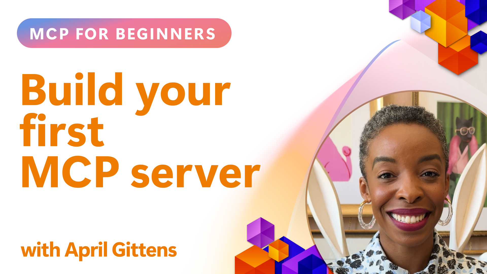

## Getting Started  

_(Click the image above to view video of this lesson)_

This section consists of several lessons:

- **1 Your first server**, in this first lesson, you will learn how to create your first server and inspect it with the inspector tool, a valuable way to test and debug your server, [to the lesson](01-first-server/README.md)

- **2 Client**, in this lesson, you will learn how to write a client that can connect to your server, [to the lesson](02-client/README.md)

- **3 Client with LLM**, an even better way of writing a client is by adding an LLM to it so it can "negotiate" with your server on what to do, [to the lesson](03-llm-client/README.md)

- **4 Consuming a server GitHub Copilot Agent mode in Visual Studio Code**. Here, we're looking at running our MCP Server from within Visual Studio Code, [to the lesson](04-vscode/README.md)

- **5 stdio Transport Server** stdio transport is the recommended standard for MCP server-to-client communication in the current specification, providing secure subprocess-based communication [to the lesson](05-stdio-server/README.md)

- **6 HTTP Streaming with MCP (Streamable HTTP)**. Learn about modern HTTP streaming, progress notifications, and how to implement scalable, real-time MCP servers and clients using Streamable HTTP. [to the lesson](06-http-streaming/README.md)

- **7 Utilising AI Toolkit for VSCode** to consume and test your MCP Clients and Servers [to the lesson](07-aitk/README.md)

- **8 Testing**. Here we will focus especially how we can test out our server and client in different ways, [to the lesson](08-testing/README.md)

- **9 Deployment**. This chapter will look at different ways of deploying your MCP solutions, [to the lesson](09-deployment/README.md)

- **10 Advanced server usage**. This chapter covers advanced server usage, [to the lesson](./10-advanced/README.md)

- **11 Auth**. This chapter covers how to add simple auth, from Basic Auth to using JWT and RBAC. You're encouraged to start here and then look at Advanced Topics in Chapter 5 and perform additional security hardening via recommendations in Chapter 2, [to the lesson](./11-simple-auth/README.md)

The Model Context Protocol (MCP) is an open protocol that standardizes how applications provide context to LLMs. Think of MCP like a USB-C port for AI applications - it provides a standardized way to connect AI models to different data sources and tools.

## Learning Objectives

By the end of this lesson, you will be able to:

- Set up development environments for MCP in C#, Java, Python, TypeScript, and JavaScript
- Build and deploy basic MCP servers with custom features (resources, prompts, and tools)
- Create host applications that connect to MCP servers
- Test and debug MCP implementations
- Understand common setup challenges and their solutions
- Connect your MCP implementations to popular LLM services

## Setting Up Your MCP Environment

Before you begin working with MCP, it's important to prepare your development environment and understand the basic workflow. This section will guide you through the initial setup steps to ensure a smooth start with MCP.

### Prerequisites

Before diving into MCP development, ensure you have:

- **Development Environment**: For your chosen language (C#, Java, Python, TypeScript, or JavaScript)
- **IDE/Editor**: Visual Studio, Visual Studio Code, IntelliJ, Eclipse, PyCharm, or any modern code editor
- **Package Managers**: NuGet, Maven/Gradle, pip, or npm/yarn
- **API Keys**: For any AI services you plan to use in your host applications

### Official SDKs

In the upcoming chapters you will see solutions built using Python, TypeScript, Java and .NET. Here are all the officially supported SDKs.

MCP provides official SDKs for multiple languages:
- [C# SDK](https://github.com/modelcontextprotocol/csharp-sdk) - Maintained in collaboration with Microsoft
- [Java SDK](https://github.com/modelcontextprotocol/java-sdk) - Maintained in collaboration with Spring AI
- [TypeScript SDK](https://github.com/modelcontextprotocol/typescript-sdk) - The official TypeScript implementation
- [Python SDK](https://github.com/modelcontextprotocol/python-sdk) - The official Python implementation
- [Kotlin SDK](https://github.com/modelcontextprotocol/kotlin-sdk) - The official Kotlin implementation
- [Swift SDK](https://github.com/modelcontextprotocol/swift-sdk) - Maintained in collaboration with Loopwork AI
- [Rust SDK](https://github.com/modelcontextprotocol/rust-sdk) - The official Rust implementation

## Key Takeaways

- Setting up an MCP development environment is straightforward with language-specific SDKs
- Building MCP servers involves creating and registering tools with clear schemas
- MCP clients connect to servers and models to leverage extended capabilities
- Testing and debugging are essential for reliable MCP implementations
- Deployment options range from local development to cloud-based solutions

## Practicing

We have a set of samples that complements the exercises you will see in all chapters in this section. Additionally each chapter also has their own exercises and assignments

- [Java Calculator](./samples/java/calculator/README.md)
- [.Net Calculator](./samples/csharp/)
- [JavaScript Calculator](./samples/javascript/README.md)
- [TypeScript Calculator](./samples/typescript/README.md)
- [Python Calculator](./samples/python/)

## Additional Resources

- [Build Agents using Model Context Protocol on Azure](https://learn.microsoft.com/azure/developer/ai/intro-agents-mcp)
- [Remote MCP with Azure Container Apps (Node.js/TypeScript/JavaScript)](https://learn.microsoft.com/samples/azure-samples/mcp-container-ts/mcp-container-ts/)
- [.NET OpenAI MCP Agent](https://learn.microsoft.com/samples/azure-samples/openai-mcp-agent-dotnet/openai-mcp-agent-dotnet/)

## What's next

Next: [Creating your first MCP Server](01-first-server/README.md)
