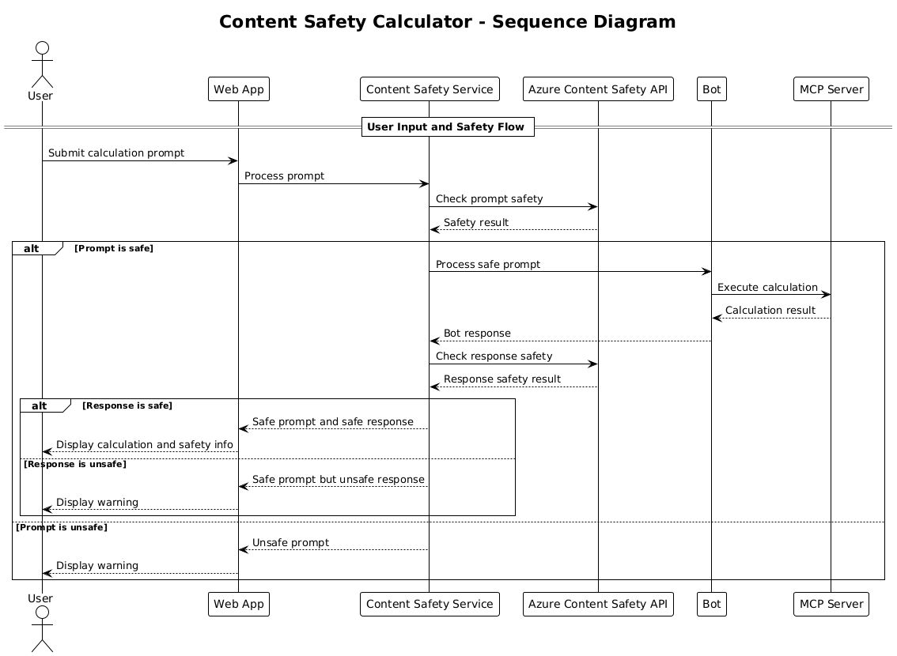

## System Architecture

This project demonstrates a web application that uses content safety checking before passing user prompts to a calculator service via Model Context Protocol (MCP).



### How It Works

1. **User Input**: The user enters a calculation prompt in the web interface
2. **Content Safety Screening (Input)**: The prompt is analyzed by Azure Content Safety API
3. **Safety Decision (Input)**:
   - If the content is safe (severity < 2 in all categories), it proceeds to the calculator
   - If the content is flagged as potentially harmful, the process stops and returns a warning
4. **Calculator Integration**: Safe content is processed by LangChain4j, which communicates with the MCP calculator server
5. **Content Safety Screening (Output)**: The bot's response is analyzed by Azure Content Safety API
6. **Safety Decision (Output)**:
   - If the bot response is safe, it's shown to the user
   - If the bot response is flagged as potentially harmful, it's replaced with a warning
7. **Response**: Results (if safe) are displayed to the user along with both safety analyses

## Using Model Context Protocol (MCP) with Calculator Services

This project demonstrates how to use Model Context Protocol (MCP) to call calculator MCP services from LangChain4j. The implementation uses a local MCP server running on port 8080 to provide calculator operations.

### Setting up Azure Content Safety Service

Before using the content safety features, you need to create an Azure Content Safety service resource:

1. Sign in to the [Azure Portal](https://portal.azure.com)
2. Click "Create a resource" and search for "Content Safety"
3. Select "Content Safety" and click "Create"
4. Enter a unique name for your resource
5. Select your subscription and resource group (or create a new one)
6. Choose a supported region (check [Region availability](https://azure.microsoft.com/en-us/global-infrastructure/services/?products=cognitive-services) for details)
7. Select an appropriate pricing tier
8. Click "Create" to deploy the resource
9. Once deployment is complete, click "Go to resource"
10. In the left pane, under "Resource Management", select "Keys and Endpoint"
11. Copy either of the keys and the endpoint URL for use in the next step

### Configuring Environment Variables

Set the `GITHUB_TOKEN` environment variable for GitHub models authentication:
```sh
export GITHUB_TOKEN=<your_github_token>
```

For content safety features, set:
```sh
export CONTENT_SAFETY_ENDPOINT=<your_content_safety_endpoint>
export CONTENT_SAFETY_KEY=<your_content_safety_key>
```

These environment variables are used by the application to authenticate with the Azure Content Safety service. If these variables are not set, the application will use placeholder values for demonstration purposes, but the content safety features will not work properly.

### Starting the Calculator MCP Server

Before running the client, you need to start the calculator MCP server in SSE mode on localhost:8080.

## Project Description

This project demonstrates the integration of Model Context Protocol (MCP) with LangChain4j to call calculator services. Key features include:

- Using MCP to connect to a calculator service for basic math operations
- Dual-layer content safety checking on both user prompts and bot responses
- Integration with GitHub's gpt-4.1-nano model via LangChain4j
- Using Server-Sent Events (SSE) for MCP transport

## Content Safety Integration

The project includes comprehensive content safety features to ensure that both user inputs and system responses are free from harmful content:

1. **Input Screening**: All user prompts are analyzed for harmful content categories such as hate speech, violence, self-harm, and sexual content before processing.

2. **Output Screening**: Even when using potentially uncensored models, the system checks all generated responses through the same content safety filters before displaying them to the user.

This dual-layer approach ensures that the system remains safe regardless of which AI model is being used, protecting users from both harmful inputs and potentially problematic AI-generated outputs.

## Web Client

The application includes a user-friendly web interface that allows users to interact with the Content Safety Calculator system:

### Web Interface Features

- Simple, intuitive form for entering calculation prompts
- Dual-layer content safety validation (input and output)
- Real-time feedback on prompt and response safety
- Color-coded safety indicators for easy interpretation
- Clean, responsive design that works on various devices
- Example safe prompts to guide users

### Using the Web Client

1. Start the application:
   ```sh
   mvn spring-boot:run
   ```

2. Open your browser and navigate to `http://localhost:8087`

3. Enter a calculation prompt in the provided text area (e.g., "Calculate the sum of 24.5 and 17.3")

4. Click "Submit" to process your request

5. View the results, which will include:
   - Content safety analysis of your prompt
   - The calculated result (if prompt was safe)
   - Content safety analysis of the bot's response
   - Any safety warnings if either the input or output was flagged

The web client automatically handles both content safety verification processes, ensuring all interactions are safe and appropriate regardless of which AI model is being used.
