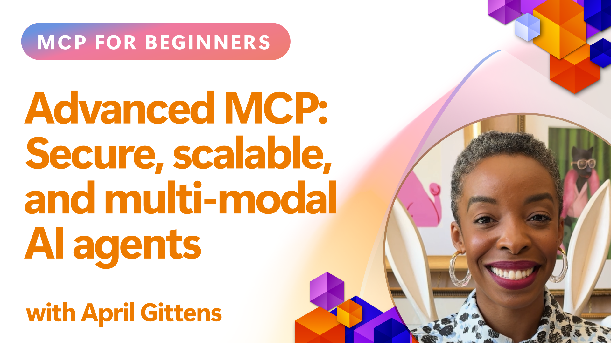

# Advanced Topics in MCP

_(Click the image above to view video of this lesson)_

This chapter covers a series of advanced topics in Model Context Protocol (MCP) implementation, including multi-modal integration, scalability, security best practices, and enterprise integration. These topics are crucial for building robust and production-ready MCP applications that can meet the demands of modern AI systems.

## Overview

This lesson explores advanced concepts in Model Context Protocol implementation, focusing on multi-modal integration, scalability, security best practices, and enterprise integration. These topics are essential for building production-grade MCP applications that can handle complex requirements in enterprise environments.

## Learning Objectives

By the end of this lesson, you will be able to:

- Implement multi-modal capabilities within MCP frameworks
- Design scalable MCP architectures for high-demand scenarios
- Apply security best practices aligned with MCP's security principles
- Integrate MCP with enterprise AI systems and frameworks
- Optimize performance and reliability in production environments

## Lessons and sample Projects

| Link | Title | Description |
|------|-------|-------------|
| [5.1 Integration with Azure](./mcp-integration/README.md) | Integrate with Azure | Learn how to integrate your MCP Server on Azure |
| [5.2 Multi modal sample](./mcp-multi-modality/README.md) | MCP Multi modal samples  | Samples for audio, image and multi modal response |
| [5.3 MCP OAuth2 sample](./mcp-oauth2-demo/) | MCP OAuth2 Demo | Minimal Spring Boot app showing OAuth2 with MCP, both as Authorization and Resource Server. Demonstrates secure token issuance, protected endpoints, Azure Container Apps deployment, and API Management integration. |
| [5.4 Root Contexts](./mcp-root-contexts/README.md) | Root contexts  | Learn more about root context and how to implement them |
| [5.5 Routing](./mcp-routing/README.md) | Routing | Learn different types of routing |
| [5.6 Sampling](./mcp-sampling/README.md) | Sampling | Learn how to work with sampling |
| [5.7 Scaling](./mcp-scaling/README.md) | Scaling  | Learn about scaling |
| [5.8 Security](./mcp-security/README.md) | Security  | Secure your MCP Server |
| [5.9 Web Search sample](./web-search-mcp/README.md) | Web Search MCP | Python MCP server and client integrating with SerpAPI for real-time web, news, product search, and Q&A. Demonstrates multi-tool orchestration, external API integration, and robust error handling. |
| [5.10 Realtime Streaming](./mcp-realtimestreaming/README.md) | Streaming  | Real-time data streaming has become essential in today's data-driven world, where businesses and applications require immediate access to information to make timely decisions.|
| [5.11 Realtime Web Search](./mcp-realtimesearch/README.md) | Web Search | Real-time web search how MCP transforms real-time web search by providing a standardized approach to context management across AI models, search engines, and applications.| 
| [5.12  Entra ID Authentication for Model Context Protocol Servers](./mcp-security-entra/README.md) | Entra ID Authentication | Microsoft Entra ID provides a robust cloud-based identity and access management solution, helping ensure that only authorized users and applications can interact with your MCP server.|
| [5.13 Azure AI Foundry Agent Integration](./mcp-foundry-agent-integration/README.md) | Azure AI Foundry Integration | Learn how to integrate Model Context Protocol servers with Azure AI Foundry agents, enabling powerful tool orchestration and enterprise AI capabilities with standardized external data source connections.|
| [5.14 Context Engineering](./mcp-contextengineering/README.md) | Context Engineering | The future opportunity of context engineering techniques for MCP servers, including context optimization, dynamic context management, and strategies for effective prompt engineering within MCP frameworks.|

## Additional References

For the most up-to-date information on advanced MCP topics, refer to:
- [MCP Documentation](https://modelcontextprotocol.io/)
- [MCP Specification](https://spec.modelcontextprotocol.io/)
- [GitHub Repository](https://github.com/modelcontextprotocol)

## Key Takeaways

- Multi-modal MCP implementations extend AI capabilities beyond text processing
- Scalability is essential for enterprise deployments and can be addressed through horizontal and vertical scaling
- Comprehensive security measures protect data and ensure proper access control
- Enterprise integration with platforms like Azure OpenAI and Microsoft AI Foundry enhances MCP capabilities
- Advanced MCP implementations benefit from optimized architectures and careful resource management

## Exercise

Design an enterprise-grade MCP implementation for a specific use case:

1. Identify multi-modal requirements for your use case
2. Outline the security controls needed to protect sensitive data
3. Design a scalable architecture that can handle varying load
4. Plan integration points with enterprise AI systems
5. Document potential performance bottlenecks and mitigation strategies

## Additional Resources

- [Azure OpenAI Documentation](https://learn.microsoft.com/en-us/azure/ai-services/openai/)
- [Microsoft AI Foundry Documentation](https://learn.microsoft.com/en-us/ai-services/)

---

## What's next

- [5.1 MCP Integration](./mcp-integration/README.md)
