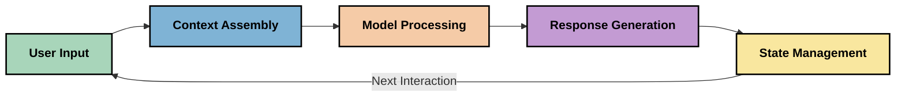
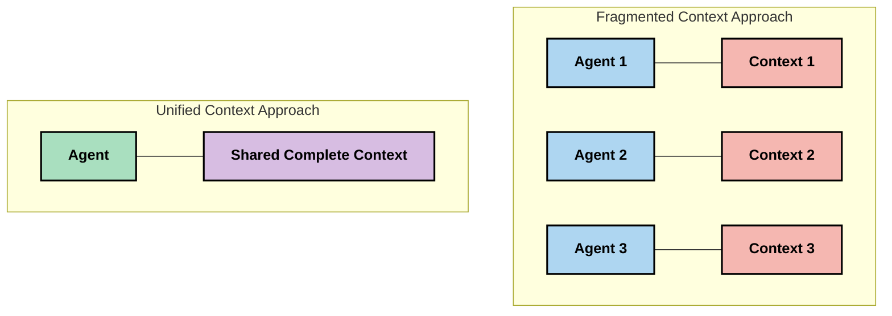
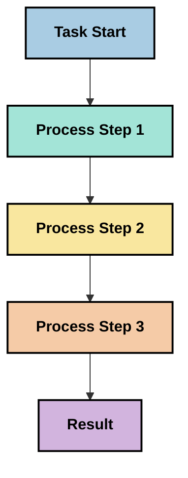
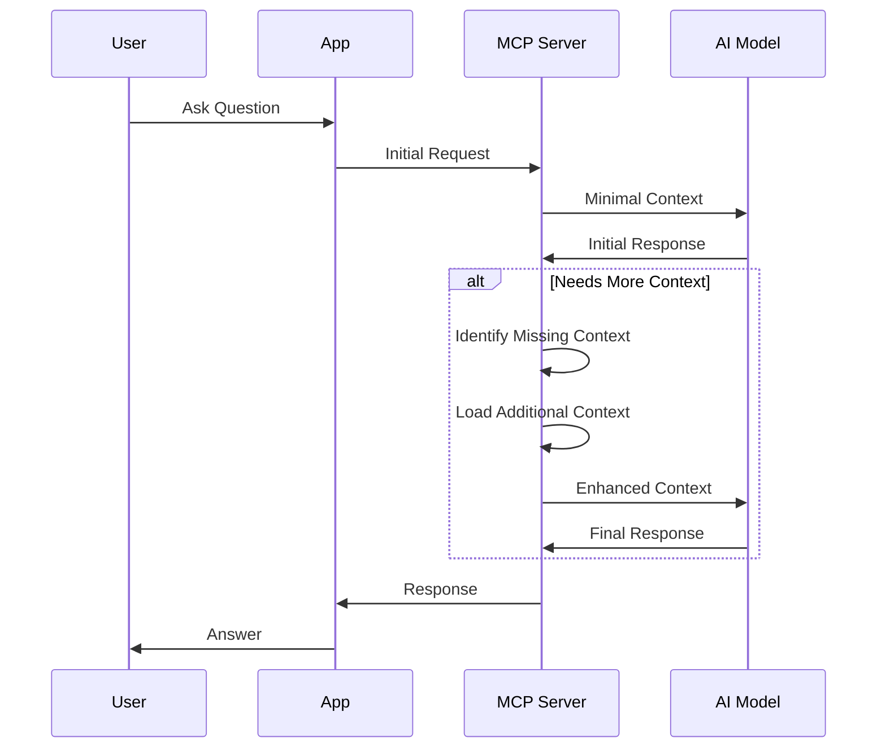
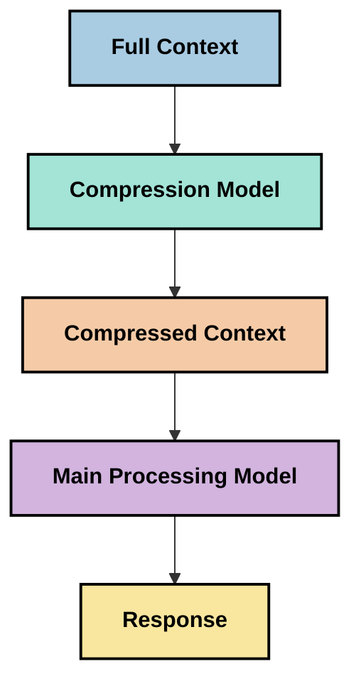
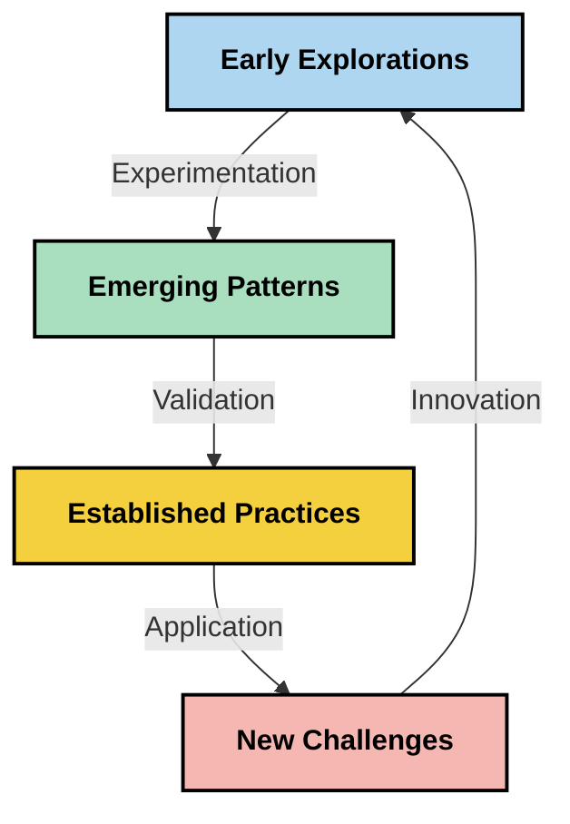

# Context Engineering: An Emerging Concept in the MCP Ecosystem

## Overview

Context engineering is an emerging concept in the AI space that explores how information is structured, delivered, and maintained throughout interactions between clients and AI services. As the Model Context Protocol (MCP) ecosystem evolves, understanding how to effectively manage context becomes increasingly important. This module introduces the concept of context engineering and explores its potential applications in MCP implementations.

## Learning Objectives

By the end of this module, you will be able to:

- Understand the emerging concept of context engineering and its potential role in MCP applications
- Identify key challenges in context management that the MCP protocol design addresses
- Explore techniques for improving model performance through better context handling
- Consider approaches to measure and evaluate context effectiveness
- Apply these emerging concepts to improve AI experiences through the MCP framework

## Introduction to Context Engineering

Context engineering is an emerging concept focused on the deliberate design and management of information flow between users, applications, and AI models. Unlike established fields such as prompt engineering, context engineering is still being defined by practitioners as they work to solve the unique challenges of providing AI models with the right information at the right time.

As large language models (LLMs) have evolved, the importance of context has become increasingly apparent. The quality, relevance, and structure of the context we provide directly impacts model outputs. Context engineering explores this relationship and seeks to develop principles for effective context management.

> "In 2025, the models out there are extremely intelligent. But even the smartest human won't be able to do their job effectively without the context of what they're being asked to do... 'Context engineering' is the next level of prompt engineering. It is about doing this automatically in a dynamic system." — Walden Yan, Cognition AI

Context engineering might encompass:

1. **Context Selection**: Determining what information is relevant for a given task
2. **Context Structuring**: Organizing information to maximize model comprehension
3. **Context Delivery**: Optimizing how and when information is sent to models
4. **Context Maintenance**: Managing state and evolution of context over time
5. **Context Evaluation**: Measuring and improving the effectiveness of context

These areas of focus are particularly relevant to the MCP ecosystem, which provides a standardized way for applications to provide context to LLMs.


## The Context Journey Perspective

One way to visualize context engineering is to trace the journey information takes through an MCP system:



### Key Stages in the Context Journey:

1. **User Input**: Raw information from the user (text, images, documents)
2. **Context Assembly**: Combining user input with system context, conversation history, and other retrieved information
3. **Model Processing**: The AI model processes the assembled context
4. **Response Generation**: The model produces outputs based on the provided context
5. **State Management**: The system updates its internal state based on the interaction

This perspective highlights the dynamic nature of context in AI systems and raises important questions about how to best manage information at each stage.

## Emerging Principles in Context Engineering

As the field of context engineering takes shape, some early principles are beginning to emerge from practitioners. These principles may help inform MCP implementation choices:

### Principle 1: Share Context Completely

Context should be shared completely between all components of a system rather than fragmented across multiple agents or processes. When context is distributed, decisions made in one part of the system may conflict with those made elsewhere.



In MCP applications, this suggests designing systems where context flows seamlessly through the entire pipeline rather than being compartmentalized.

### Principle 2: Recognize That Actions Carry Implicit Decisions

Each action a model takes embodies implicit decisions about how to interpret the context. When multiple components act on different contexts, these implicit decisions can conflict, leading to inconsistent outcomes.

This principle has important implications for MCP applications:
- Prefer linear processing of complex tasks over parallel execution with fragmented context
- Ensure that all decision points have access to the same contextual information
- Design systems where later steps can see the full context of earlier decisions

### Principle 3: Balance Context Depth with Window Limitations

As conversations and processes grow longer, context windows eventually overflow. Effective context engineering explores approaches to manage this tension between comprehensive context and technical limitations.

Potential approaches being explored include:
- Context compression that maintains essential information while reducing token usage
- Progressive loading of context based on relevance to current needs
- Summarization of previous interactions while preserving key decisions and facts

## Context Challenges and MCP Protocol Design

The Model Context Protocol (MCP) was designed with an awareness of the unique challenges of context management. Understanding these challenges helps explain key aspects of the MCP protocol design:


### Challenge 1: Context Window Limitations
Most AI models have fixed context window sizes, limiting how much information they can process at once.

**MCP Design Response:** 
- The protocol supports structured, resource-based context that can be referenced efficiently
- Resources can be paginated and loaded progressively

### Challenge 2: Relevance Determination
Determining which information is most relevant to include in context is difficult.

**MCP Design Response:**
- Flexible tooling allows dynamic retrieval of information based on need
- Structured prompts enable consistent context organization

### Challenge 3: Context Persistence
Managing state across interactions requires careful tracking of context.

**MCP Design Response:**
- Standardized session management
- Clearly defined interaction patterns for context evolution

### Challenge 4: Multi-Modal Context
Different types of data (text, images, structured data) require different handling.

**MCP Design Response:**
- Protocol design accommodates various content types
- Standardized representation of multi-modal information

### Challenge 5: Security and Privacy
Context often contains sensitive information that must be protected.

**MCP Design Response:**
- Clear boundaries between client and server responsibilities
- Local processing options to minimize data exposure

Understanding these challenges and how MCP addresses them provides a foundation for exploring more advanced context engineering techniques.

## Emerging Context Engineering Approaches

As the field of context engineering develops, several promising approaches are emerging. These represent current thinking rather than established best practices, and will likely evolve as we gain more experience with MCP implementations.

### 1. Single-Threaded Linear Processing

In contrast to multi-agent architectures that distribute context, some practitioners are finding that single-threaded linear processing produces more consistent results. This aligns with the principle of maintaining unified context.



While this approach may seem less efficient than parallel processing, it often produces more coherent and reliable results because each step builds on a complete understanding of previous decisions.

### 2. Context Chunking and Prioritization

Breaking large contexts into manageable pieces and prioritizing what's most important.

```python
# Conceptual Example: Context Chunking and Prioritization
def process_with_chunked_context(documents, query):
    # 1. Break documents into smaller chunks
    chunks = chunk_documents(documents)
    
    # 2. Calculate relevance scores for each chunk
    scored_chunks = [(chunk, calculate_relevance(chunk, query)) for chunk in chunks]
    
    # 3. Sort chunks by relevance score
    sorted_chunks = sorted(scored_chunks, key=lambda x: x[1], reverse=True)
    
    # 4. Use the most relevant chunks as context
    context = create_context_from_chunks([chunk for chunk, score in sorted_chunks[:5]])
    
    # 5. Process with the prioritized context
    return generate_response(context, query)
```

The concept above illustrates how we might break large documents into manageable pieces and select only the most relevant parts for context. This approach can help work within context window limitations while still leveraging large knowledge bases.

### 3. Progressive Context Loading

Loading context progressively as needed rather than all at once.



Progressive context loading starts with minimal context and expands only when necessary. This can significantly reduce token usage for simple queries while maintaining the ability to handle complex questions.

### 4. Context Compression and Summarization

Reducing context size while preserving essential information.



Context compression focuses on:
- Removing redundant information
- Summarizing lengthy content
- Extracting key facts and details
- Preserving critical context elements
- Optimizing for token efficiency

This approach can be particularly valuable for maintaining long conversations within context windows or for processing large documents efficiently. Some practitioners are using specialized models specifically for context compression and summarization of conversation history.


## Exploratory Context Engineering Considerations

As we explore the emerging field of context engineering, several considerations are worth keeping in mind when working with MCP implementations. These are not prescriptive best practices but rather areas of exploration that may yield improvements in your specific use case.

### Consider Your Context Goals

Before implementing complex context management solutions, clearly articulate what you're trying to achieve:
- What specific information does the model need to be successful?
- Which information is essential versus supplementary?
- What are your performance constraints (latency, token limits, costs)?

### Explore Layered Context Approaches

Some practitioners are finding success with context arranged in conceptual layers:
- **Core Layer**: Essential information the model always needs
- **Situational Layer**: Context specific to the current interaction
- **Supporting Layer**: Additional information that may be helpful
- **Fallback Layer**: Information accessed only when needed

### Investigate Retrieval Strategies

The effectiveness of your context often depends on how you retrieve information:
- Semantic search and embeddings for finding conceptually relevant information
- Keyword-based search for specific factual details
- Hybrid approaches that combine multiple retrieval methods
- Metadata filtering to narrow scope based on categories, dates, or sources

### Experiment with Context Coherence

The structure and flow of your context may affect model comprehension:
- Grouping related information together
- Using consistent formatting and organization
- Maintaining logical or chronological ordering where appropriate
- Avoiding contradictory information

### Weigh the Tradeoffs of Multi-Agent Architectures

While multi-agent architectures are popular in many AI frameworks, they come with significant challenges for context management:
- Context fragmentation can lead to inconsistent decisions across agents
- Parallel processing may introduce conflicts that are difficult to reconcile
- Communication overhead between agents can offset performance gains
- Complex state management is required to maintain coherence

In many cases, a single-agent approach with comprehensive context management may produce more reliable results than multiple specialized agents with fragmented context.

### Develop Evaluation Methods

To improve context engineering over time, consider how you'll measure success:
- A/B testing different context structures
- Monitoring token usage and response times
- Tracking user satisfaction and task completion rates
- Analyzing when and why context strategies fail

These considerations represent active areas of exploration in the context engineering space. As the field matures, more definitive patterns and practices will likely emerge.

## Measuring Context Effectiveness: An Evolving Framework

As context engineering emerges as a concept, practitioners are beginning to explore how we might measure its effectiveness. No established framework exists yet, but various metrics are being considered that could help guide future work.

### Potential Measurement Dimensions


#### 1. Input Efficiency Considerations

- **Context-to-Response Ratio**: How much context is needed relative to the response size?
- **Token Utilization**: What percentage of provided context tokens appear to influence the response?
- **Context Reduction**: How effectively might we compress raw information?

#### 2. Performance Considerations

- **Latency Impact**: How does context management affect response time?
- **Token Economy**: Are we optimizing token usage effectively?
- **Retrieval Precision**: How relevant is the retrieved information?
- **Resource Utilization**: What computational resources are required?

#### 3. Quality Considerations

- **Response Relevance**: How well does the response address the query?
- **Factual Accuracy**: Does context management improve factual correctness?
- **Consistency**: Are responses consistent across similar queries?
- **Hallucination Rate**: Does better context reduce model hallucinations?

#### 4. User Experience Considerations

- **Follow-up Rate**: How often do users need clarification?
- **Task Completion**: Do users successfully accomplish their goals?
- **Satisfaction Indicators**: How do users rate their experience?

### Exploratory Approaches to Measurement

When experimenting with context engineering in MCP implementations, consider these exploratory approaches:

1. **Baseline Comparisons**: Establish a baseline with simple context approaches before testing more sophisticated methods

2. **Incremental Changes**: Change one aspect of context management at a time to isolate its effects

3. **User-Centered Evaluation**: Combine quantitative metrics with qualitative user feedback

4. **Failure Analysis**: Examine cases where context strategies fail to understand potential improvements

5. **Multi-Dimensional Assessment**: Consider trade-offs between efficiency, quality, and user experience

This experimental, multi-faceted approach to measurement aligns with the emerging nature of context engineering.

## Closing Thoughts

Context engineering is an emerging area of exploration that may prove central to effective MCP applications. By thoughtfully considering how information flows through your system, you can potentially create AI experiences that are more efficient, accurate, and valuable to users.

The techniques and approaches outlined in this module represent early thinking in this space, not established practices. Context engineering may develop into a more defined discipline as AI capabilities evolve and our understanding deepens. For now, experimentation combined with careful measurement seems to be the most productive approach.

## Potential Future Directions

The field of context engineering is still in its early stages, but several promising directions are emerging:

- Context engineering principles may significantly impact model performance, efficiency, user experience, and reliability
- Single-threaded approaches with comprehensive context management may outperform multi-agent architectures for many use cases
- Specialized context compression models may become standard components in AI pipelines
- The tension between context completeness and token limitations will likely drive innovation in context handling
- As models become more capable at efficient human-like communication, true multi-agent collaboration may become more viable
- MCP implementations may evolve to standardize context management patterns that emerge from current experimentation



## Resources

### Official MCP Resources
- [Model Context Protocol Website](https://modelcontextprotocol.io/)
- [Model Context Protocol Specification](https://github.com/modelcontextprotocol/modelcontextprotocol)
- [MCP Documentation](https://modelcontextprotocol.io/docs)
- [MCP C# SDK](https://github.com/modelcontextprotocol/csharp-sdk)
- [MCP Python SDK](https://github.com/modelcontextprotocol/python-sdk)
- [MCP TypeScript SDK](https://github.com/modelcontextprotocol/typescript-sdk)
- [MCP Inspector](https://github.com/modelcontextprotocol/inspector) - Visual testing tool for MCP servers

### Context Engineering Articles
- [Don't Build Multi-Agents: Principles of Context Engineering](https://cognition.ai/blog/dont-build-multi-agents) - Walden Yan's insights on context engineering principles
- [A Practical Guide to Building Agents](https://cdn.openai.com/business-guides-and-resources/a-practical-guide-to-building-agents.pdf) - OpenAI's guide on effective agent design
- [Building Effective Agents](https://www.anthropic.com/engineering/building-effective-agents) - Anthropic's approach to agent development

### Related Research
- [Dynamic Retrieval Augmentation for Large Language Models](https://arxiv.org/abs/2310.01487) - Research on dynamic retrieval approaches
- [Lost in the Middle: How Language Models Use Long Contexts](https://arxiv.org/abs/2307.03172) - Important research on context processing patterns
- [Hierarchical Text-Conditioned Image Generation with CLIP Latents](https://arxiv.org/abs/2204.06125) - DALL-E 2 paper with insights on context structuring
- [Exploring the Role of Context in Large Language Model Architectures](https://aclanthology.org/2023.findings-emnlp.124/) - Recent research on context handling
- [Multi-Agent Collaboration: A Survey](https://arxiv.org/abs/2304.03442) - Research on multi-agent systems and their challenges

### Additional Resources
- [Context Window Optimization Techniques](https://learn.microsoft.com/en-us/azure/ai-services/openai/concepts/context-window)
- [Advanced RAG Techniques](https://www.microsoft.com/en-us/research/blog/retrieval-augmented-generation-rag-and-frontier-models/)
- [Semantic Kernel Documentation](https://github.com/microsoft/semantic-kernel)
- [AI Toolkit for Context Management](https://github.com/microsoft/aitoolkit)

## What's next 

- [5.15 MCP Custom Transport](../mcp-transport/README.md)