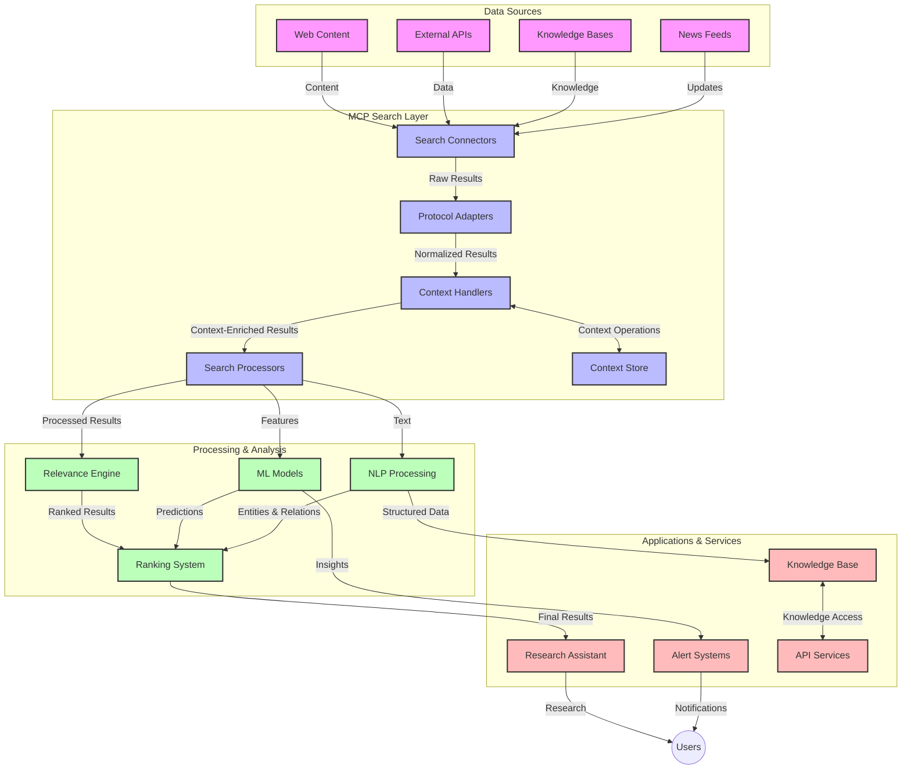
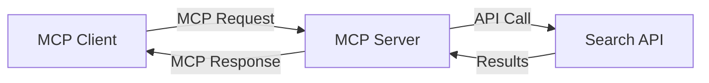
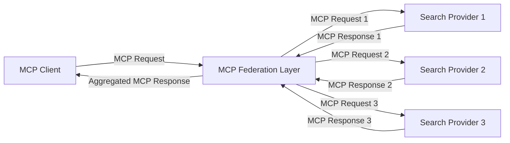
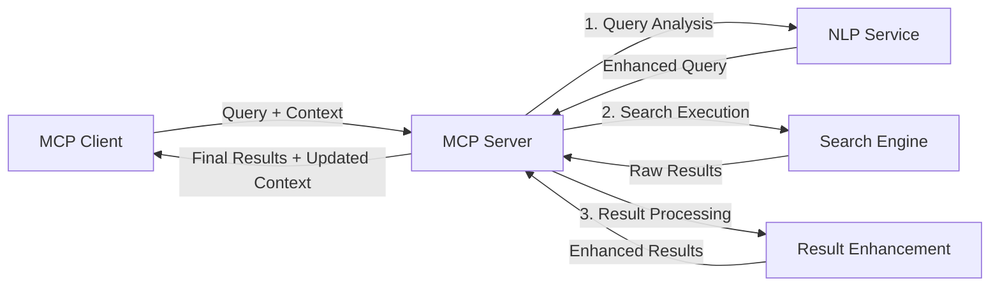

# Model Context Protocol for Real-Time Web Search

## Overview

Real-time web search has become essential in today's information-driven environment, where applications need immediate access to up-to-date information across the internet to provide relevant and timely responses. The Model Context Protocol (MCP) represents a significant advancement in optimizing these real-time search processes, enhancing search efficiency, maintaining contextual integrity, and improving overall system performance.

This module explores how MCP transforms real-time web search by providing a standardized approach to context management across AI models, search engines, and applications.

### What You'll Learn

In this comprehensive guide, you'll discover:

- How MCP creates a seamless bridge between AI models and real-time web search capabilities
- Architectural patterns for implementing efficient and scalable search solutions with MCP
- Techniques for preserving search context across multiple queries and interactions
- Practical code implementations in Python and JavaScript for various search scenarios
- Methods to balance relevance, recency, and performance in MCP-powered search systems

## Introduction to Real-Time Web Search

Real-time web search is a technological approach that enables continuous querying, processing, and analysis of web-based information as it's published or updated, allowing systems to provide fresh and relevant information with minimal latency. Unlike traditional search systems that operate on indexed data which may be hours or days old, real-time search processes live data from the web, delivering insights and information that reflect the current state of online content.

### Core Concepts of Real-Time Web Search:

- **Continuous Query Processing**: Search queries are processed against constantly updating data sources
- **Recency Prioritization**: Systems are designed to prioritize fresh information
- **Relevance Balancing**: Maintaining a balance between relevance and recency
- **Scalable Architecture**: Systems must handle variable query loads and data volumes
- **Contextual Understanding**: Maintaining user context across search iterations is crucial for meaningful results
- **Dynamic Query Reformulation**: Adaptively modifying queries based on context and previous results
- **Multi-Source Integration**: Combining results from multiple search providers and web sources
- **Semantic Understanding**: Processing queries and content based on meaning rather than just keywords
- **Real-Time Ranking**: Continuously adjusting result rankings as new information becomes available

### The Model Context Protocol and Real-Time Web Search

The Model Context Protocol (MCP) addresses several critical challenges in real-time web search environments:

1. **Search Context Preservation**: MCP standardizes how context is maintained across distributed search components, ensuring that AI models and processing nodes have access to relevant query history and user preferences.

2. **Efficient Query Management**: By providing structured mechanisms for context transmission, MCP reduces the overhead of repeating context in each search iteration.

3. **Interoperability**: MCP creates a common language for context sharing between diverse search technologies and AI models, enabling more flexible and extensible architectures.

4. **Search-Optimized Context**: MCP implementations can prioritize which context elements are most relevant for effective search, optimizing for both performance and accuracy.

5. **Adaptive Search Processing**: With proper context management through MCP, search systems can dynamically adjust processing based on evolving user needs and information landscapes.

In modern applications ranging from news aggregation to research assistants, the integration of MCP with web search technologies enables more intelligent, context-aware search that can provide increasingly relevant results as user interactions continue.

## Learning Objectives

By the end of this lesson, you will be able to:

- Understand the fundamentals of real-time web search and its challenges in modern applications
- Explain how the Model Context Protocol (MCP) enhances real-time web search capabilities
- Implement MCP-based search solutions using popular frameworks and APIs
- Design and deploy scalable, high-performance search architectures with MCP
- Apply MCP concepts to various use cases including semantic search, research assistance, and AI-augmented browsing
- Evaluate emerging trends and future innovations in MCP-based search technologies
- Develop context-aware search systems that learn from user interactions
- Integrate web search capabilities into AI assistants using standardized MCP protocols
- Create multi-stage search pipelines that progressively refine results based on context
- Optimize search performance while maintaining comprehensive context awareness

### Definition and Significance

Real-time web search involves the continuous querying, retrieval, and delivery of web-based information with minimal latency. Unlike traditional search engines that periodically crawl and index the web, real-time search aims to surface information as it becomes available, enabling immediate access to the most current content.

Key characteristics of real-time web search include:

- **Freshness**: Prioritizing recent content and updates
- **Continuous Processing**: Constantly monitoring for new information
- **Query Adaptation**: Refining search queries based on context and feedback
- **Immediate Delivery**: Providing search results with minimal delay
- **Context Retention**: Building on previous queries for improved relevance

### Challenges in Traditional Web Search

Traditional web search approaches face several limitations when applied to real-time scenarios:

1. **Context Fragmentation**: Difficulty maintaining search context across multiple queries
2. **Information Freshness**: Challenges in accessing and prioritizing the most recent information
3. **Integration Complexity**: Problems with interoperability between search systems and applications
4. **Latency Issues**: Balancing comprehensive search with response time requirements
5. **Relevance Tuning**: Ensuring accuracy and relevance while prioritizing recency

## Understanding Model Context Protocol (MCP) for Search

### What is MCP in Search Contexts?

The Model Context Protocol (MCP) is a standardized communication protocol designed to facilitate efficient interaction between AI models and applications. In the context of real-time web search, MCP provides a framework for:

- Preserving search context throughout query sequences
- Standardizing search query and result formats
- Optimizing the transmission of search parameters and results
- Enhancing model-to-search engine communication

### Core Components and Architecture

MCP architecture for real-time web search consists of several key components:

1. **Query Context Handlers**: Manage and maintain search context across multiple queries
2. **Search Processors**: Process incoming search requests using context-aware techniques
3. **Protocol Adapters**: Convert between different search APIs while preserving context
4. **Context Store**: Efficiently store and retrieve search history and preferences
5. **Search Connectors**: Connect to various search engines and web APIs



### How MCP Improves Real-Time Web Search

MCP addresses traditional web search challenges through:

- **Contextual Continuity**: Maintaining relationships between queries across the entire search session
- **Optimized Transmission**: Reducing redundancy in search parameters through intelligent context management
- **Standardized Interfaces**: Providing consistent APIs for search components
- **Reduced Latency**: Minimizing processing overhead through efficient context handling
- **Enhanced Relevance**: Improving search relevance by preserving user intent across multiple queries

## Integration and Implementation

Real-time web search systems require careful architectural design and implementation to maintain both performance and contextual integrity. The Model Context Protocol offers a standardized approach to integrating AI models and search technologies, allowing for more sophisticated, context-aware search pipelines.

### Overview of MCP Integration in Search Architectures

Implementing MCP in real-time web search environments involves several key considerations:

1. **Search Context Serialization**: MCP provides efficient mechanisms for encoding contextual information within search requests, ensuring that essential context follows the query throughout the processing pipeline. This includes standardized serialization formats optimized for search-related metadata.

2. **Stateful Search Processing**: MCP enables more intelligent stateful processing by maintaining consistent context representation across search iterations. This is particularly valuable in multi-stage search pipelines where context refinement improves results.

3. **Query Expansion and Refinement**: MCP implementations in search systems can facilitate sophisticated query expansion and refinement based on accumulated context, allowing for increasingly relevant results as the search session progresses.

4. **Result Caching and Prioritization**: By standardizing context handling, MCP helps manage result caching and prioritization, allowing components to adapt based on the evolving search context.

5. **Search Federation and Aggregation**: MCP facilitates more sophisticated federation of search across multiple backends by providing structured representations of search context, enabling more meaningful aggregation of results from diverse sources.

The implementation of MCP across various search technologies creates a unified approach to context management, reducing the need for custom integration code while enhancing the system's ability to maintain meaningful context as search queries evolve.

### MCP in Various Web Search Implementations

These examples follow the current MCP specification which focuses on a JSON-RPC based protocol with distinct transport mechanisms. The code demonstrates how you can implement custom search integrations while maintaining full compatibility with the MCP protocol.


<details>
<summary>Python Implementation with Generic Search API</summary>

```python
import asyncio
import json
import aiohttp
from typing import Dict, Any, Optional, List
from contextlib import asynccontextmanager
from collections.abc import AsyncIterator

# Import standard MCP libraries
from mcp.client.session import ClientSession
from mcp.client.streamable_http import streamablehttp_client
from mcp.types import TextContent, CreateMessageRequestParams, CreateMessageResult
from mcp.server.fastmcp import FastMCP

# Create a FastMCP server for web search
search_server = FastMCP("WebSearch")

# Class to handle web search operations
class WebSearchHandler:
    def __init__(self, api_endpoint: str, api_key: str):
        self.api_endpoint = api_endpoint
        self.api_key = api_key
        self.session = None
        
    async def initialize(self):
        """Initialize the HTTP session"""
        self.session = aiohttp.ClientSession(
            headers={"Authorization": f"Bearer {self.api_key}"}
        )
    
    async def close(self):
        """Close the HTTP session"""
        if self.session:
            await self.session.close()
            
    async def perform_search(self, query: str, max_results: int = 5, 
                           include_domains: List[str] = None, 
                           exclude_domains: List[str] = None,
                           time_period: str = "any") -> Dict[str, Any]:
        """Perform web search using the search API"""
        # Construct search parameters
        search_params = {
            "q": query,
            "limit": max_results,
            "time": time_period
        }
        
        if include_domains:
            search_params["site"] = ",".join(include_domains)
            
        if exclude_domains:
            search_params["exclude_site"] = ",".join(exclude_domains)
        
        # Perform the search request
        try:
            async with self.session.get(
                self.api_endpoint,
                params=search_params
            ) as response:
                if response.status != 200:
                    error_text = await response.text()
                    raise Exception(f"Search API error: {response.status} - {error_text}")
                
                search_data = await response.json()
                
                # Transform API-specific response to a standard format
                results = []
                for item in search_data.get("results", []):
                    results.append({
                        "title": item.get("title", ""),
                        "url": item.get("url", ""),
                        "snippet": item.get("snippet", ""),
                        "date": item.get("published_date", ""),
                        "source": item.get("source", "")
                    })
                
                return {
                    "query": query,
                    "totalResults": len(results),
                    "results": results
                }
        except Exception as e:
            print(f"Search API request error: {e}")
            raise

# Initialize the search handler
search_handler = WebSearchHandler(
    api_endpoint="https://api.search-service.example/search",
    api_key="your-api-key-here"
)

# Setup lifespan to manage the search handler
@asyncio.asynccontextmanager
async def app_lifespan(server: FastMCP):
    """Manage application lifecycle"""
    await search_handler.initialize()
    try:
        yield {"search_handler": search_handler}
    finally:
        await search_handler.close()

# Set lifespan for the server
search_server = FastMCP("WebSearch", lifespan=app_lifespan)

# Register a web search tool
@search_server.tool()
async def web_search(query: str, max_results: int = 5, 
                   include_domains: List[str] = None,
                   exclude_domains: List[str] = None,
                   time_period: str = "any") -> Dict[str, Any]:
    """
    Search the web for information
    
    Args:
        query: The search query
        max_results: Maximum number of results to return (default: 5)
        include_domains: List of domains to include in search results
        exclude_domains: List of domains to exclude from search results
        time_period: Time period for results ("day", "week", "month", "any")
        
    Returns:
        Dictionary containing search results
    """
    ctx = search_server.get_context()
    search_handler = ctx.request_context.lifespan_context["search_handler"]
    
    results = await search_handler.perform_search(
        query=query,
        max_results=max_results,
        include_domains=include_domains,
        exclude_domains=exclude_domains,
        time_period=time_period
    )
    
    return results

# Example client usage
async def client_example():
    # Connect to the search server using Streamable HTTP transport
    async with streamablehttp_client("http://localhost:8000/mcp") as (read, write, _):
        async with ClientSession(read, write) as session:
            # Initialize the connection
            await session.initialize()
            
            # Call the web_search tool
            search_results = await session.call_tool(
                "web_search", 
                {
                    "query": "latest developments in AI and Model Context Protocol",
                    "max_results": 5,
                    "time_period": "day",
                    "include_domains": ["github.com", "microsoft.com"]
                }
            )
            
            print(f"Search results: {search_results}")

# Server execution example
if __name__ == "__main__":
    # Run the server with Streamable HTTP transport
    search_server.run(transport="streamable-http")
```
</details> 

<details>
<summary>JavaScript Implementation with Browser-Based Search</summary>


```javascript
// MCP server implementation for web search
import { McpServer, ResourceTemplate } from '@modelcontextprotocol/sdk/server/mcp.js';
import { StreamableHTTPServerTransport } from '@modelcontextprotocol/sdk/server/streamableHttp.js';
import { z } from 'zod';

// Create an MCP server for web search
const searchServer = new McpServer({
    name: "BrowserSearch",
    description: "A server that provides web search capabilities"
});

// Search service class
class SearchService {
    constructor(searchApiUrl, apiKey) {
        this.searchApiUrl = searchApiUrl;
        this.apiKey = apiKey;
    }

    async performSearch(parameters) {
        const {
            query = '',
            maxResults = 5,
            includeDomains = [],
            excludeDomains = [],
            timePeriod = 'any'
        } = parameters;
        
        // Construct search URL with parameters
        const url = new URL(this.searchApiUrl);
        url.searchParams.append('q', query);
        url.searchParams.append('limit', maxResults);
        url.searchParams.append('time', timePeriod);
        
        if (includeDomains.length > 0) {
            url.searchParams.append('site', includeDomains.join(','));
        }
        
        if (excludeDomains.length > 0) {
            url.searchParams.append('exclude_site', excludeDomains.join(','));
        }
        
        try {
            const response = await fetch(url.toString(), {
                method: 'GET',
                headers: {
                    'Authorization': `Bearer ${this.apiKey}`,
                    'Content-Type': 'application/json'
                }
            });
            
            if (!response.ok) {
                const errorText = await response.text();
                throw new Error(`Search API error: ${response.status} - ${errorText}`);
            }
            
            const searchData = await response.json();
            
            // Transform API-specific response to a standard format
            const results = searchData.results?.map(item => ({
                title: item.title || '',
                url: item.url || '',
                snippet: item.snippet || '',
                date: item.published_date || '',
                source: item.source || ''
            })) || [];
            
            return {
                query,
                totalResults: results.length,
                results
            };
        } catch (error) {
            console.error('Search API request error:', error);
            throw error;
        }
    }
}

// Initialize the search service
const searchService = new SearchService(
    'https://api.search-service.example/search',
    'your-api-key-here'
);

// Setup the context provider for the server
searchServer.setContextProvider(() => {
    return {
        searchService
    };
});

// Register web search tool
searchServer.tool({
    name: 'web_search',
    description: 'Search the web for information',
    parameters: {
        type: 'object',
        properties: {
            query: {
                type: 'string',
                description: 'The search query'
            },
            maxResults: {
                type: 'integer',
                description: 'Maximum number of results to return',
                default: 5
            },
            includeDomains: {
                type: 'array',
                items: { type: 'string' },
                description: 'List of domains to include in search results'
            },
            excludeDomains: {
                type: 'array',
                items: { type: 'string' },
                description: 'List of domains to exclude from search results'
            },
            timePeriod: {
                type: 'string',
                description: 'Time period for results',
                enum: ['day', 'week', 'month', 'any'],
                default: 'any'
            }
        },
        required: ['query']
    },
    handler: async (params, context) => {
        const { searchService } = context;
        return await searchService.performSearch(params);
    }
});

// Example client code to connect to the search server
import { Client } from '@modelcontextprotocol/sdk/client/index.js';
import { StreamableHTTPClientTransport } from '@modelcontextprotocol/sdk/client/streamableHttp.js';

async function connectToSearchServer() {
    // Connect to the search server
    const transport = new StreamableHTTPClientTransport(
        new URL('http://localhost:8000/mcp')
    );
    
    const client = new Client({
        name: 'search-client',
        version: '1.0.0'
    });
    
    await client.connect(transport);
    
    // Execute the search tool
    const searchResults = await client.callTool({
        name: 'web_search',
        arguments: {
            query: 'Model Context Protocol implementation examples',
            maxResults: 10,
            timePeriod: 'week',
            includeDomains: ['github.com', 'docs.microsoft.com']
        }
    });
    
    console.log('Search results:', searchResults);
    
    // Cleanup
    await client.disconnect();
}

// Start the server
const transport = new StreamableHTTPServerTransport();
await searchServer.connect(transport);
console.log('Search server running at http://localhost:8000/mcp');

// In a separate process or after server is started
// connectToSearchServer().catch(console.error);
```
</details> 


## Code Examples Disclaimer

> **Important Note**: The code examples below demonstrate the integration of the Model Context Protocol (MCP) with web search functionality. While they follow the patterns and structures of the official MCP SDKs, they have been simplified for educational purposes.
> 
> These examples showcase:
> 
> 1. **Python Implementation**: A FastMCP server implementation that provides a web search tool and connects to an external search API. This example demonstrates proper lifespan management, context handling, and tool implementation following the patterns of the [official MCP Python SDK](https://github.com/modelcontextprotocol/python-sdk). The server utilizes the recommended Streamable HTTP transport which has superseded the older SSE transport for production deployments.
> 
> 2. **JavaScript Implementation**: A TypeScript/JavaScript implementation using the FastMCP pattern from the [official MCP TypeScript SDK](https://github.com/modelcontextprotocol/typescript-sdk) to create a search server with proper tool definitions and client connections. It follows the latest recommended patterns for session management and context preservation.
> 
> These examples would require additional error handling, authentication, and specific API integration code for production use. The search API endpoints shown (`https://api.search-service.example/search`) are placeholders and would need to be replaced with actual search service endpoints.
> 
> For complete implementation details and the most up-to-date approaches, please refer to the [official MCP specification](https://spec.modelcontextprotocol.io/) and SDK documentation.

## Core Concepts

### The Model Context Protocol (MCP) Framework

At its foundation, the Model Context Protocol provides a standardized way for AI models, applications, and services to exchange context. In real-time web search, this framework is essential for creating coherent, multi-turn search experiences. Key components include:

1. **Client-Server Architecture**: MCP establishes a clear separation between search clients (requesters) and search servers (providers), allowing for flexible deployment models.

2. **JSON-RPC Communication**: The protocol uses JSON-RPC for message exchange, making it compatible with web technologies and easy to implement across different platforms.

3. **Context Management**: MCP defines structured methods for maintaining, updating, and leveraging search context across multiple interactions.

4. **Tool Definitions**: Search capabilities are exposed as standardized tools with well-defined parameters and return values.

5. **Streaming Support**: The protocol supports streaming results, essential for real-time search where results may arrive progressively.

### Web Search Integration Patterns

When integrating MCP with web search, several patterns emerge:

#### 1. Direct Search Provider Integration



In this pattern, the MCP server directly interfaces with one or more search APIs, translating MCP requests into API-specific calls and formatting the results as MCP responses.

#### 2. Federated Search with Context Preservation



This pattern distributes search queries across multiple MCP-compatible search providers, each potentially specializing in different types of content or search capabilities, while maintaining a unified context.

#### 3. Context-Enhanced Search Chain



In this pattern, the search process is divided into multiple stages, with context being enriched at each step, resulting in progressively more relevant results.

### Search Context Components

In MCP-based web search, context typically includes:

- **Query History**: Previous search queries in the session
- **User Preferences**: Language, region, safe search settings
- **Interaction History**: Which results were clicked, time spent on results
- **Search Parameters**: Filters, sort orders, and other search modifiers
- **Domain Knowledge**: Subject-specific context relevant to the search
- **Temporal Context**: Time-based relevance factors
- **Source Preferences**: Trusted or preferred information sources

## Use Cases and Applications

### Research and Information Gathering

MCP enhances research workflows by:

- Preserving research context across search sessions
- Enabling more sophisticated and contextually relevant queries
- Supporting multi-source search federation
- Facilitating knowledge extraction from search results

### Real-Time News and Trend Monitoring

MCP-powered search offers advantages for news monitoring:

- Near-real-time discovery of emerging news stories
- Contextual filtering of relevant information
- Topic and entity tracking across multiple sources
- Personalized news alerts based on user context

### AI-Augmented Browsing and Research

MCP creates new possibilities for AI-augmented browsing:

- Contextual search suggestions based on current browser activity
- Seamless integration of web search with LLM-powered assistants
- Multi-turn search refinement with maintained context
- Enhanced fact-checking and information verification

## Future Trends and Innovations

### Evolution of MCP in Web Search

Looking ahead, we anticipate MCP evolving to address:

- **Multimodal Search**: Integrating text, image, audio, and video search with preserved context
- **Decentralized Search**: Supporting distributed and federated search ecosystems
- **Search Privacy**: Context-aware privacy-preserving search mechanisms
- **Query Understanding**: Deep semantic parsing of natural language search queries

### Potential Advancements in Technology

Emerging technologies that will shape the future of MCP search:

1. **Neural Search Architectures**: Embedding-based search systems optimized for MCP
2. **Personalized Search Context**: Learning individual user search patterns over time
3. **Knowledge Graph Integration**: Contextual search enhanced by domain-specific knowledge graphs
4. **Cross-Modal Context**: Maintaining context across different search modalities

## Hands-On Exercises

### Exercise 1: Setting Up a Basic MCP Search Pipeline

In this exercise, you'll learn how to:
- Configure a basic MCP search environment
- Implement context handlers for web search
- Test and validate context preservation across search iterations

### Exercise 2: Building a Research Assistant with MCP Search

Create a complete application that:
- Processes natural language research questions
- Performs context-aware web searches
- Synthesizes information from multiple sources
- Presents organized research findings

### Exercise 3: Implementing Multi-Source Search Federation with MCP

Advanced exercise covering:
- Context-aware query dispatching to multiple search engines
- Result ranking and aggregation
- Contextual deduplication of search results
- Handling source-specific metadata

## Additional Resources

- [Model Context Protocol Specification](https://spec.modelcontextprotocol.io/) - Official MCP specification and detailed protocol documentation
- [Model Context Protocol Documentation](https://modelcontextprotocol.io/) - Detailed tutorials and implementation guides
- [MCP Python SDK](https://github.com/modelcontextprotocol/python-sdk) - Official Python implementation of the MCP protocol
- [MCP TypeScript SDK](https://github.com/modelcontextprotocol/typescript-sdk) - Official TypeScript implementation of the MCP protocol
- [MCP Reference Servers](https://github.com/modelcontextprotocol/servers) - Reference implementations of MCP servers
- [Bing Web Search API Documentation](https://learn.microsoft.com/en-us/bing/search-apis/bing-web-search/overview) - Microsoft's web search API
- [Google Custom Search JSON API](https://developers.google.com/custom-search/v1/overview) - Google's programmable search engine
- [SerpAPI Documentation](https://serpapi.com/search-api) - Search engine results page API
- [Meilisearch Documentation](https://www.meilisearch.com/docs) - Open-source search engine
- [Elasticsearch Documentation](https://www.elastic.co/guide/index.html) - Distributed search and analytics engine
- [LangChain Documentation](https://python.langchain.com/docs/get_started/introduction) - Building applications with LLMs

## Learning Outcomes

By completing this module, you will be able to:

- Understand the fundamentals of real-time web search and its challenges
- Explain how the Model Context Protocol (MCP) enhances real-time web search capabilities
- Implement MCP-based search solutions using popular frameworks and APIs
- Design and deploy scalable, high-performance search architectures with MCP
- Apply MCP concepts to various use cases including semantic search, research assistance, and AI-augmented browsing
- Evaluate emerging trends and future innovations in MCP-based search technologies


### Trust and Safety Considerations

When implementing MCP-based web search solutions, remember these important principles from the MCP specification:

1. **User Consent and Control**: Users must explicitly consent to and understand all data access and operations. This is particularly important for web search implementations that may access external data sources.

2. **Data Privacy**: Ensure appropriate handling of search queries and results, especially when they might contain sensitive information. Implement appropriate access controls to protect user data.

3. **Tool Safety**: Implement proper authorization and validation for search tools, as they represent potential security risks through arbitrary code execution. Descriptions of tool behavior should be considered untrusted unless obtained from a trusted server.

4. **Clear Documentation**: Provide clear documentation about the capabilities, limitations, and security considerations of your MCP-based search implementation, following the implementation guidelines from the MCP specification.

5. **Robust Consent Flows**: Build robust consent and authorization flows that clearly explain what each tool does before authorizing its use, especially for tools that interact with external web resources.

For complete details on MCP security and trust considerations, refer to the [official documentation](https://modelcontextprotocol.io/specification/2025-03-26#security-and-trust-%26-safety).

## What's next 

- [5.12 Entra ID Authentication for Model Context Protocol Servers](../mcp-security-entra/README.md)