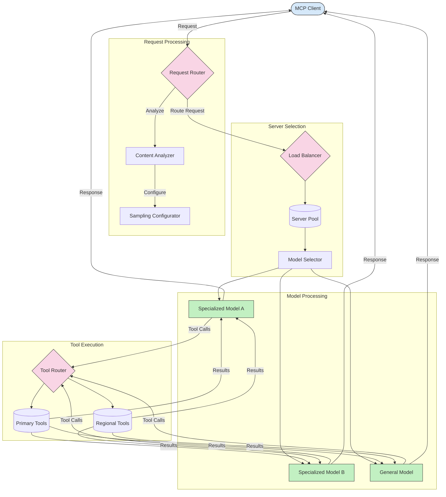

# Routing in Model Context Protocol

Routing is essential for directing requests to the appropriate models, tools, or services within an MCP ecosystem.

## Introduction

Routing in the Model Context Protocol (MCP) involves directing requests to the most suitable models or services based on various criteria such as content type, user context, and system load. This ensures efficient processing and optimal resource utilization.

## Learning Objectives

By the end of this lesson, you will be able to:

- Understand the principles of routing in MCP.
- Implement content-based routing to direct requests to specialized services.
- Apply intelligent load balancing strategies to optimize resource utilization.
- Implement dynamic tool routing based on request context.

## Content-Based Routing

Content-based routing directs requests to specialized services based on the content of the request. For example, requests related to code generation can be routed to a specialized code model, while creative writing requests can be sent to a creative writing model.

Let's look at an example implementation in different programming languages.

<details>
<summary>.NET</summary>

```csharp
// .NET Example: Content-based routing in MCP
public class ContentBasedRouter
{
    private readonly Dictionary<string, McpClient> _specializedClients;
    private readonly RoutingClassifier _classifier;
    
    public ContentBasedRouter()
    {
        // Initialize specialized clients for different domains
        _specializedClients = new Dictionary<string, McpClient>
        {
            ["code"] = new McpClient("https://code-specialized-mcp.com"),
            ["creative"] = new McpClient("https://creative-specialized-mcp.com"),
            ["scientific"] = new McpClient("https://scientific-specialized-mcp.com"),
            ["general"] = new McpClient("https://general-mcp.com")
        };
        
        // Initialize content classifier
        _classifier = new RoutingClassifier();
    }
    
    public async Task<McpResponse> RouteAndProcessAsync(string prompt, IDictionary<string, object> parameters = null)
    {
        // Classify the prompt to determine the best specialized service
        string category = await _classifier.ClassifyPromptAsync(prompt);
        
        // Get the appropriate client or fall back to general
        var client = _specializedClients.ContainsKey(category) 
            ? _specializedClients[category] 
            : _specializedClients["general"];
            
        Console.WriteLine($"Routing request to {category} specialized service");
        
        // Send request to the selected service
        return await client.SendPromptAsync(prompt, parameters);
    }
    
    // Simple classifier for routing decisions
    private class RoutingClassifier
    {
        public Task<string> ClassifyPromptAsync(string prompt)
        {
            prompt = prompt.ToLowerInvariant();
            
            if (prompt.Contains("code") || prompt.Contains("function") || 
                prompt.Contains("program") || prompt.Contains("algorithm"))
            {
                return Task.FromResult("code");
            }
            
            if (prompt.Contains("story") || prompt.Contains("creative") || 
                prompt.Contains("imagine") || prompt.Contains("design"))
            {
                return Task.FromResult("creative");
            }
            
            if (prompt.Contains("science") || prompt.Contains("research") || 
                prompt.Contains("analyze") || prompt.Contains("study"))
            {
                return Task.FromResult("scientific");
            }
            
            return Task.FromResult("general");
        }
    }
}
```

In the preceding code, we've:

- Created a `ContentBasedRouter` class that routes requests based on the content of the prompt.
- Initialized specialized clients for different domains (code, creative, scientific, general).
- Implemented a simple classifier that determines the category of the prompt and routes it to the appropriate specialized service.
- Used a fallback mechanism to route requests to a general service if no specialized service is available.
- Implemented asynchronous processing to handle requests efficiently.
- Used a dictionary to map content categories to specialized MCP clients.
- Implemented a simple classifier that analyzes the prompt and returns the appropriate category.
- Used the specialized client to send the request and receive a response.
- Handled cases where the prompt does not match any specialized category by routing to a general service.

</details>

## Intelligent Load Balancing

Load balancing optimizes resource utilization and ensures high availability for MCP services. There are different ways to implement load balancing, such as round-robin, weighted response time, or content-aware strategies.

Let's look at below example implementation that uses the following strategies:

- **Round Robin**: Distributes requests evenly across available servers.
- **Weighted Response Time**: Routes requests to servers based on their average response time.
- **Content-Aware**: Routes requests to specialized servers based on the content of the request.

<details>
<summary>Java</summary>

```java
// Java Example: Intelligent load balancing for MCP servers
public class McpLoadBalancer {
    private final List<McpServerNode> serverNodes;
    private final LoadBalancingStrategy strategy;
    
    public McpLoadBalancer(List<McpServerNode> nodes, LoadBalancingStrategy strategy) {
        this.serverNodes = new ArrayList<>(nodes);
        this.strategy = strategy;
    }
    
    public McpResponse processRequest(McpRequest request) {
        // Select the best server based on strategy
        McpServerNode selectedNode = strategy.selectNode(serverNodes, request);
        
        try {
            // Route the request to the selected node
            return selectedNode.processRequest(request);
        } catch (Exception e) {
            // Handle failure - implement retry or fallback logic
            System.err.println("Error processing request on node " + selectedNode.getId() + ": " + e.getMessage());
            
            // Mark node as potentially unhealthy
            selectedNode.recordFailure();
            
            // Try next best node as fallback
            List<McpServerNode> remainingNodes = new ArrayList<>(serverNodes);
            remainingNodes.remove(selectedNode);
            
            if (!remainingNodes.isEmpty()) {
                McpServerNode fallbackNode = strategy.selectNode(remainingNodes, request);
                return fallbackNode.processRequest(request);
            } else {
                throw new RuntimeException("All MCP server nodes failed to process the request");
            }
        }
    }
    
    // Node health check task
    public void startHealthChecks(Duration interval) {
        ScheduledExecutorService scheduler = Executors.newScheduledThreadPool(1);
        scheduler.scheduleAtFixedRate(() -> {
            for (McpServerNode node : serverNodes) {
                try {
                    boolean isHealthy = node.checkHealth();
                    System.out.println("Node " + node.getId() + " health status: " + 
                                      (isHealthy ? "HEALTHY" : "UNHEALTHY"));
                } catch (Exception e) {
                    System.err.println("Health check failed for node " + node.getId());
                    node.setHealthy(false);
                }
            }
        }, 0, interval.toMillis(), TimeUnit.MILLISECONDS);
    }
    
    // Interface for load balancing strategies
    public interface LoadBalancingStrategy {
        McpServerNode selectNode(List<McpServerNode> nodes, McpRequest request);
    }
    
    // Round-robin strategy
    public static class RoundRobinStrategy implements LoadBalancingStrategy {
        private AtomicInteger counter = new AtomicInteger(0);
        
        @Override
        public McpServerNode selectNode(List<McpServerNode> nodes, McpRequest request) {
            List<McpServerNode> healthyNodes = nodes.stream()
                .filter(McpServerNode::isHealthy)
                .collect(Collectors.toList());
            
            if (healthyNodes.isEmpty()) {
                throw new RuntimeException("No healthy nodes available");
            }
            
            int index = counter.getAndIncrement() % healthyNodes.size();
            return healthyNodes.get(index);
        }
    }
    
    // Weighted response time strategy
    public static class ResponseTimeStrategy implements LoadBalancingStrategy {
        @Override
        public McpServerNode selectNode(List<McpServerNode> nodes, McpRequest request) {
            return nodes.stream()
                .filter(McpServerNode::isHealthy)
                .min(Comparator.comparing(McpServerNode::getAverageResponseTime))
                .orElseThrow(() -> new RuntimeException("No healthy nodes available"));
        }
    }
    
    // Content-aware strategy
    public static class ContentAwareStrategy implements LoadBalancingStrategy {
        @Override
        public McpServerNode selectNode(List<McpServerNode> nodes, McpRequest request) {
            // Determine request characteristics
            boolean isCodeRequest = request.getPrompt().contains("code") || 
                                   request.getAllowedTools().contains("codeInterpreter");
            
            boolean isCreativeRequest = request.getPrompt().contains("creative") || 
                                       request.getPrompt().contains("story");
            
            // Find specialized nodes
            Optional<McpServerNode> specializedNode = nodes.stream()
                .filter(McpServerNode::isHealthy)
                .filter(node -> {
                    if (isCodeRequest && node.getSpecialization().equals("code")) {
                        return true;
                    }
                    if (isCreativeRequest && node.getSpecialization().equals("creative")) {
                        return true;
                    }
                    return false;
                })
                .findFirst();
            
            // Return specialized node or least loaded node
            return specializedNode.orElse(
                nodes.stream()
                    .filter(McpServerNode::isHealthy)
                    .min(Comparator.comparing(McpServerNode::getCurrentLoad))
                    .orElseThrow(() -> new RuntimeException("No healthy nodes available"))
            );
        }
    }
}
```

In the preceding code, we've:

- Created a `McpLoadBalancer` class that manages a list of MCP server nodes and routes requests based on the selected load balancing strategy.
- Implemented different load balancing strategies: `RoundRobinStrategy`, `ResponseTimeStrategy`, and `ContentAwareStrategy`.
- Used a `ScheduledExecutorService` to periodically check the health of server nodes.
- Implemented a health check mechanism that marks nodes as healthy or unhealthy based on their response to health checks.
- Handled request processing with error handling and fallback logic to ensure high availability.
- Used a `McpServerNode` class to represent individual MCP server nodes, including their health status, average response time, and current load.
- Implemented a `McpRequest` class to encapsulate request details such as the prompt and allowed tools.
- Used Java Streams to filter and select nodes based on health status and specialization.

</details>

## Dynamic Tool Routing

Tool routing ensures that tool calls are directed to the most appropriate service based on context. For example, a weather tool call may need to be routed to a regional endpoint based on the user's location, or a calculator tool may need to use a specific version of the API.

Let's have a look at an example implementation that demonstrates dynamic tool routing based on request analysis, regional endpoints, and versioning support.

<details>
<summary>Python</summary>

```python
# Python Example: Dynamic tool routing based on request analysis
class McpToolRouter:
    def __init__(self):
        # Register available tool endpoints
        self.tool_endpoints = {
            "weatherTool": "https://weather-service.example.com/api",
            "calculatorTool": "https://calculator-service.example.com/compute",
            "databaseTool": "https://database-service.example.com/query",
            "searchTool": "https://search-service.example.com/search"
        }
        
        # Regional endpoints for global distribution
        self.regional_endpoints = {
            "us": {
                "weatherTool": "https://us-west.weather-service.example.com/api",
                "searchTool": "https://us.search-service.example.com/search"
            },
            "europe": {
                "weatherTool": "https://eu.weather-service.example.com/api",
                "searchTool": "https://eu.search-service.example.com/search"
            },
            "asia": {
                "weatherTool": "https://asia.weather-service.example.com/api",
                "searchTool": "https://asia.search-service.example.com/search"
            }
        }
        
        # Tool versioning support
        self.tool_versions = {
            "weatherTool": {
                "default": "v2",
                "v1": "https://weather-service.example.com/api/v1",
                "v2": "https://weather-service.example.com/api/v2",
                "beta": "https://weather-service.example.com/api/beta"
            }
        }
    
    async def route_tool_request(self, tool_name, parameters, user_context=None):
        """Route a tool request to the appropriate endpoint based on context"""
        endpoint = self._select_endpoint(tool_name, parameters, user_context)
        
        if not endpoint:
            raise ValueError(f"No endpoint available for tool: {tool_name}")
        
        # Perform the actual request to the selected endpoint
        return await self._execute_tool_request(endpoint, tool_name, parameters)
    
    def _select_endpoint(self, tool_name, parameters, user_context=None):
        """Select the most appropriate endpoint based on context"""
        # Base endpoint from registry
        if tool_name not in self.tool_endpoints:
            return None
            
        base_endpoint = self.tool_endpoints[tool_name]
        
        # Check if we need to use a specific tool version
        if tool_name in self.tool_versions:
            version_info = self.tool_versions[tool_name]
            
            # Use specified version or default
            requested_version = parameters.get("_version", version_info["default"])
            if requested_version in version_info:
                base_endpoint = version_info[requested_version]
        
        # Check for regional routing if user region is known
        if user_context and "region" in user_context:
            user_region = user_context["region"]
            
            if user_region in self.regional_endpoints:
                regional_tools = self.regional_endpoints[user_region]
                
                if tool_name in regional_tools:
                    # Use region-specific endpoint
                    return regional_tools[tool_name]
        
        # Check for data residency requirements
        if user_context and "data_residency" in user_context:
            # This would implement logic to ensure data remains in specified jurisdiction
            pass
        
        # Check for latency-based routing
        if user_context and "latency_sensitive" in user_context and user_context["latency_sensitive"]:
            # This would implement logic to select lowest-latency endpoint
            pass
            
        return base_endpoint
        
    async def _execute_tool_request(self, endpoint, tool_name, parameters):
        """Execute the actual tool request to the selected endpoint"""
        try:
            async with aiohttp.ClientSession() as session:
                async with session.post(
                    endpoint,
                    json={"toolName": tool_name, "parameters": parameters},
                    headers={"Content-Type": "application/json"}
                ) as response:
                    if response.status == 200:
                        result = await response.json()
                        return result
                    else:
                        error_text = await response.text()
                        raise Exception(f"Tool execution failed: {error_text}")
        except Exception as e:
            # Implement retry logic or fallback strategy
            print(f"Error executing tool {tool_name} at {endpoint}: {str(e)}")
            raise
```

In the preceding code, we've:

- Created a `McpToolRouter` class that manages tool routing based on request analysis, regional endpoints, and versioning support.
- Registered available tool endpoints and regional endpoints for global distribution.
- Implemented dynamic routing logic that selects the appropriate endpoint based on user context, such as region and data residency requirements.
- Implemented versioning support for tools, allowing users to specify which version of a tool they want to use.
- Used asynchronous HTTP requests to execute tool calls and handle responses.

</details>

## Sampling and Routing Architecture in MCP

Sampling is a critical component of the Model Context Protocol (MCP) that allows for efficient request processing and routing. It involves analyzing incoming requests to determine the most appropriate model or service to handle them, based on various criteria such as content type, user context, and system load.

Sampling and routing can be combined to create a robust architecture that optimizes resource utilization and ensures high availability. The sampling process can be used to classify requests, while routing directs them to the appropriate models or services.

The diagram below illustrates how sampling and routing work together in a comprehensive MCP architecture:



## What's next

- [5.6 Sampling](../mcp-sampling/README.md)
