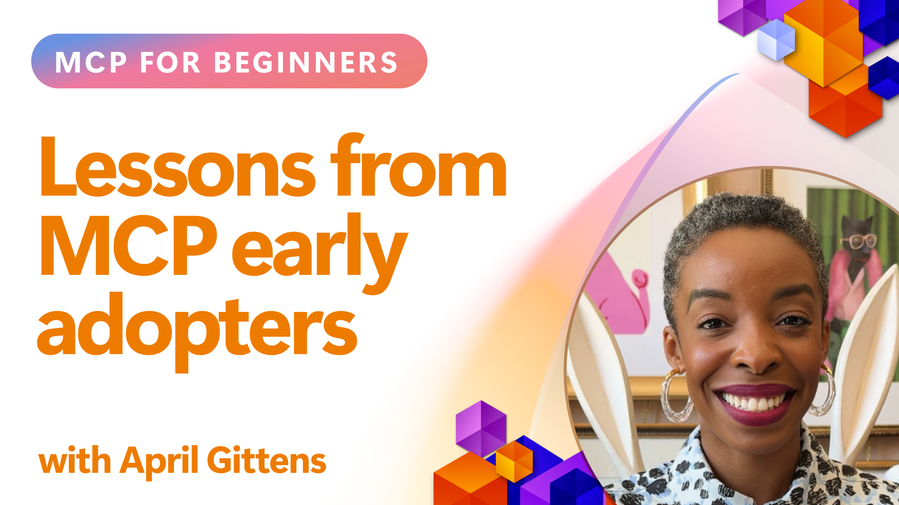

# 🌟 Lessons from Early Adopters

[](https://youtu.be/jds7dSmNptE)

_(Click the image above to view video of this lesson)_

## 🎯 What This Module Covers

This module explores how real organizations and developers are leveraging the Model Context Protocol (MCP) to solve actual challenges and drive innovation. Through detailed case studies, hands-on projects### Case Study 5: Azure MCP – Enterprise-Grade Model Context Protocol as a Service

Azure MCP ([https://aka.ms/azmcp](https://aka.ms/azmcp)) is Microsoft's managed, enterprise-grade implementation of the Model Context Protocol, designed to provide scalable, secure, and compliant MCP server capabilities as a cloud service. This comprehensive suite includes multiple specialized MCP servers for different Azure services and scenarios.

[Microsoft MCP Center](https://mcp.azure.com) Build Your Scalable, Enterprise-Ready MCP Registry with Azure API Center this is a catalog of available Microsoft MCP Servers.

> **🎯 Production Ready Tools**
> 
> This case study represents multiple production-ready MCP servers! Learn about the Azure MCP Server and other Azure-integrated servers in our [**Microsoft MCP Servers Guide**](microsoft-mcp-servers.md#2--azure-mcp-server).

**Key Features:**
- Fully managed MCP server hosting with built-in scaling, monitoring, and security
- Native integration with Azure OpenAI, Azure AI Search, and other Azure services
- Enterprise authentication and authorization via Microsoft Entra ID
- Support for custom tools, prompt templates, and resource connectors
- Compliance with enterprise security and regulatory requirements
- 15+ specialized Azure service connectors including database, monitoring, and storage

**Azure MCP Server Capabilities:**
- **Resource Management**: Full Azure resource lifecycle management
- **Database Connectors**: Direct access to Azure Database for PostgreSQL and SQL Server
- **Azure Monitor**: KQL-powered log analysis and operational insights
- **Authentication**: DefaultAzureCredential and managed identity patterns
- **Storage Services**: Blob Storage, Queue Storage, and Table Storage operations
- **Container Services**: Azure Container Apps, Container Instances, and AKS managementctical examples, you'll discover how MCP enables secure, scalable AI integration that connects language models, tools, and enterprise data.

### 📚 See MCP in Action

Want to see these principles applied to production-ready tools? Check out our [**10 Microsoft MCP Servers That Are Transforming Developer Productivity**](microsoft-mcp-servers.md), which showcases real Microsoft MCP servers you can use today.

## Overview

This lesson explores how early adopters have leveraged the Model Context Protocol (MCP) to solve real-world challenges and drive innovation across industries. Through detailed case studies and hands-on projects, you'll see how MCP enables standardized, secure, and scalable AI integration—connecting large language models, tools, and enterprise data in a unified framework. You'll gain practical experience designing and building MCP-based solutions, learn from proven implementation patterns, and discover best practices for deploying MCP in production environments. The lesson also highlights emerging trends, future directions, and open-source resources to help you stay at the forefront of MCP technology and its evolving ecosystem.

## Learning Objectives

- Analyze real-world MCP implementations across different industries
- Design and build complete MCP-based applications
- Explore emerging trends and future directions in MCP technology
- Apply best practices in actual development scenarios

## Real-world MCP Implementations

### Case Study 1: Enterprise Customer Support Automation

A multinational corporation implemented an MCP-based solution to standardize AI interactions across their customer support systems. This allowed them to:

- Create a unified interface for multiple LLM providers
- Maintain consistent prompt management across departments
- Implement robust security and compliance controls
- Easily switch between different AI models based on specific needs

**Technical Implementation:**

```python
# Python MCP server implementation for customer support
import logging
import asyncio
from modelcontextprotocol import create_server, ServerConfig
from modelcontextprotocol.server import MCPServer
from modelcontextprotocol.transports import create_http_transport
from modelcontextprotocol.resources import ResourceDefinition
from modelcontextprotocol.prompts import PromptDefinition
from modelcontextprotocol.tool import ToolDefinition

# Configure logging
logging.basicConfig(level=logging.INFO)

async def main():
    # Create server configuration
    config = ServerConfig(
        name="Enterprise Customer Support Server",
        version="1.0.0",
        description="MCP server for handling customer support inquiries"
    )
    
    # Initialize MCP server
    server = create_server(config)
    
    # Register knowledge base resources
    server.resources.register(
        ResourceDefinition(
            name="customer_kb",
            description="Customer knowledge base documentation"
        ),
        lambda params: get_customer_documentation(params)
    )
    
    # Register prompt templates
    server.prompts.register(
        PromptDefinition(
            name="support_template",
            description="Templates for customer support responses"
        ),
        lambda params: get_support_templates(params)
    )
    
    # Register support tools
    server.tools.register(
        ToolDefinition(
            name="ticketing",
            description="Create and update support tickets"
        ),
        handle_ticketing_operations
    )
    
    # Start server with HTTP transport
    transport = create_http_transport(port=8080)
    await server.run(transport)

if __name__ == "__main__":
    asyncio.run(main())
```

**Results:** 30% reduction in model costs, 45% improvement in response consistency, and enhanced compliance across global operations.

### Case Study 2: Healthcare Diagnostic Assistant

A healthcare provider developed an MCP infrastructure to integrate multiple specialized medical AI models while ensuring sensitive patient data remained protected:

- Seamless switching between generalist and specialist medical models
- Strict privacy controls and audit trails
- Integration with existing Electronic Health Record (EHR) systems
- Consistent prompt engineering for medical terminology

**Technical Implementation:**

```csharp
// C# MCP host application implementation in healthcare application
using Microsoft.Extensions.DependencyInjection;
using ModelContextProtocol.SDK.Client;
using ModelContextProtocol.SDK.Security;
using ModelContextProtocol.SDK.Resources;

public class DiagnosticAssistant
{
    private readonly MCPHostClient _mcpClient;
    private readonly PatientContext _patientContext;
    
    public DiagnosticAssistant(PatientContext patientContext)
    {
        _patientContext = patientContext;
        
        // Configure MCP client with healthcare-specific settings
        var clientOptions = new ClientOptions
        {
            Name = "Healthcare Diagnostic Assistant",
            Version = "1.0.0",
            Security = new SecurityOptions
            {
                Encryption = EncryptionLevel.Medical,
                AuditEnabled = true
            }
        };
        
        _mcpClient = new MCPHostClientBuilder()
            .WithOptions(clientOptions)
            .WithTransport(new HttpTransport("https://healthcare-mcp.example.org"))
            .WithAuthentication(new HIPAACompliantAuthProvider())
            .Build();
    }
    
    public async Task<DiagnosticSuggestion> GetDiagnosticAssistance(
        string symptoms, string patientHistory)
    {
        // Create request with appropriate resources and tool access
        var resourceRequest = new ResourceRequest
        {
            Name = "patient_records",
            Parameters = new Dictionary<string, object>
            {
                ["patientId"] = _patientContext.PatientId,
                ["requestingProvider"] = _patientContext.ProviderId
            }
        };
        
        // Request diagnostic assistance using appropriate prompt
        var response = await _mcpClient.SendPromptRequestAsync(
            promptName: "diagnostic_assistance",
            parameters: new Dictionary<string, object>
            {
                ["symptoms"] = symptoms,
                patientHistory = patientHistory,
                relevantGuidelines = _patientContext.GetRelevantGuidelines()
            });
            
        return DiagnosticSuggestion.FromMCPResponse(response);
    }
}
```

**Results:** Improved diagnostic suggestions for physicians while maintaining full HIPAA compliance and significant reduction in context-switching between systems.

### Case Study 3: Financial Services Risk Analysis

A financial institution implemented MCP to standardize their risk analysis processes across different departments:

- Created a unified interface for credit risk, fraud detection, and investment risk models
- Implemented strict access controls and model versioning
- Ensured auditability of all AI recommendations
- Maintained consistent data formatting across diverse systems

**Technical Implementation:**

```java
// Java MCP server for financial risk assessment
import org.mcp.server.*;
import org.mcp.security.*;

public class FinancialRiskMCPServer {
    public static void main(String[] args) {
        // Create MCP server with financial compliance features
        MCPServer server = new MCPServerBuilder()
            .withModelProviders(
                new ModelProvider("risk-assessment-primary", new AzureOpenAIProvider()),
                new ModelProvider("risk-assessment-audit", new LocalLlamaProvider())
            )
            .withPromptTemplateDirectory("./compliance/templates")
            .withAccessControls(new SOCCompliantAccessControl())
            .withDataEncryption(EncryptionStandard.FINANCIAL_GRADE)
            .withVersionControl(true)
            .withAuditLogging(new DatabaseAuditLogger())
            .build();
            
        server.addRequestValidator(new FinancialDataValidator());
        server.addResponseFilter(new PII_RedactionFilter());
        
        server.start(9000);
        
        System.out.println("Financial Risk MCP Server running on port 9000");
    }
}
```

**Results:** Enhanced regulatory compliance, 40% faster model deployment cycles, and improved risk assessment consistency across departments.

### Case Study 4: Microsoft Playwright MCP Server for Browser Automation

Microsoft developed the [Playwright MCP server](https://github.com/microsoft/playwright-mcp) to enable secure, standardized browser automation through the Model Context Protocol. This production-ready server allows AI agents and LLMs to interact with web browsers in a controlled, auditable, and extensible way—enabling use cases such as automated web testing, data extraction, and end-to-end workflows.

> **🎯 Production Ready Tool**
> 
> This case study showcases a real MCP server you can use today! Learn more about the Playwright MCP Server and 9 other production-ready Microsoft MCP servers in our [**Microsoft MCP Servers Guide**](microsoft-mcp-servers.md#8--playwright-mcp-server).

**Key Features:**
- Exposes browser automation capabilities (navigation, form filling, screenshot capture, etc.) as MCP tools
- Implements strict access controls and sandboxing to prevent unauthorized actions
- Provides detailed audit logs for all browser interactions
- Supports integration with Azure OpenAI and other LLM providers for agent-driven automation
- Powers GitHub Copilot's Coding Agent with web browsing capabilities

**Technical Implementation:**

```typescript
// TypeScript: Registering Playwright browser automation tools in an MCP server
import { createServer, ToolDefinition } from 'modelcontextprotocol';
import { launch } from 'playwright';

const server = createServer({
  name: 'Playwright MCP Server',
  version: '1.0.0',
  description: 'MCP server for browser automation using Playwright'
});

// Register a tool for navigating to a URL and capturing a screenshot
server.tools.register(
  new ToolDefinition({
    name: 'navigate_and_screenshot',
    description: 'Navigate to a URL and capture a screenshot',
    parameters: {
      url: { type: 'string', description: 'The URL to visit' }
    }
  }),
  async ({ url }) => {
    const browser = await launch();
    const page = await browser.newPage();
    await page.goto(url);
    const screenshot = await page.screenshot();
    await browser.close();
    return { screenshot };
  }
);

// Start the MCP server
server.listen(8080);
```

**Results:**

- Enabled secure, programmatic browser automation for AI agents and LLMs
- Reduced manual testing effort and improved test coverage for web applications
- Provided a reusable, extensible framework for browser-based tool integration in enterprise environments
- Powers GitHub Copilot's web browsing capabilities

**References:**

- [Playwright MCP Server GitHub Repository](https://github.com/microsoft/playwright-mcp)
- [Microsoft AI and Automation Solutions](https://azure.microsoft.com/en-us/products/ai-services/)

### Case Study 5: Azure MCP – Enterprise-Grade Model Context Protocol as a Service

Azure MCP Server ([https://aka.ms/azmcp](https://aka.ms/azmcp)) is Microsoft’s managed, enterprise-grade implementation of the Model Context Protocol, designed to provide scalable, secure, and compliant MCP server capabilities as a cloud service. Azure MCP enables organizations to rapidly deploy, manage, and integrate MCP servers with Azure AI, data, and security services, reducing operational overhead and accelerating AI adoption.

> **🎯 Production Ready Tool**
> 
> This is a real MCP server you can use today! Learn more about the Azure AI Foundry MCP Server in our [**Microsoft MCP Servers Guide**](microsoft-mcp-servers.md).


- Fully managed MCP server hosting with built-in scaling, monitoring, and security
- Native integration with Azure OpenAI, Azure AI Search, and other Azure services
- Enterprise authentication and authorization via Microsoft Entra ID
- Support for custom tools, prompt templates, and resource connectors
- Compliance with enterprise security and regulatory requirements

**Technical Implementation:**

```yaml
# Example: Azure MCP server deployment configuration (YAML)
apiVersion: mcp.microsoft.com/v1
kind: McpServer
metadata:
  name: enterprise-mcp-server
spec:
  modelProviders:
    - name: azure-openai
      type: AzureOpenAI
      endpoint: https://<your-openai-resource>.openai.azure.com/
      apiKeySecret: <your-azure-keyvault-secret>
  tools:
    - name: document_search
      type: AzureAISearch
      endpoint: https://<your-search-resource>.search.windows.net/
      apiKeySecret: <your-azure-keyvault-secret>
  authentication:
    type: EntraID
    tenantId: <your-tenant-id>
  monitoring:
    enabled: true
    logAnalyticsWorkspace: <your-log-analytics-id>
```

**Results:**  
- Reduced time-to-value for enterprise AI projects by providing a ready-to-use, compliant MCP server platform
- Simplified integration of LLMs, tools, and enterprise data sources
- Enhanced security, observability, and operational efficiency for MCP workloads
- Improved code quality with Azure SDK best practices and current authentication patterns

**References:**  
- [Azure MCP Documentation](https://aka.ms/azmcp)
- [Azure MCP Server GitHub Repository](https://github.com/Azure/azure-mcp)
- [Azure AI Services](https://azure.microsoft.com/en-us/products/ai-services/)
- [Microsoft MCP Center](https://mcp.azure.com)

## Case Study 6: NLWeb 
MCP (Model Context Protocol) is an emerging protocol for Chatbots and AI assistants to interact with tools. Every NLWeb instance is also an MCP server, which supports one core method, ask, which is used to ask a website a question in natural language. The returned response leverages schema.org, a widely-used vocabulary for describing web data. Loosely speaking, MCP is NLWeb as Http is to HTML. NLWeb combines protocols, Schema.org formats, and sample code to help sites rapidly create these endpoints, benefiting both humans through conversational interfaces and machines through natural agent-to-agent interaction.

There are two distinct components to NLWeb.
- A protocol, very simple to begin with, to interface with a site in natural language and a format, leveraging json and schema.org for the returned answer. See the documentation on the REST API for more details.
- A straightforward implementation of (1) that leverages existing markup, for sites that can be abstracted as lists of items (products, recipes, attractions, reviews, etc.). Together with a set of user interface widgets, sites can easily provide conversational interfaces to their content. See the documentation on Life of a chat query for more details on how this works.
 
**References:**  
- [Azure MCP Documentation](https://aka.ms/azmcp)
- [NLWeb](https://github.com/microsoft/NlWeb)

### Case Study 7: Azure AI Foundry MCP Server – Enterprise AI Agent Integration

Azure AI Foundry MCP servers demonstrate how MCP can be used to orchestrate and manage AI agents and workflows in enterprise environments. By integrating MCP with Azure AI Foundry, organizations can standardize agent interactions, leverage Foundry's workflow management, and ensure secure, scalable deployments.

> **🎯 Production Ready Tool**
> 
> This is a real MCP server you can use today! Learn more about the Azure AI Foundry MCP Server in our [**Microsoft MCP Servers Guide**](microsoft-mcp-servers.md#9--azure-ai-foundry-mcp-server).

**Key Features:**
- Comprehensive access to Azure's AI ecosystem, including model catalogs and deployment management
- Knowledge indexing with Azure AI Search for RAG applications
- Evaluation tools for AI model performance and quality assurance
- Integration with Azure AI Foundry Catalog and Labs for cutting-edge research models
- Agent management and evaluation capabilities for production scenarios

**Results:**
- Rapid prototyping and robust monitoring of AI agent workflows
- Seamless integration with Azure AI services for advanced scenarios
- Unified interface for building, deploying, and monitoring agent pipelines
- Improved security, compliance, and operational efficiency for enterprises
- Accelerated AI adoption while maintaining control over complex agent-driven processes

**References:**
- [Azure AI Foundry MCP Server GitHub Repository](https://github.com/azure-ai-foundry/mcp-foundry)
- [Integrating Azure AI Agents with MCP (Microsoft Foundry Blog)](https://devblogs.microsoft.com/foundry/integrating-azure-ai-agents-mcp/)

### Case Study 8: Foundry MCP Playground – Experimentation and Prototyping

The Foundry MCP Playground offers a ready-to-use environment for experimenting with MCP servers and Azure AI Foundry integrations. Developers can quickly prototype, test, and evaluate AI models and agent workflows using resources from the Azure AI Foundry Catalog and Labs. The playground streamlines setup, provides sample projects, and supports collaborative development, making it easy to explore best practices and new scenarios with minimal overhead. It is especially useful for teams looking to validate ideas, share experiments, and accelerate learning without the need for complex infrastructure. By lowering the barrier to entry, the playground helps foster innovation and community contributions in the MCP and Azure AI Foundry ecosystem.

**References:**

- [Foundry MCP Playground GitHub Repository](https://github.com/azure-ai-foundry/foundry-mcp-playground)

### Case Study 9: Microsoft Learn Docs MCP Server – AI-Powered Documentation Access

The Microsoft Learn Docs MCP Server is a cloud-hosted service that provides AI assistants with real-time access to official Microsoft documentation through the Model Context Protocol. This production-ready server connects to the comprehensive Microsoft Learn ecosystem and enables semantic search across all official Microsoft sources.

> **🎯 Production Ready Tool**
> 
> This is a real MCP server you can use today! Learn more about the Microsoft Learn Docs MCP Server in our [**Microsoft MCP Servers Guide**](microsoft-mcp-servers.md#1--microsoft-learn-docs-mcp-server).

**Key Features:**
- Real-time access to official Microsoft documentation, Azure docs, and Microsoft 365 documentation
- Advanced semantic search capabilities that understand context and intent
- Always up-to-date information as Microsoft Learn content is published
- Comprehensive coverage across Microsoft Learn, Azure documentation, and Microsoft 365 sources
- Returns up to 10 high-quality content chunks with article titles and URLs

**Why It's Critical:**
- Solves the "outdated AI knowledge" problem for Microsoft technologies
- Ensures AI assistants have access to the latest .NET, C#, Azure, and Microsoft 365 features
- Provides authoritative, first-party information for accurate code generation
- Essential for developers working with rapidly evolving Microsoft technologies

**Results:**
- Dramatically improved accuracy of AI-generated code for Microsoft technologies
- Reduced time spent searching for current documentation and best practices
- Enhanced developer productivity with context-aware documentation retrieval
- Seamless integration with development workflows without leaving the IDE

**References:**
- [Microsoft Learn Docs MCP Server GitHub Repository](https://github.com/MicrosoftDocs/mcp)
- [Microsoft Learn Documentation](https://learn.microsoft.com/)

## Hands-on Projects

### Project 1: Build a Multi-Provider MCP Server

**Objective:** Create an MCP server that can route requests to multiple AI model providers based on specific criteria.

**Requirements:**

- Support at least three different model providers (e.g., OpenAI, Anthropic, local models)
- Implement a routing mechanism based on request metadata
- Create a configuration system for managing provider credentials
- Add caching to optimize performance and costs
- Build a simple dashboard for monitoring usage

**Implementation Steps:**

1. Set up the basic MCP server infrastructure
2. Implement provider adapters for each AI model service
3. Create the routing logic based on request attributes
4. Add caching mechanisms for frequent requests
5. Develop the monitoring dashboard
6. Test with various request patterns

**Technologies:** Choose from Python (.NET/Java/Python based on your preference), Redis for caching, and a simple web framework for the dashboard.

### Project 2: Enterprise Prompt Management System

**Objective:** Develop an MCP-based system for managing, versioning, and deploying prompt templates across an organization.

**Requirements:**

- Create a centralized repository for prompt templates
- Implement versioning and approval workflows
- Build template testing capabilities with sample inputs
- Develop role-based access controls
- Create an API for template retrieval and deployment

**Implementation Steps:**

1. Design the database schema for template storage
2. Create the core API for template CRUD operations
3. Implement the versioning system
4. Build the approval workflow
5. Develop the testing framework
6. Create a simple web interface for management
7. Integrate with an MCP server

**Technologies:** Your choice of backend framework, SQL or NoSQL database, and a frontend framework for the management interface.

### Project 3: MCP-Based Content Generation Platform

**Objective:** Build a content generation platform that leverages MCP to provide consistent results across different content types.

**Requirements:**

- Support multiple content formats (blog posts, social media, marketing copy)
- Implement template-based generation with customization options
- Create a content review and feedback system
- Track content performance metrics
- Support content versioning and iteration

**Implementation Steps:**

1. Set up the MCP client infrastructure
2. Create templates for different content types
3. Build the content generation pipeline
4. Implement the review system
5. Develop the metrics tracking system
6. Create a user interface for template management and content generation

**Technologies:** Your preferred programming language, web framework, and database system.

## Future Directions for MCP Technology

### Emerging Trends

1. **Multi-Modal MCP**
   - Expansion of MCP to standardize interactions with image, audio, and video models
   - Development of cross-modal reasoning capabilities
   - Standardized prompt formats for different modalities

2. **Federated MCP Infrastructure**
   - Distributed MCP networks that can share resources across organizations
   - Standardized protocols for secure model sharing
   - Privacy-preserving computation techniques

3. **MCP Marketplaces**
   - Ecosystems for sharing and monetizing MCP templates and plugins
   - Quality assurance and certification processes
   - Integration with model marketplaces

4. **MCP for Edge Computing**
   - Adaptation of MCP standards for resource-constrained edge devices
   - Optimized protocols for low-bandwidth environments
   - Specialized MCP implementations for IoT ecosystems

5. **Regulatory Frameworks**
   - Development of MCP extensions for regulatory compliance
   - Standardized audit trails and explainability interfaces
   - Integration with emerging AI governance frameworks

### MCP Solutions from Microsoft

Microsoft and Azure have developed several open-source repositories to help developers implement MCP in various scenarios:

#### Microsoft Organization

1. [playwright-mcp](https://github.com/microsoft/playwright-mcp) - A Playwright MCP server for browser automation and testing
2. [files-mcp-server](https://github.com/microsoft/files-mcp-server) - A OneDrive MCP server implementation for local testing and community contribution
3. [NLWeb](https://github.com/microsoft/NlWeb) - NLWeb is a collection of open protocols and associated open source tools. Its main focus is establishing a foundational layer for the AI Web

#### Azure-Samples Organization

1. [mcp](https://github.com/Azure-Samples/mcp) - Links to samples, tools, and resources for building and integrating MCP servers on Azure using multiple languages
2. [mcp-auth-servers](https://github.com/Azure-Samples/mcp-auth-servers) - Reference MCP servers demonstrating authentication with the current Model Context Protocol specification
3. [remote-mcp-functions](https://github.com/Azure-Samples/remote-mcp-functions) - Landing page for Remote MCP Server implementations in Azure Functions with links to language-specific repos
4. [remote-mcp-functions-python](https://github.com/Azure-Samples/remote-mcp-functions-python) - Quickstart template for building and deploying custom remote MCP servers using Azure Functions with Python
5. [remote-mcp-functions-dotnet](https://github.com/Azure-Samples/remote-mcp-functions-dotnet) - Quickstart template for building and deploying custom remote MCP servers using Azure Functions with .NET/C#
6. [remote-mcp-functions-typescript](https://github.com/Azure-Samples/remote-mcp-functions-typescript) - Quickstart template for building and deploying custom remote MCP servers using Azure Functions with TypeScript
7. [remote-mcp-apim-functions-python](https://github.com/Azure-Samples/remote-mcp-apim-functions-python) - Azure API Management as AI Gateway to Remote MCP servers using Python
8. [AI-Gateway](https://github.com/Azure-Samples/AI-Gateway) - APIM ❤️ AI experiments including MCP capabilities, integrating with Azure OpenAI and AI Foundry

These repositories provide various implementations, templates, and resources for working with the Model Context Protocol across different programming languages and Azure services. They cover a range of use cases from basic server implementations to authentication, cloud deployment, and enterprise integration scenarios.

#### MCP Resources Directory

The [MCP Resources directory](https://github.com/microsoft/mcp/tree/main/Resources) in the official Microsoft MCP repository provides a curated collection of sample resources, prompt templates, and tool definitions for use with Model Context Protocol servers. This directory is designed to help developers quickly get started with MCP by offering reusable building blocks and best-practice examples for:

- **Prompt Templates:** Ready-to-use prompt templates for common AI tasks and scenarios, which can be adapted for your own MCP server implementations.
- **Tool Definitions:** Example tool schemas and metadata to standardize tool integration and invocation across different MCP servers.
- **Resource Samples:** Example resource definitions for connecting to data sources, APIs, and external services within the MCP framework.
- **Reference Implementations:** Practical samples that demonstrate how to structure and organize resources, prompts, and tools in real-world MCP projects.

These resources accelerate development, promote standardization, and help ensure best practices when building and deploying MCP-based solutions.

#### MCP Resources Directory

- [MCP Resources (Sample Prompts, Tools, and Resource Definitions)](https://github.com/microsoft/mcp/tree/main/Resources)

### Research Opportunities

- Efficient prompt optimization techniques within MCP frameworks
- Security models for multi-tenant MCP deployments
- Performance benchmarking across different MCP implementations
- Formal verification methods for MCP servers

## Conclusion

The Model Context Protocol (MCP) is rapidly shaping the future of standardized, secure, and interoperable AI integration across industries. Through the case studies and hands-on projects in this lesson, you've seen how early adopters—including Microsoft and Azure—are leveraging MCP to solve real-world challenges, accelerate AI adoption, and ensure compliance, security, and scalability. MCP's modular approach enables organizations to connect large language models, tools, and enterprise data in a unified, auditable framework. As MCP continues to evolve, staying engaged with the community, exploring open-source resources, and applying best practices will be key to building robust, future-ready AI solutions.

## Additional Resources

- [MCP Foundry GitHub Repository](https://github.com/azure-ai-foundry/mcp-foundry)
- [Foundry MCP Playground](https://github.com/azure-ai-foundry/foundry-mcp-playground)
- [Integrating Azure AI Agents with MCP (Microsoft Foundry Blog)](https://devblogs.microsoft.com/foundry/integrating-azure-ai-agents-mcp/)
- [MCP GitHub Repository (Microsoft)](https://github.com/microsoft/mcp)
- [MCP Resources Directory (Sample Prompts, Tools, and Resource Definitions)](https://github.com/microsoft/mcp/tree/main/Resources)
- [MCP Community & Documentation](https://modelcontextprotocol.io/introduction)
- [Azure MCP Documentation](https://aka.ms/azmcp)
- [Playwright MCP Server GitHub Repository](https://github.com/microsoft/playwright-mcp)
- [Files MCP Server (OneDrive)](https://github.com/microsoft/files-mcp-server)
- [Azure-Samples MCP](https://github.com/Azure-Samples/mcp)
- [MCP Auth Servers (Azure-Samples)](https://github.com/Azure-Samples/mcp-auth-servers)
- [Remote MCP Functions (Azure-Samples)](https://github.com/Azure-Samples/remote-mcp-functions)
- [Remote MCP Functions Python (Azure-Samples)](https://github.com/Azure-Samples/remote-mcp-functions-python)
- [Remote MCP Functions .NET (Azure-Samples)](https://github.com/Azure-Samples/remote-mcp-functions-dotnet)
- [Remote MCP Functions TypeScript (Azure-Samples)](https://github.com/Azure-Samples/remote-mcp-functions-typescript)
- [Remote MCP APIM Functions Python (Azure-Samples)](https://github.com/Azure-Samples/remote-mcp-apim-functions-python)
- [AI-Gateway (Azure-Samples)](https://github.com/Azure-Samples/AI-Gateway)
- [Microsoft AI and Automation Solutions](https://azure.microsoft.com/en-us/products/ai-services/)

## Exercises

1. Analyze one of the case studies and propose an alternative implementation approach.
2. Choose one of the project ideas and create a detailed technical specification.
3. Research an industry not covered in the case studies and outline how MCP could address its specific challenges.
4. Explore one of the future directions and create a concept for a new MCP extension to support it.

Next: [Microsoft MCP Server](../07-LessonsfromEarlyAdoption/microsoft-mcp-servers.md)
