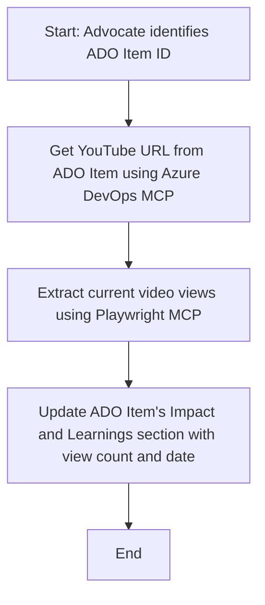

# Case Study: Updating Azure DevOps Items from YouTube Data with MCP

> **Disclaimer:** There are existing online tools and reports that can automate the process of updating Azure DevOps items with data from platforms like YouTube. The following scenario is provided purely as a sample use case to illustrate how MCP tools can be applied for automation and integration tasks.

## Overview

This case study demonstrates one example of how the Model Context Protocol (MCP) and its tools can be used to automate the process of updating Azure DevOps (ADO) work items with information sourced from online platforms, such as YouTube. The described scenario is just one illustration of the broader capabilities of these tools, which can be adapted to many similar automation needs.

In this example, an Advocate tracks online sessions using ADO items, where each item includes a YouTube video URL. By leveraging MCP tools, the Advocate can keep ADO items up to date with the latest video metrics, such as view counts, in a repeatable and automated way. This approach can be generalized to other use cases where information from online sources needs to be integrated into ADO or other systems.

## Scenario

An Advocate is responsible for tracking the impact of online sessions and community engagements. Each session is logged as an ADO work item in the 'DevRel' project, and the work item contains a field for the YouTube video URL. To accurately report the session's reach, the Advocate needs to update the ADO item with the current number of video views and the date this information was retrieved.

## Tools Used

- [Azure DevOps MCP](https://github.com/microsoft/azure-devops-mcp): Enables programmatic access and updates to ADO work items via MCP.
- [Playwright MCP](https://github.com/microsoft/playwright-mcp): Automates browser actions to extract live data from web pages, such as YouTube video statistics.

## Step-by-Step Workflow

1. **Identify the ADO Item**: Start with the ADO work item ID (e.g., 1234) in the 'DevRel' project.
2. **Retrieve the YouTube URL**: Use the Azure DevOps MCP tool to get the YouTube URL from the work item.
3. **Extract Video Views**: Use the Playwright MCP tool to navigate to the YouTube URL and extract the current view count.
4. **Update the ADO Item**: Write the latest view count and the date of retrieval into the 'Impact and Learnings' section of the ADO work item using the Azure DevOps MCP tool.

## Example Prompt

```bash
- Work with the ADO Item ID: 1234
- The project is '2025-Awesome'
- Get the YouTube URL for the ADO item
- Use Playwright to get the current views from the YouTube video
- Update the ADO item with the current video views and the updated date of the information
```

## Mermaid Flowchart



## Technical Implementation

- **MCP Orchestration**: The workflow is orchestrated by an MCP server, which coordinates the use of both Azure DevOps MCP and Playwright MCP tools.
- **Automation**: The process can be triggered manually or scheduled to run at regular intervals to keep ADO items up to date.
- **Extensibility**: The same pattern can be extended to update ADO items with other online metrics (e.g., likes, comments) or from other platforms.

## Results and Impact

- **Efficiency**: Reduces manual effort for Advocates by automating the retrieval and update of video metrics.
- **Accuracy**: Ensures that ADO items reflect the most current data available from online sources.
- **Repeatability**: Provides a reusable workflow for similar scenarios involving other data sources or metrics.

## References

- [Azure DevOps MCP](https://github.com/microsoft/azure-devops-mcp)
- [Playwright MCP](https://github.com/microsoft/playwright-mcp)
- [Model Context Protocol (MCP)](https://modelcontextprotocol.io/)
