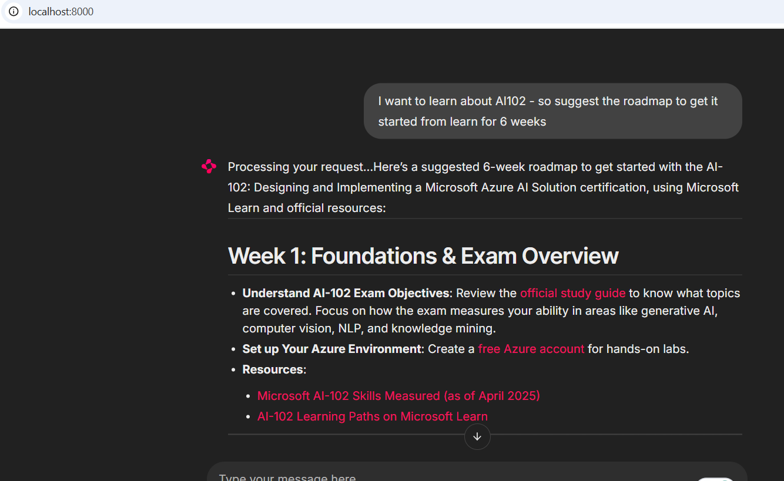
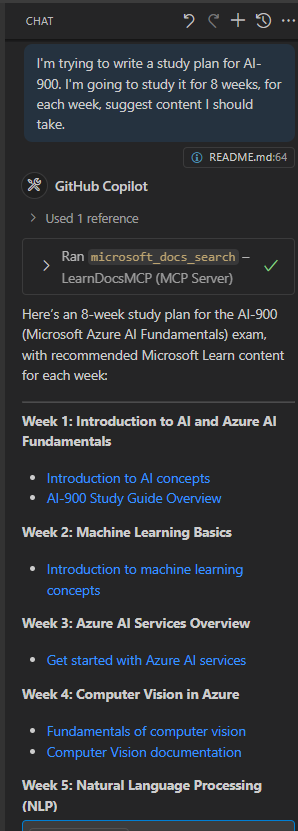

# Case Study: Connecting to the Microsoft Learn Docs MCP Server from a Client

Have you ever found yourself juggling between documentation sites, Stack Overflow, and endless search engine tabs, all while trying to solve a problem in your code? Maybe you keep a second monitor just for docs, or you’re constantly alt-tabbing between your IDE and a browser. Wouldn’t it be better if you could bring the documentation right into your workflow—integrated into your apps, your IDE, or even your own custom tools? In this case study, we’ll explore how to do exactly that by connecting directly to the Microsoft Learn Docs MCP server from your own client application.

## Overview

Modern development is more than just writing code—it’s about finding the right information at the right time. Documentation is everywhere, but it’s rarely where you need it most: inside your tools and workflows. By integrating documentation retrieval directly into your applications, you can save time, reduce context switching, and boost productivity. In this section, we’ll show you how to connect a client to the Microsoft Learn Docs MCP server, so you can access real-time, context-aware documentation without ever leaving your app.

We’ll walk through the process of establishing a connection, sending a request, and handling streaming responses efficiently. This approach not only streamlines your workflow but also opens the door to building smarter, more helpful developer tools.

## Learning Objectives

Why are we doing this? Because the best developer experiences are those that remove friction. Imagine a world where your code editor, chatbot, or web app can answer your documentation questions instantly, using the latest content from Microsoft Learn. By the end of this chapter, you’ll know how to:

- Understand the basics of MCP server-client communication for documentation
- Implement a console or web application to connect to the Microsoft Learn Docs MCP server
- Use streaming HTTP clients for real-time documentation retrieval
- Log and interpret documentation responses in your application

You’ll see how these skills can help you build tools that are not just reactive, but truly interactive and context-aware.

## Scenario 1 - Real-Time Documentation Retrieval with MCP

In this scenario, we’ll show you how to connect a client to the Microsoft Learn Docs MCP server, so you can access real-time, context-aware documentation without ever leaving your app. 

Let’s put this into practice. Your task is to write an app that connects to the Microsoft Learn Docs MCP server, invokes the `microsoft_docs_search` tool, and logs the streaming response to the console.

### Why this approach?
Because it’s the foundation for building more advanced integrations—whether you want to power a chatbot, an IDE extension, or a web dashboard.

You'll find the code and instructions for this scenario in the [`solution`](./solution/README.md) folder within this case study. The steps will guide you through setting up the connection:
- Use the official MCP SDK and streamable HTTP client for connection
- Call the `microsoft_docs_search` tool with a query parameter to retrieve documentation
- Implement proper logging and error handling
- Create an interactive console interface to allow users to enter multiple search queries

This scenario demonstrates how to:
- Connect to the Docs MCP server
- Send a query
- Parse and print the results

Here’s what running the solution might look like:

```
Prompt> What is Azure Key Vault?
Answer> Azure Key Vault is a cloud service for securely storing and accessing secrets. ...
```

Below is a minimal sample solution. The full code and details are available in the solution folder.

<details>
<summary>Python</summary>

```python
import asyncio
from mcp.client.streamable_http import streamablehttp_client
from mcp import ClientSession

async def main():
    async with streamablehttp_client("https://learn.microsoft.com/api/mcp") as (read_stream, write_stream, _):
        async with ClientSession(read_stream, write_stream) as session:
            await session.initialize()
            result = await session.call_tool("microsoft_docs_search", {"query": "Azure Functions best practices"})
            print(result.content)

if __name__ == "__main__":
    asyncio.run(main())
```

- For the complete implementation and logging, see [`scenario1.py`](./solution/python/scenario1.py).
- For installation and usage instructions, see the [`README.md`](./solution/python/README.md) file in the same folder.
</details>


## Scenario 2 - Interactive Study Plan Generator Web App with MCP

In this scenario, you’ll learn how to integrate Docs MCP into a web development project. The goal is to enable users to search Microsoft Learn documentation directly from a web interface, making documentation instantly accessible within your app or site.

You’ll see how to:
- Set up a web app
- Connect to the Docs MCP server
- Handle user input and display results

Here’s what running the solution might look like:

```
User> I want to learn about AI102 - so suggest the roadmap to get it started from learn for 6 weeks

Assistant> Here’s a detailed 6-week roadmap to start your preparation for the AI-102: Designing and Implementing a Microsoft Azure AI Solution certification, using official Microsoft resources and focusing on exam skills areas:

---
## Week 1: Introduction & Fundamentals
- **Understand the Exam**: Review the [AI-102 exam skills outline](https://learn.microsoft.com/en-us/credentials/certifications/exams/ai-102/).
- **Set up Azure**: Sign up for a free Azure account if you don't have one.
- **Learning Path**: [Introduction to Azure AI services](https://learn.microsoft.com/en-us/training/modules/intro-to-azure-ai/)
- **Focus**: Get familiar with Azure portal, AI capabilities, and necessary tools.

....more weeks of the roadmap...

Let me know if you want module-specific recommendations or need more customized weekly tasks!
```

Below is a minimal sample solution. The full code and details are available in the solution folder.



<details>
<summary>Python (Chainlit)</summary>

Chainlit is a framework for building conversational AI web apps. It makes it easy to create interactive chatbots and assistants that can call MCP tools and display results in real time. It’s ideal for rapid prototyping and user-friendly interfaces.

```python
import chainlit as cl
import requests

MCP_URL = "https://learn.microsoft.com/api/mcp"

@cl.on_message
def handle_message(message):
    query = {"question": message}
    response = requests.post(MCP_URL, json=query)
    if response.ok:
        result = response.json()
        cl.Message(content=result.get("answer", "No answer found.")).send()
    else:
        cl.Message(content="Error: " + response.text).send()
```

- For the complete implementation, see [`scenario2.py`](./solution/python/scenario2.py).
- For setup and running instructions, see the [`README.md`](./solution/python/README.md).
</details>


## Scenario 3: In-Editor Docs with MCP Server in VS Code

If you want to get Microsoft Learn Docs directly inside your VS Code (instead of switching browser tabs), you can use the MCP server in your editor. This allows you to:
- Search and read docs in VS Code without leaving your coding environment.
- Reference documentation and insert links directly into your README or course files.
- Leverage GitHub Copilot and MCP together for a seamless, AI-powered documentation workflow.

**You'll see how to:**
- Add a valid `.vscode/mcp.json` file to your workspace root (see example below).
- Open the MCP panel or use the command palette in VS Code to search and insert docs.
- Reference documentation directly in your markdown files as you work.
- Combine this workflow with GitHub Copilot for even greater productivity.

Here’s a example of how to set up the MCP server in VS Code:

```json
{
  "servers": {
    "LearnDocsMCP": {
      "url": "https://learn.microsoft.com/api/mcp"
    }
  }
}
```

</details>

> For a detailed walkthrough with screenshots and step-by-step guide, see [`README.md`](./solution/scenario3/README.md).



This approach is ideal for anyone building technical courses, writing documentation, or developing code with frequent reference needs.

## Key Takeaways

Integrating documentation directly into your tools isn’t just a convenience—it’s a game changer for productivity. By connecting to the Microsoft Learn Docs MCP server from your client, you can:

- Eliminate context switching between your code and documentation
- Retrieve up-to-date, context-aware docs in real time
- Build smarter, more interactive developer tools

These skills will help you create solutions that are not only efficient, but also delightful to use.

## Additional Resources

To deepen your understanding, explore these official resources:

- [Microsoft Learn Docs MCP Server (GitHub)](https://github.com/MicrosoftDocs/mcp)
- [Get started with Azure MCP Server (mcp-python)](https://learn.microsoft.com/en-us/azure/developer/azure-mcp-server/get-started#create-the-python-app)
- [What is the Azure MCP Server?](https://learn.microsoft.com/en-us/azure/developer/azure-mcp-server/)
- [Model Context Protocol (MCP) Introduction](https://modelcontextprotocol.io/introduction)
- [Add plugins from a MCP Server (Python)](https://learn.microsoft.com/en-us/semantic-kernel/concepts/plugins/adding-mcp-plugins)