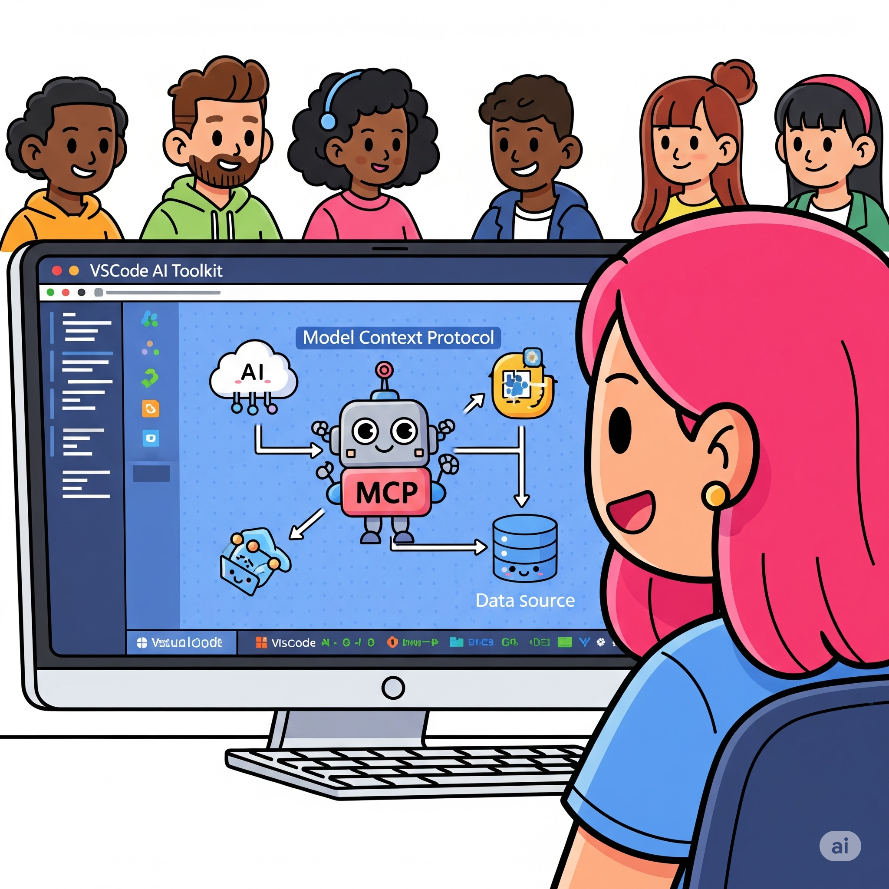
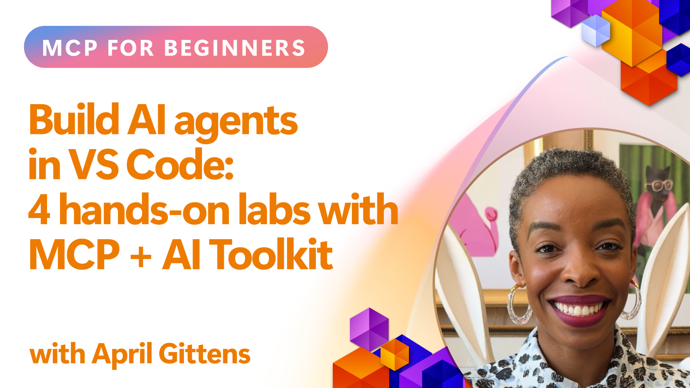

# Streamlining AI Workflows: Building an MCP Server with AI Toolkit

## 🎯  Overview

_(Click the image above to view video of this lesson)_

Welcome to the **Model Context Protocol (MCP) Workshop**! This comprehensive hands-on workshop combines two cutting-edge technologies to revolutionize AI application development:

- **🔗 Model Context Protocol (MCP)**: An open standard for seamless AI-tool integration
- **🛠️ AI Toolkit for Visual Studio Code (AITK)**: Microsoft's powerful AI development extension

### 🎓 What You'll Learn

By the end of this workshop, you'll master the art of building intelligent applications that bridge AI models with real-world tools and services. From automated testing to custom API integrations, you'll gain practical skills to solve complex business challenges.

## 🏗️ Technology Stack

### 🔌 Model Context Protocol (MCP)

MCP is the **"USB-C for AI"** - a universal standard that connects AI models to external tools and data sources.

**✨ Key Features:**

- 🔄 **Standardized Integration**: Universal interface for AI-tool connections
- 🏛️ **Flexible Architecture**: Local & remote servers via stdio/SSE transport
- 🧰 **Rich Ecosystem**: Tools, prompts, and resources in one protocol
- 🔒 **Enterprise-Ready**: Built-in security and reliability

**🎯 Why MCP Matters:**
Just like USB-C eliminated cable chaos, MCP eliminates the complexity of AI integrations. One protocol, infinite possibilities.

### 🤖 AI Toolkit for Visual Studio Code (AITK)

Microsoft's flagship AI development extension that transforms VS Code into an AI powerhouse.

**🚀 Core Capabilities:**

- 📦 **Model Catalog**: Access models from Azure AI, GitHub, Hugging Face, Ollama
- ⚡ **Local Inference**: ONNX-optimized CPU/GPU/NPU execution
- 🏗️ **Agent Builder**: Visual AI agent development with MCP integration
- 🎭 **Multi-Modal**: Text, vision, and structured output support

**💡 Development Benefits:**

- Zero-config model deployment
- Visual prompt engineering
- Real-time testing playground
- Seamless MCP server integration

## 📚 Learning Journey

### [🚀 Module 1: AI Toolkit Fundamentals](./lab1/README.md)

**Duration**: 15 minutes

- 🛠️ Install and configure AI Toolkit for VS Code
- 🗂️ Explore the Model Catalog (100+ models from GitHub, ONNX, OpenAI, Anthropic, Google)
- 🎮 Master the Interactive Playground for real-time model testing
- 🤖 Build your first AI agent with Agent Builder
- 📊 Evaluate model performance with built-in metrics (F1, relevance, similarity, coherence)
- ⚡ Learn batch processing and multi-modal support capabilities

**🎯 Learning Outcome**: Create a functional AI agent with comprehensive understanding of AITK capabilities

### [🌐 Module 2: MCP with AI Toolkit Fundamentals](./lab2/README.md)

**Duration**: 20 minutes

- 🧠 Master Model Context Protocol (MCP) architecture and concepts
- 🌐 Explore Microsoft's MCP server ecosystem
- 🤖 Build a browser automation agent using Playwright MCP server
- 🔧 Integrate MCP servers with AI Toolkit Agent Builder
- 📊 Configure and test MCP tools within your agents
- 🚀 Export and deploy MCP-powered agents for production use

**🎯 Learning Outcome**: Deploy an AI agent supercharged with external tools through MCP

### [🔧 Module 3: Advanced MCP Development with AI Toolkit](./lab3/README.md)

**Duration**: 20 minutes

- 💻 Create custom MCP servers using AI Toolkit
- 🐍 Configure and use the latest MCP Python SDK (v1.9.3)
- 🔍 Set up and utilize MCP Inspector for debugging
- 🛠️ Build a Weather MCP Server with professional debugging workflows
- 🧪 Debug MCP servers in both Agent Builder and Inspector environments

**🎯 Learning Outcome**: Develop and debug custom MCP servers with modern tooling

### [🐙 Module 4: Practical MCP Development - Custom GitHub Clone Server](./lab4/README.md)

**Duration**: 30 minutes

- 🏗️ Build a real-world GitHub Clone MCP Server for development workflows
- 🔄 Implement smart repository cloning with validation and error handling
- 📁 Create intelligent directory management and VS Code integration
- 🤖 Use GitHub Copilot Agent Mode with custom MCP tools
- 🛡️ Apply production-ready reliability and cross-platform compatibility

**🎯 Learning Outcome**: Deploy a production-ready MCP server that streamlines real development workflows

## 💡 Real-World Applications & Impact

### 🏢 Enterprise Use Cases

#### 🔄 DevOps Automation

Transform your development workflow with intelligent automation:

- **Smart Repository Management**: AI-driven code review and merge decisions
- **Intelligent CI/CD**: Automated pipeline optimization based on code changes
- **Issue Triage**: Automatic bug classification and assignment

#### 🧪 Quality Assurance Revolution

Elevate testing with AI-powered automation:

- **Intelligent Test Generation**: Create comprehensive test suites automatically
- **Visual Regression Testing**: AI-powered UI change detection
- **Performance Monitoring**: Proactive issue identification and resolution

#### 📊 Data Pipeline Intelligence

Build smarter data processing workflows:

- **Adaptive ETL Processes**: Self-optimizing data transformations
- **Anomaly Detection**: Real-time data quality monitoring
- **Intelligent Routing**: Smart data flow management

#### 🎧 Customer Experience Enhancement

Create exceptional customer interactions:

- **Context-Aware Support**: AI agents with access to customer history
- **Proactive Issue Resolution**: Predictive customer service
- **Multi-Channel Integration**: Unified AI experience across platforms

## 🛠️ Prerequisites & Setup

### 💻 System Requirements

| Component | Requirement | Notes |
|-----------|-------------|-------|
| **Operating System** | Windows 10+, macOS 10.15+, Linux | Any modern OS |
| **Visual Studio Code** | Latest stable version | Required for AITK |
| **Node.js** | v18.0+ and npm | For MCP server development |
| **Python** | 3.10+ | Optional for Python MCP servers |
| **Memory** | 8GB RAM minimum | 16GB recommended for local models |

### 🔧 Development Environment

#### Recommended VS Code Extensions

- **AI Toolkit** (ms-windows-ai-studio.windows-ai-studio)
- **Python** (ms-python.python)
- **Python Debugger** (ms-python.debugpy)
- **GitHub Copilot** (GitHub.copilot) - Optional but helpful

#### Optional Tools

- **uv**: Modern Python package manager
- **MCP Inspector**: Visual debugging tool for MCP servers
- **Playwright**: For web automation examples

## 🎖️ Learning Outcomes & Certification Path

### 🏆 Skill Mastery Checklist

By completing this workshop, you will achieve mastery in:

#### 🎯 Core Competencies

- [ ] **MCP Protocol Mastery**: Deep understanding of architecture and implementation patterns
- [ ] **AITK Proficiency**: Expert-level usage of AI Toolkit for rapid development
- [ ] **Custom Server Development**: Build, deploy, and maintain production MCP servers
- [ ] **Tool Integration Excellence**: Seamlessly connect AI with existing development workflows
- [ ] **Problem-Solving Application**: Apply learned skills to real business challenges

#### 🔧 Technical Skills

- [ ] Set up and configure AI Toolkit in VS Code
- [ ] Design and implement custom MCP servers
- [ ] Integrate GitHub Models with MCP architecture
- [ ] Build automated testing workflows with Playwright
- [ ] Deploy AI agents for production use
- [ ] Debug and optimize MCP server performance

#### 🚀 Advanced Capabilities

- [ ] Architect enterprise-scale AI integrations
- [ ] Implement security best practices for AI applications
- [ ] Design scalable MCP server architectures
- [ ] Create custom tool chains for specific domains
- [ ] Mentor others in AI-native development

## 📖 Additional Resources

- [MCP Specification](https://modelcontextprotocol.io/docs)
- [AI Toolkit GitHub Repository](https://github.com/microsoft/vscode-ai-toolkit)
- [Sample MCP Servers Collection](https://github.com/modelcontextprotocol/servers)
- [Best Practices Guide](https://modelcontextprotocol.io/docs/best-practices)

---

**🚀 Ready to revolutionize your AI development workflow?**

Let's build the future of intelligent applications together with MCP and AI Toolkit!
