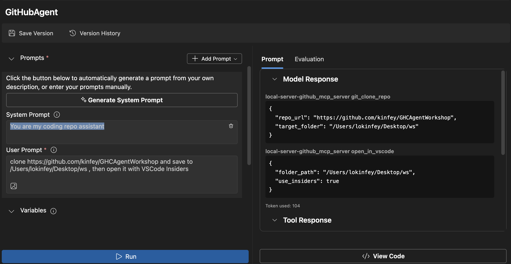

# 🐙 Module 4: Practical MCP Development - Custom GitHub Clone Server


> **⚡ Quick Start:** Build a production-ready MCP server that automates GitHub repository cloning and VS Code integration in just 30 minutes!

## 🎯 Learning Objectives

By the end of this lab, you will be able to:

- ✅ Create a custom MCP server for real-world development workflows
- ✅ Implement GitHub repository cloning functionality via MCP
- ✅ Integrate custom MCP servers with VS Code and Agent Builder
- ✅ Use GitHub Copilot Agent Mode with custom MCP tools
- ✅ Test and deploy custom MCP servers in production environments

## 📋 Prerequisites

- Completion of Labs 1-3 (MCP fundamentals and advanced development)
- GitHub Copilot subscription ([free signup available](https://github.com/github-copilot/signup))
- VS Code with AI Toolkit and GitHub Copilot extensions
- Git CLI installed and configured

## 🏗️ Project Overview

### **Real-World Development Challenge**
As developers, we frequently use GitHub to clone repositories and open them in VS Code or VS Code Insiders. This manual process involves:
1. Opening terminal/command prompt
2. Navigating to the desired directory
3. Running `git clone` command
4. Opening VS Code in the cloned directory

**Our MCP solution streamlines this into a single intelligent command!**

### **What You'll Build**
A **GitHub Clone MCP Server** (`git_mcp_server`) that provides:

| Feature | Description | Benefit |
|---------|-------------|---------|
| 🔄 **Smart Repository Cloning** | Clone GitHub repos with validation | Automated error checking |
| 📁 **Intelligent Directory Management** | Check and create directories safely | Prevents overwriting |
| 🚀 **Cross-Platform VS Code Integration** | Open projects in VS Code/Insiders | Seamless workflow transition |
| 🛡️ **Robust Error Handling** | Handle network, permission, and path issues | Production-ready reliability |

---

## 📖 Step-by-Step Implementation

### Step 1: Create GitHub Agent in Agent Builder

1. **Launch Agent Builder** through the AI Toolkit extension
2. **Create a new agent** with the following configuration:
   ```
   Agent Name: GitHubAgent
   ```

3. **Initialize custom MCP server:**
   - Navigate to **Tools** → **Add Tool** → **MCP Server**
   - Select **"Create A new MCP Server"**
   - Choose **Python template** for maximum flexibility
   - **Server Name:** `git_mcp_server`

### Step 2: Configure GitHub Copilot Agent Mode

1. **Open GitHub Copilot** in VS Code (Ctrl/Cmd + Shift + P → "GitHub Copilot: Open")
2. **Select Agent Model** in the Copilot interface
3. **Choose Claude 3.7 model** for enhanced reasoning capabilities
4. **Enable MCP integration** for tool access

> **💡 Pro Tip:** Claude 3.7 provides superior understanding of development workflows and error handling patterns.

### Step 3: Implement Core MCP Server Functionality

**Use the following detailed prompt with GitHub Copilot Agent Mode:**

```
Create two MCP tools with the following comprehensive requirements:

🔧 TOOL A: clone_repository
Requirements:
- Clone any GitHub repository to a specified local folder
- Return the absolute path of the successfully cloned project
- Implement comprehensive validation:
  ✓ Check if target directory already exists (return error if exists)
  ✓ Validate GitHub URL format (https://github.com/user/repo)
  ✓ Verify git command availability (prompt installation if missing)
  ✓ Handle network connectivity issues
  ✓ Provide clear error messages for all failure scenarios

🚀 TOOL B: open_in_vscode
Requirements:
- Open specified folder in VS Code or VS Code Insiders
- Cross-platform compatibility (Windows/Linux/macOS)
- Use direct application launch (not terminal commands)
- Auto-detect available VS Code installations
- Handle cases where VS Code is not installed
- Provide user-friendly error messages

Additional Requirements:
- Follow MCP 1.9.3 best practices
- Include proper type hints and documentation
- Implement logging for debugging purposes
- Add input validation for all parameters
- Include comprehensive error handling
```

### Step 4: Test Your MCP Server

#### 4a. Test in Agent Builder

1. **Launch the debug configuration** for Agent Builder
2. **Configure your agent with this system prompt:**

```
SYSTEM_PROMPT:
You are my intelligent coding repository assistant. You help developers efficiently clone GitHub repositories and set up their development environment. Always provide clear feedback about operations and handle errors gracefully.
```

3. **Test with realistic user scenarios:**

```
USER_PROMPT EXAMPLES:

Scenario : Basic Clone and Open
"Clone {Your GitHub Repo link such as https://github.com/kinfey/GHCAgentWorkshop
 } and save to {The global path you specify}, then open it with VS Code Insiders"
```



**Expected Results:**
- ✅ Successful cloning with path confirmation
- ✅ Automatic VS Code launch
- ✅ Clear error messages for invalid scenarios
- ✅ Proper handling of edge cases

#### 4b. Test in MCP Inspector


---


**🎉 Congratulations!** You've successfully created a practical, production-ready MCP server that solves real development workflow challenges. Your custom GitHub clone server demonstrates the power of MCP for automating and enhancing developer productivity.

### 🏆 Achievement Unlocked:
- ✅ **MCP Developer** - Created custom MCP server
- ✅ **Workflow Automator** - Streamlined development processes  
- ✅ **Integration Expert** - Connected multiple development tools
- ✅ **Production Ready** - Built deployable solutions

---

## 🎓 Workshop Completion: Your Journey with Model Context Protocol

**Dear Workshop Participant,**

Congratulations on completing all four modules of the Model Context Protocol workshop! You've come a long way from understanding basic AI Toolkit concepts to building production-ready MCP servers that solve real-world development challenges.

### 🚀 Your Learning Path Recap:

**[Module 1](../lab1/README.md)**: You began by exploring AI Toolkit fundamentals, model testing, and creating your first AI agent.

**[Module 2](../lab2/README.md)**: You learned MCP architecture, integrated Playwright MCP, and built your first browser automation agent.

**[Module 3](../lab3/README.md)**: You advanced to custom MCP server development with the Weather MCP server and mastered debugging tools.

**[Module 4](../lab4/README.md)**: You've now applied everything to create a practical GitHub repository workflow automation tool.

### 🌟 What You've Mastered:

- ✅ **AI Toolkit Ecosystem**: Models, agents, and integration patterns
- ✅ **MCP Architecture**: Client-server design, transport protocols, and security
- ✅ **Developer Tools**: From Playground to Inspector to production deployment
- ✅ **Custom Development**: Building, testing, and deploying your own MCP servers
- ✅ **Practical Applications**: Solving real-world workflow challenges with AI

### 🔮 Your Next Steps:

1. **Build Your Own MCP Server**: Apply these skills to automate your unique workflows
2. **Join the MCP Community**: Share your creations and learn from others
3. **Explore Advanced Integration**: Connect MCP servers to enterprise systems
4. **Contribute to Open Source**: Help improve MCP tooling and documentation

Remember, this workshop is just the beginning. The Model Context Protocol ecosystem is rapidly evolving, and you're now equipped to be at the forefront of AI-powered development tools.

**Thank you for your participation and dedication to learning!**

We hope this workshop has sparked ideas that will transform how you build and interact with AI tools in your development journey.

**Happy coding!**

---


