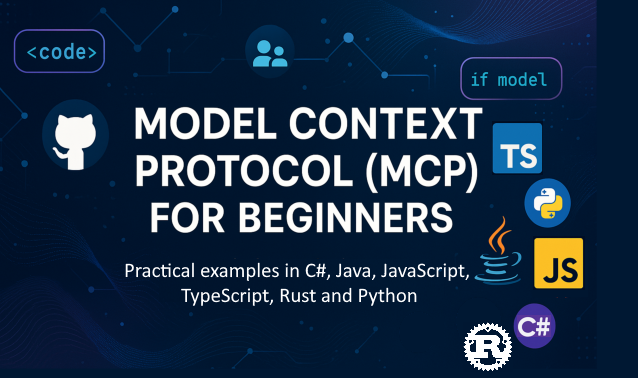

 

Follow these steps to get started using these resources:
1. **Fork the Repository**: Click 
2. **Clone the Repository**:   `git clone https://github.com/microsoft/mcp-for-beginners.git`
3. **Join The** 

### 🌐 Multi-Language Support

#### Supported via GitHub Action (Automated & Always Up-to-Date)

<!-- CO-OP TRANSLATOR LANGUAGES TABLE START -->
[Arabic](./translations/ar/README.md) | [Bengali](./translations/bn/README.md) | [Bulgarian](./translations/bg/README.md) | [Burmese (Myanmar)](./translations/my/README.md) | [Chinese (Simplified)](./translations/zh/README.md) | [Chinese (Traditional, Hong Kong)](./translations/hk/README.md) | [Chinese (Traditional, Macau)](./translations/mo/README.md) | [Chinese (Traditional, Taiwan)](./translations/tw/README.md) | [Croatian](./translations/hr/README.md) | [Czech](./translations/cs/README.md) | [Danish](./translations/da/README.md) | [Dutch](./translations/nl/README.md) | [Estonian](./translations/et/README.md) | [Finnish](./translations/fi/README.md) | [French](./translations/fr/README.md) | [German](./translations/de/README.md) | [Greek](./translations/el/README.md) | [Hebrew](./translations/he/README.md) | [Hindi](./translations/hi/README.md) | [Hungarian](./translations/hu/README.md) | [Indonesian](./translations/id/README.md) | [Italian](./translations/it/README.md) | [Japanese](./translations/ja/README.md) | [Korean](./translations/ko/README.md) | [Lithuanian](./translations/lt/README.md) | [Malay](./translations/ms/README.md) | [Marathi](./translations/mr/README.md) | [Nepali](./translations/ne/README.md) | [Norwegian](./translations/no/README.md) | [Persian (Farsi)](./translations/fa/README.md) | [Polish](./translations/pl/README.md) | [Portuguese (Brazil)](./translations/br/README.md) | [Portuguese (Portugal)](./translations/pt/README.md) | [Punjabi (Gurmukhi)](./translations/pa/README.md) | [Romanian](./translations/ro/README.md) | [Russian](./translations/ru/README.md) | [Serbian (Cyrillic)](./translations/sr/README.md) | [Slovak](./translations/sk/README.md) | [Slovenian](./translations/sl/README.md) | [Spanish](./translations/es/README.md) | [Swahili](./translations/sw/README.md) | [Swedish](./translations/sv/README.md) | [Tagalog (Filipino)](./translations/tl/README.md) | [Tamil](./translations/ta/README.md) | [Thai](./translations/th/README.md) | [Turkish](./translations/tr/README.md) | [Ukrainian](./translations/uk/README.md) | [Urdu](./translations/ur/README.md) | [Vietnamese](./translations/vi/README.md)
<!-- CO-OP TRANSLATOR LANGUAGES TABLE END -->

# 🚀 Model Context Protocol (MCP) Curriculum for Beginners

## **Learn MCP with Hands-on Code Examples in C#, Java, JavaScript, Rust, Python, and TypeScript**

## 🧠 Overview of the Model Context Protocol Curriculum
Welcome to your journey into the Model Context Protocol! If you've ever wondered how AI applications communicate with different tools and services, you're about to discover the elegant solution that's transforming how developers build intelligent systems.

Think of MCP as a universal translator for AI applications - just like how USB ports let you connect any device to your computer, MCP lets AI models connect to any tool or service in a standardized way. Whether you're building your first chatbot or working on complex AI workflows, understanding MCP will give you the power to create more capable and flexible applications.

This curriculum is designed with patience and care for your learning journey. We'll start with simple concepts you already understand and gradually build your expertise through hands-on practice in your favorite programming language. Every step includes clear explanations, practical examples, and plenty of encouragement along the way.

By the time you complete this journey, you'll have the confidence to build your own MCP servers, integrate them with popular AI platforms, and understand how this technology is reshaping the future of AI development. Let's begin this exciting adventure together!

### Official Documentation and Specifications

These resources become more valuable as your understanding grows, but don't feel pressured to read everything immediately. Start with the areas that interest you most!
- 📘 [MCP Documentation](https://modelcontextprotocol.io/) – This is your go-to resource for step-by-step tutorials and user guides. The documentation is written with beginners in mind, providing clear examples you can follow along with at your own pace.
- 📜 [MCP Specification](https://modelcontextprotocol.io/docs/) – Think of this as your comprehensive reference manual. As you work through the curriculum, you'll find yourself returning here to look up specific details and explore advanced features.
- 📜 [Original MCP Specification](https://spec.modelcontextprotocol.io/) – This contains additional technical details that can be helpful for advanced implementations. It's there when you need it, but don't worry about it when you're starting out.
- 🧑‍💻 [MCP GitHub Repository](https://github.com/modelcontextprotocol) –  Here you'll find SDKs, tools, and code samples in multiple programming languages. It's like a treasure trove of practical examples and ready-to-use components.
- 🌐 [MCP Community](https://github.com/orgs/modelcontextprotocol/discussions) – Join fellow learners and experienced developers in discussions about MCP. It's a supportive community where questions are welcome and knowledge is shared freely.
  
## Learning Objectives

By the end of this curriculum, you'll feel confident and excited about your new abilities. Here's what you'll achieve:

• **Understand MCP fundamentals**: You'll grasp what the Model Context Protocol is and why it's revolutionizing how AI applications work together, using analogies and examples that make sense.

• **Build your first MCP server**: You'll create a working MCP server in your preferred programming language, starting with simple examples and growing your skills step by step.

• **Connect AI models to real tools**: You'll learn how to bridge the gap between AI models and actual services, giving your applications powerful new capabilities.

• **Implement security best practices**: You'll understand how to keep your MCP implementations safe and secure, protecting both your applications and your users.

• **Deploy with confidence**: You'll know how to take your MCP projects from development to production, with practical deployment strategies that work in the real world.

• **Join the MCP community**: You'll become part of a growing community of developers who are shaping the future of AI application development. 

## Essential Background

Before we dive into MCP specifics, let's make sure you feel comfortable with some foundational concepts. Don't worry if you're not an expert in these areas - we'll explain everything you need to know as we go!

### Understanding Protocols (The Foundation)

Think of a protocol like the rules for a conversation. When you call a friend, you both know to say "hello" when you answer, take turns speaking, and say "goodbye" when you're done. Computer programs need similar rules to communicate effectively.

MCP is a protocol - a set of agreed-upon rules that help AI models and applications have productive "conversations" with tools and services. Just like how having conversation rules makes human communication smoother, having MCP makes AI application communication much more reliable and powerful.

### Client-Server Relationships (How Programs Work Together)

You already use client-server relationships every day! When you use a web browser (the client) to visit a website, you're connecting to a web server that sends you the page content. The browser knows how to ask for information, and the server knows how to respond.

In MCP, we have a similar relationship: AI models act as clients that request information or actions, while MCP servers provide those capabilities. It's like having a helpful assistant (the server) that the AI can ask to perform specific tasks.

### Why Standardization Matters (Making Things Work Together)

Imagine if every car manufacturer used different shaped gas pumps - you'd need a different adapter for each car! Standardization means agreeing on common approaches so things work together seamlessly.

MCP provides this standardization for AI applications. Instead of every AI model needing custom code to work with every tool, MCP creates a universal way for them to communicate. This means developers can build tools once and have them work with many different AI systems.

## 🧭 Your Learning Path Overview

Your MCP journey is carefully structured to build your confidence and skills progressively. Each phase introduces new concepts while reinforcing what you've already learned.

### 🌱 Foundation Phase: Understanding the Basics (Modules 0-2)

This is where your adventure begins! We'll introduce you to MCP concepts using familiar analogies and simple examples. You'll understand what MCP is, why it exists, and how it fits into the larger world of AI development.

• **Module 0 - Introduction to MCP**: We'll start by exploring what MCP is and why it's so important for modern AI applications. You'll see real-world examples of MCP in action and understand how it solves common problems developers face.

• **Module 1 - Core Concepts Explained**: Here you'll learn the essential building blocks of MCP. We'll use plenty of analogies and visual examples to make sure these concepts feel natural and understandable.

• **Module 2 - Security in MCP**: Security might sound intimidating, but we'll show you how MCP includes built-in safety features and teach you best practices that protect your applications from the start.

### 🔨 Building Phase: Creating Your First Implementations (Module 3)

Now the real fun begins! You'll get hands-on experience building actual MCP servers and clients. Don't worry - we'll start simple and guide you through every step.

This module includes multiple hands-on guides that let you practice in your preferred programming language. You'll create your first server, build a client to connect to it, and even integrate with popular development tools like VS Code.

Each guide includes complete code examples, troubleshooting tips, and explanations of why we make specific design choices. By the end of this phase, you'll have working MCP implementations you can be proud of!

### 🚀 Growing Phase: Advanced Concepts and Real-World Application (Modules 4-5)

With the basics mastered, you're ready to explore more sophisticated MCP features. We'll cover practical implementation strategies, debugging techniques, and advanced topics like multi-modal AI integration.

You'll also learn how to scale your MCP implementations for production use and integrate with cloud platforms like Azure. These modules prepare you to build MCP solutions that can handle real-world demands.

### 🌟 Mastery Phase: Community and Specialization (Modules 6-11)

The final phase focuses on joining the MCP community and specializing in areas that interest you most. You'll learn how to contribute to open-source MCP projects, implement advanced authentication patterns, and build comprehensive database-integrated solutions.

Module 11 deserves special mention - it's a complete 13-lab hands-on learning path that teaches you to build production-ready MCP servers with PostgreSQL integration. It's like a capstone project that brings together everything you've learned!

### 📚 Complete Curriculum Structure

| Module | Topic | Description | Link |
|--------|-------|-------------|------|
| **Module 1-3: Fundamentals** | | | |
| 00 | Introduction to MCP | Overview of the Model Context Protocol and its significance in AI pipelines | [Read more](./00-Introduction/README.md) |
| 01 | Core Concepts Explained | In-depth exploration of core MCP concepts | [Read more](./01-CoreConcepts/README.md) |
| 02 | Security in MCP | Security threats and best practices | [Read more](./02-Security/README.md) |
| 03 | Getting Started with MCP | Environment setup, basic servers/clients, integration | [Read more](./03-GettingStarted/README.md) |
| **Module 3: Building Your First Server & Client** | | | |
| 3.1 | First Server | Create your first MCP server | [Guide](./03-GettingStarted/01-first-server/README.md) |
| 3.2 | First Client | Develop a basic MCP client | [Guide](./03-GettingStarted/02-client/README.md) |
| 3.3 | Client with LLM | Integrate large language models | [Guide](./03-GettingStarted/03-llm-client/README.md) |
| 3.4 | VS Code Integration | Consume MCP servers in VS Code | [Guide](./03-GettingStarted/04-vscode/README.md) |
| 3.5 | stdio Server | Create servers using stdio transport | [Guide](./03-GettingStarted/05-stdio-server/README.md) |
| 3.6 | HTTP Streaming | Implement HTTP streaming in MCP | [Guide](./03-GettingStarted/06-http-streaming/README.md) |
| 3.7 | AI Toolkit | Use AI Toolkit with MCP | [Guide](./03-GettingStarted/07-aitk/README.md) |
| 3.8 | Testing | Test your MCP server implementation | [Guide](./03-GettingStarted/08-testing/README.md) |
| 3.9 | Deployment | Deploy MCP servers to production | [Guide](./03-GettingStarted/09-deployment/README.md) |
| 3.10 | Advanced server usage | Use advanced servers for advanced feature usage and improved architecture | [Guide](./03-GettingStarted/10-advanced/README.md) |
| 3.11 | Simple auth | A chapter showing you auth from the beginning and RBAC | [Guide](./03-GettingStarted/11-simple-auth/README.md) |
| **Module 4-5: Practical & Advanced** | | | |
| 04 | Practical Implementation | SDKs, debugging, testing, reusable prompt templates | [Read more](./04-PracticalImplementation/README.md) |
| 05 | Advanced Topics in MCP | Multi-modal AI, scaling, enterprise use | [Read more](./05-AdvancedTopics/README.md) |
| 5.1 | Azure Integration | MCP Integration with Azure | [Guide](./05-AdvancedTopics/mcp-integration/README.md) |
| 5.2 | Multi-modality | Working with multiple modalities | [Guide](./05-AdvancedTopics/mcp-multi-modality/README.md) |
| 5.3 | OAuth2 Demo | Implement OAuth2 authentication | [Guide](./05-AdvancedTopics/mcp-oauth2-demo/README.md) |
| 5.4 | Root Contexts | Understand and implement root contexts | [Guide](./05-AdvancedTopics/mcp-root-contexts/README.md) |
| 5.5 | Routing | MCP routing strategies | [Guide](./05-AdvancedTopics/mcp-routing/README.md) |
| 5.6 | Sampling | Sampling techniques in MCP | [Guide](./05-AdvancedTopics/mcp-sampling/README.md) |
| 5.7 | Scaling | Scale MCP implementations | [Guide](./05-AdvancedTopics/mcp-scaling/README.md) |
| 5.8 | Security | Advanced security considerations | [Guide](./05-AdvancedTopics/mcp-security/README.md) |
| 5.9 | Web Search | Implement web search capabilities | [Guide](./05-AdvancedTopics/web-search-mcp/README.md) |
| 5.10 | Realtime Streaming | Build realtime streaming functionality | [Guide](./05-AdvancedTopics/mcp-realtimestreaming/README.md) |
| 5.11 | Realtime Search | Implement realtime search | [Guide](./05-AdvancedTopics/mcp-realtimesearch/README.md) |
| 5.12 | Entra ID Auth | Authentication with Microsoft Entra ID | [Guide](./05-AdvancedTopics/mcp-security-entra/README.md) |
| 5.13 | Foundry Integration | Integrate with Azure AI Foundry | [Guide](./05-AdvancedTopics/mcp-foundry-agent-integration/README.md) |
| 5.14 | Context Engineering | Techniques for effective context engineering | [Guide](./05-AdvancedTopics/mcp-contextengineering/README.md) |
| 5.15 | MCP Custom Transport | Custom Transport implementations | [Guide](./05-AdvancedTopics/mcp-transport/README.md) |
| **Module 6-10: Community & Best Practices** | | | |
| 06 | Community Contributions | How to contribute to the MCP ecosystem | [Guide](./06-CommunityContributions/README.md) |
| 07 | Insights from Early Adoption | Real-world implementation stories | [Guide](./07-LessonsFromEarlyAdoption/README.md) |
| 08 | Best Practices for MCP | Performance, fault-tolerance, resilience | [Guide](./08-BestPractices/README.md) |
| 09 | MCP Case Studies | Practical implementation examples | [Guide](./09-CaseStudy/README.md) |
| 10 | Hands-on Workshop | Building an MCP Server with AI Toolkit | [Lab](./10-StreamliningAIWorkflowsBuildingAnMCPServerWithAIToolkit/README.md) |
| **Module 11: MCP Server Hands On Lab** | | | |
| 11 | MCP Server Database Integration | Comprehensive 13-lab hands-on learning path for PostgreSQL integration | [Labs](./11-MCPServerHandsOnLabs/README.md) |
| 11.1 | Introduction | Overview of MCP with database integration and retail analytics use case | [Lab 00](./11-MCPServerHandsOnLabs/00-Introduction/README.md) |
| 11.2 | Core Architecture | Understanding MCP server architecture, database layers, and security patterns | [Lab 01](./11-MCPServerHandsOnLabs/01-Architecture/README.md) |
| 11.3 | Security & Multi-Tenancy | Row Level Security, authentication, and multi-tenant data access | [Lab 02](./11-MCPServerHandsOnLabs/02-Security/README.md) |
| 11.4 | Environment Setup | Setting up development environment, Docker, Azure resources | [Lab 03](./11-MCPServerHandsOnLabs/03-Setup/README.md) |
| 11.5 | Database Design | PostgreSQL setup, retail schema design, and sample data | [Lab 04](./11-MCPServerHandsOnLabs/04-Database/README.md) |
| 11.6 | MCP Server Implementation | Building the FastMCP server with database integration | [Lab 05](./11-MCPServerHandsOnLabs/05-MCP-Server/README.md) |
| 11.7 | Tool Development | Creating database query tools and schema introspection | [Lab 06](./11-MCPServerHandsOnLabs/06-Tools/README.md) |
| 11.8 | Semantic Search | Implementing vector embeddings with Azure OpenAI and pgvector | [Lab 07](./11-MCPServerHandsOnLabs/07-Semantic-Search/README.md) |
| 11.9 | Testing & Debugging | Testing strategies, debugging tools, and validation approaches | [Lab 08](./11-MCPServerHandsOnLabs/08-Testing/README.md) |
| 11.10 | VS Code Integration | Configuring VS Code MCP integration and AI Chat usage | [Lab 09](./11-MCPServerHandsOnLabs/09-VS-Code/README.md) |
| 11.11 | Deployment Strategies | Docker deployment, Azure Container Apps, and scaling considerations | [Lab 10](./11-MCPServerHandsOnLabs/10-Deployment/README.md) |
| 11.12 | Monitoring | Application Insights, logging, performance monitoring | [Lab 11](./11-MCPServerHandsOnLabs/11-Monitoring/README.md) |
| 11.13 | Best Practices | Performance optimization, security hardening, and production tips | [Lab 12](./11-MCPServerHandsOnLabs/12-Best-Practices/README.md) |

### 💻 Sample Code Projects

One of the most exciting parts of learning MCP is seeing your code skills develop progressively. We've designed our code examples to start simple and grow more sophisticated as your understanding deepens. Here's how we introduce concepts - with code that's easy to understand but demonstrates real MCP principles, you'll understand not just what this code does, but why it's structured this way and how it fits into larger MCP applications.

#### Basic MCP Calculator Samples

| Language | Description | Link |
|----------|-------------|------|
| C# | MCP Server Example | [View Code](./03-GettingStarted/samples/csharp/README.md) |
| Java | MCP Calculator | [View Code](./03-GettingStarted/samples/java/calculator/README.md) |
| JavaScript | MCP Demo | [View Code](./03-GettingStarted/samples/javascript/README.md) |
| Python | MCP Server | [View Code](./03-GettingStarted/samples/python/mcp_calculator_server.py) |
| TypeScript | MCP Example | [View Code](./03-GettingStarted/samples/typescript/README.md) |
| Rust | MCP Example | [View Code](./03-GettingStarted/samples/rust/README.md) |

#### Advanced MCP Implementations

| Language | Description | Link |
|----------|-------------|------|
| C# | Advanced Sample | [View Code](./04-PracticalImplementation/samples/csharp/README.md) |
| Java with Spring | Container App Example | [View Code](./04-PracticalImplementation/samples/java/containerapp/README.md) |
| JavaScript | Advanced Sample | [View Code](./04-PracticalImplementation/samples/javascript/README.md) |
| Python | Complex Implementation | [View Code](./04-PracticalImplementation/samples/python/READMEmd) |
| TypeScript | Container Sample | [View Code](./04-PracticalImplementation/samples/typescript/README.md) |

## 🎯 Prerequisites for Learning MCP

To get the most out of this curriculum, you should have:

- Basic knowledge of programming in at least one of the following languages: C#, Java, JavaScript, Python, or TypeScript
- Understanding of client-server model and APIs
- Familiarity with REST and HTTP concepts
- (Optional) Background in AI/ML concepts

- Joining our community discussions for support

## 📚 Study Guide & Resources

This repository includes several resources to help you navigate and learn effectively:

### Study Guide

A comprehensive [Study Guide](./study_guide.md) is available to help you navigate this repository effectively. This visual curriculum map shows how all the topics connect and provides guidance on how to use the sample projects effectively. It's especially helpful if you're a visual learner who likes to see the big picture.

The guide includes:
- A visual curriculum map showing all topics covered
- Detailed breakdown of each repository section
- Guidance on how to use sample projects
- Recommended learning paths for different skill levels
- Additional resources to complement your learning journey

### Changelog

We maintain a detailed [Changelog](./changelog.md) that tracks all significant updates to the curriculum materials, so you can stay current with the latest improvements and additions.
- New content additions
- Structural changes
- Feature improvements
- Documentation updates

## 🛠️ How to Use This Curriculum Effectively

Each lesson in this guide includes:

1. Clear explanations of MCP concepts  
2. Live code examples in multiple languages  
3. Exercises to build real MCP applications  
4. Extra resources for advanced learners

## On Demand Content 

### [MCP Dev Days July 2025](https://developer.microsoft.com/en-us/reactor/series/S-1563/)
#### [➡️Watch on Demand - MCP Dev Days](https://developer.microsoft.com/en-us/reactor/series/S-1563/)
Get ready for two days of deep technical insight, community connection, and hands-on learning at MCP Dev Days, a virtual event dedicated to the Model Context Protocol (MCP) — the emerging standard that bridges AI models and the tools they rely on.
You can watch MCP Dev Days by registering on our event page: https://aka.ms/mcpdevdays. 

#### [Day 1: MCP Productivity, DevTools, & Community:](https://developer.microsoft.com/en-us/reactor/series/S-1563/)

Is all about empowering developers to use MCP in their developer workflow and celebrating the amazing MCP community. We’ll be joined with community members and partners such as Arcade, Block, Okta, and Neon to see how they are collaborating with Microsoft to shape an open, extensible MCP ecosystem. Real-world demos across VS Code, Visual Studio, GitHub Copilot, and popular community tools
Practical, context-driven dev workflows
Community-led sessions and insights
Whether you’re just getting started with MCP or already building with it, Day 1 will set the stage with inspiration and actionable takeaways.

#### [Day 2: Build MCP Servers with Confidence](https://developer.microsoft.com/en-us/reactor/series/S-1563/)

Is for MCP builders. We’ll go deep into implementation strategies and best practices for creating MCP servers and integrating MCP into your AI workflows.

#### Topics include:

- Building MCP Servers and integrating them into agent experiences
- Prompt-driven development
- Security best practices
- Using building blocks like Functions, ACA, and API Management
- Registry alignment and tooling (1P + 3P)

If you’re a developer, tool builder, or AI product strategist, this day is packed with the insights you need to build scalable, secure, and future-ready MCP solutions.

### MCP Boot Camp August 2025
Learn in intensive video sessions how to create MCP servers, integrate with VS Code, and deploy professionally on Azure based on content from the MCP for Beginners curriculum. Walk away with practical skills in a technology that major companies are already using.

#### [➡️Watch on Demand MCP Bootcamp | English](https://developer.microsoft.com/en-us/reactor/series/s-1568/)
#### [➡️Watch on Demand MCP Bootcamp | Brasil](https://developer.microsoft.com/en-us/reactor/series/S-1566/)
#### [➡️Watch on Demand MCP Bootcamp | Spanish](https://developer.microsoft.com/en-us/reactor/series/S-1567/)

### Let's Learn MCP with C# - Tutorial Series
Let's learn about the Model Context Protocol (MCP), a cutting-edge framework designed to standardize interactions between AI models and client applications. Through this beginner-friendly session, we'll introduce you to MCP and guide you through creating your first MCP server.
#### C#: [https://aka.ms/letslearnmcp-csharp](https://aka.ms/letslearnmcp-csharp)
#### Java: [https://aka.ms/letslearnmcp-java](https://aka.ms/letslearnmcp-java)
#### JavaScript: [https://aka.ms/letslearnmcp-javascript](https://aka.ms/letslearnmcp-javascript)
#### Python: [https://aka.ms/letslearnmcp-python](https://aka.ms/letslearnmcp-python)

## 🎓 Your MCP Journey Begins

Congratulations! You've just taken the first step in an exciting journey that will expand your programming capabilities and connect you to the cutting edge of AI development.

### What You've Already Accomplished

By reading through this introduction, you've already begun building your MCP knowledge foundation. You understand what MCP is, why it matters, and how this curriculum will support your learning journey. That's a significant achievement and the beginning of your expertise in this important technology.

### The Adventure Ahead

As you progress through the modules, remember that every expert was once a beginner. The concepts that might seem complex now will become second nature as you practice and apply them. Each small step builds toward powerful capabilities that will serve you throughout your development career.

### Your Support Network

You're joining a community of learners and experts who are passionate about MCP and eager to help others succeed. Whether you're stuck on a coding challenge or excited to share a breakthrough, the community is here to support your journey.

If you get stuck or have any questions about building AI apps. Join fellow learners and experienced developers in discussions about MCP. It's a supportive community where questions are welcome and knowledge is shared freely.

If you have product feedback or errors while building visit:

### Ready to Begin?

Your MCP adventure starts now! Begin with Module 0 to dive into your first hands-on MCP experiences, or explore the sample projects to see what you'll be building. Remember - every expert started exactly where you are now, and with patience and practice, you'll be amazed at what you can achieve.

Welcome to the world of Model Context Protocol development. Let's build something amazing together!

## 🤝 Contributing to the Learning Community

This curriculum grows stronger with contributions from learners like you! Whether you're fixing a typo, suggesting a clearer explanation, or adding a new example, your contributions help other beginners succeed.

Thanks to Microsoft Valued Professional [Shivam Goyal](https://www.linkedin.com/in/shivam2003/) for contributing code samples.

The contribution process is designed to be welcoming and supportive. Most contributions require a Contributor License Agreement (CLA), but the automated tools will guide you through the process smoothly.

## 📜 Open Source Learning

This entire curriculum is available under the MIT [LICENSE](./LICENSE), meaning you can use, modify, and share it freely. This supports our mission of making MCP knowledge accessible to developers everywhere.
## 🤝 Contribution Guidelines

This project welcomes contributions and suggestions.  Most contributions require you to agree to a
Contributor License Agreement (CLA) declaring that you have the right to, and actually do, grant us
the rights to use your contribution. For details, visit <https://cla.opensource.microsoft.com>.

When you submit a pull request, a CLA bot will automatically determine whether you need to provide
a CLA and decorate the PR appropriately (e.g., status check, comment). Simply follow the instructions
provided by the bot. You will only need to do this once across all repos using our CLA.

This project has adopted the [Microsoft Open Source Code of Conduct](https://opensource.microsoft.com/codeofconduct/).
For more information see the [Code of Conduct FAQ](https://opensource.microsoft.com/codeofconduct/faq/) or
contact [opencode@microsoft.com](mailto:opencode@microsoft.com) with any additional questions or comments.

---

*Ready to start your MCP journey? Begin with [Module 00 - Introduction to MCP](./00-Introduction/README.md) and take your first steps into the world of Model Context Protocol development!*

## 🎒 Other Courses
Our team produces other courses! Check out:

<!-- CO-OP TRANSLATOR OTHER COURSES START -->
### Azure / Edge / MCP / Agents

---
 
### Generative AI Series

[-9333EA?style=for-the-badge&labelColor=E5E7EB&color=9333EA)](https://github.com/microsoft/Generative-AI-for-beginners-dotnet?WT.mc_id=academic-105485-koreyst)
[-C084FC?style=for-the-badge&labelColor=E5E7EB&color=C084FC)](https://github.com/microsoft/generative-ai-for-beginners-java?WT.mc_id=academic-105485-koreyst)
[-E879F9?style=for-the-badge&labelColor=E5E7EB&color=E879F9)](https://github.com/microsoft/generative-ai-with-javascript?WT.mc_id=academic-105485-koreyst)

---
 
### Core Learning

---
 
### Copilot Series

<!-- CO-OP TRANSLATOR OTHER COURSES END -->
